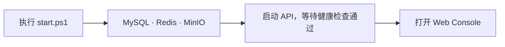
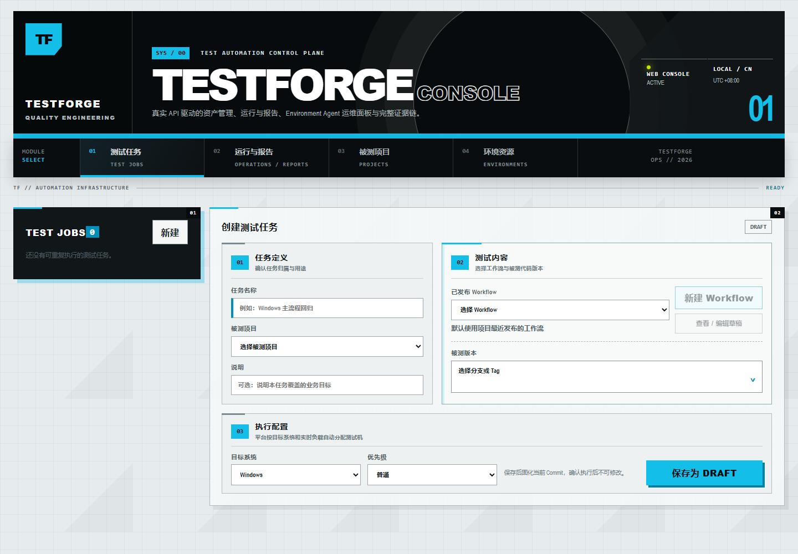
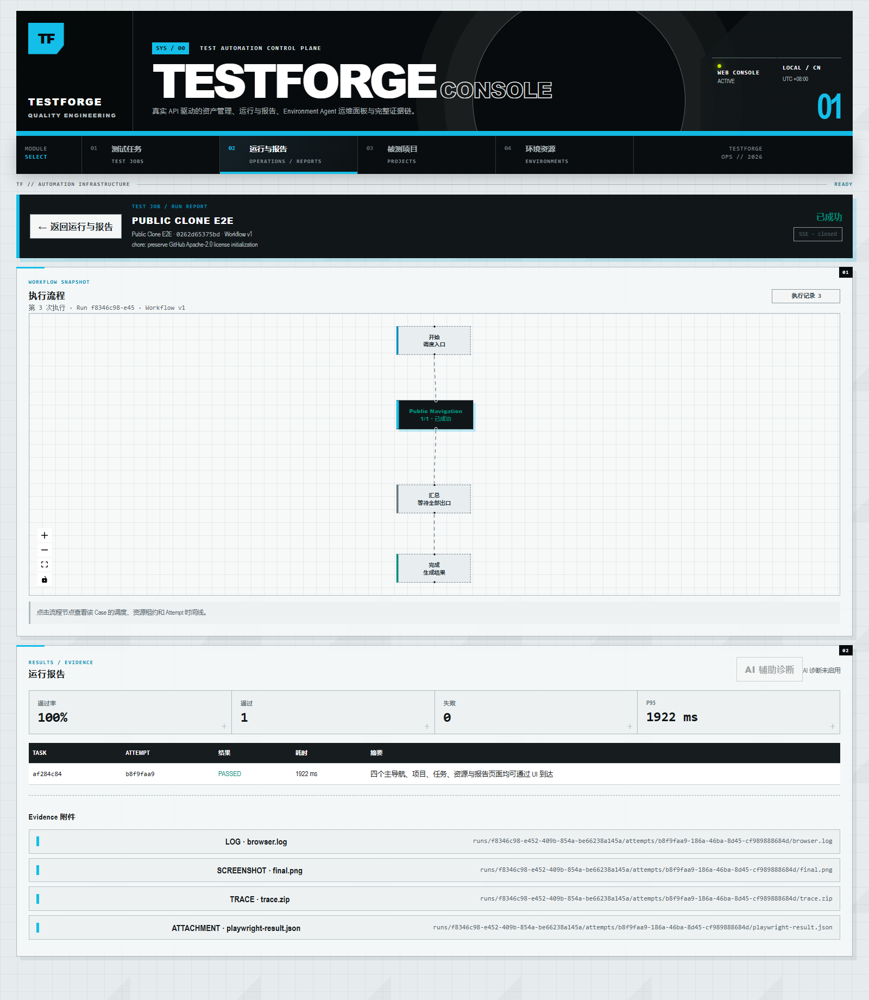

# TestForge Platform

把测试资产、代码版本、Jenkins 发布、Worker 执行和报告放在同一条可追溯链路中。TestForge 是面向本机自托管开发与测试的测试编排平台。

- **定义测试**：用 YAML 管理 Case 和脚本，通过可视化 Workflow 编排测试流程。
- **执行测试**：冻结 Git Commit，由 Jenkins 真实发布，按 Case 需求分配 Worker 执行。
- **查看结果**：汇总执行状态、测试结果、截图和 Trace；可选 AI 诊断基于证据提供建议。

[快速开始](#快速开始) · [功能设计与开发](#功能设计与开发) · [完整文档](docs/README.md) · [参与贡献](CONTRIBUTING.md)

## 快速开始

先启动本地控制面，再接入自己的测试项目。当前一键启动支持 **Windows 10/11 + PowerShell 5.1+**。

### 1. 准备环境

| 工具 | 要求 |
| --- | --- |
| Git | 用于克隆仓库 |
| Java | 21 |
| Node.js | 22.12+ |
| Docker | 已启动，支持 Compose v2 |

这一步不需要 Python 或 Go；运行 Worker 需要 Python 3.10+，构建 MCP 需要 Go 1.25+。

### 2. 克隆并启动

在 PowerShell 中执行：

```powershell
git clone https://github.com/Caqlatufi/testforge-platform.git
cd testforge-platform
.\scripts\start.ps1
```

首次启动会下载依赖和容器镜像，耗时取决于网络。脚本启动的服务如下：



默认使用本机 3306、6379、9000/9001、8081、5174 端口。若已有服务占用，先按[快速开始指南](docs/guides/01-五分钟快速开始.md#5-常见问题)配置 .env.local，再启动。

### 3. 打开控制台

浏览器访问 **<http://127.0.0.1:5174>**，可以看到测试任务页面。初始没有项目和任务，需要先在“被测项目”中登记自己的 Git 仓库。



*实际运行界面。初始空列表是正常状态，启动脚本不会自动生成示例任务。*

检查 API 是否就绪：

```powershell
Invoke-RestMethod http://127.0.0.1:8081/actuator/health
```

返回的 status 应为 UP。运行日志位于 build/local-runtime/。

**这时控制面已启动。** 实际执行测试还需要接入 Jenkins 和兼容 Worker；启动脚本不会自动启动它们或虚拟机。详细步骤和排障见[五分钟快速开始](docs/guides/01-五分钟快速开始.md)，后续操作见[文档总索引](docs/README.md)。

停止本地服务：

```powershell
.\scripts\stop.ps1
```

停止后保留数据库和对象存储的数据卷，再次启动可以继续使用。

## 运行示例

公开版已在新克隆中完成单 Case 的页面建任务、Jenkins 发布、Playwright Worker 执行及报告验证，并成功重复执行。以下是该用例的真实报告；图中的 100% 仅指本次单 Case 的通过率。

<details>
<summary>查看实际运行报告：流程状态、测试结果与证据附件</summary>



</details>

当前报告列出附件名称与对象键，尚无直接下载按钮。复杂场景的覆盖范围和其他已知限制见[验证记录](docs/reference/公开准备记录.md#公开版主链路验证补充)。

## 工程组成

- `testforge-app`：Java 21 / Spring Boot Gradle多模块控制面。
- `testforge-client`：Vue 3 Web Console。
- `testforge-worker`：Python pytest-http / Playwright Web / Airtest执行器。
- `testforge-mcp`：面向 MCP Host 的独立 Go 接入层，可读取授权本地项目并调用 TestForge。
- `contracts`：OpenAPI与JSON Schema。
- `infra`：MySQL、Redis、MinIO和可观测性环境。
- `acceptance`：平台 API、可靠性验收与 HTTP 测试夹具。
- [`docs`](docs/README.md)：使用指南、功能设计、开发与验收方案，以及维护者参考。

构建、测试、组件配置和发布检查见 [CONTRIBUTING.md](CONTRIBUTING.md)。

## 功能设计与开发

每个功能目录均包含四份文档：**需求分析**说明做什么、范围是什么；**架构设计**说明模块和数据如何协作；**开发方案**说明具体实现；**验收方案**说明如何验证及通过标准。各份文件的直接链接见 [功能域索引](docs/README.md#功能域索引)。

| 目录 | 主要内容 |
| --- | --- |
| [01 · 被测项目与 Jenkins 发布](docs/01-project-delivery/) | 项目登记、Git 版本选择、真实部署及部署回调 |
| [02 · Case 与脚本资产](docs/02-test-assets/) | YAML Case、脚本上传、资产版本及执行需求 |
| [03 · 工作流编排](docs/03-workflow-orchestration/) | DAG 节点与依赖、草稿编辑、发布和流程复用 |
| [04 · 测试任务管理](docs/04-test-job-management/) | 创建任务、冻结 Commit 与 Workflow 版本、确认和重复执行 |
| [05 · 执行编排与可靠性](docs/05-run-orchestration/) | 任务派发、状态推进、回调幂等、重试、取消与故障恢复 |
| [06 · 执行资源与调度](docs/06-execution-resources/) | Worker、环境和资源容量，按 Case 需求分配执行资源 |
| [07 · 结果与可观测性](docs/07-results-observability/) | 结果聚合、报告、事件推送、指标与执行证据 |
| [08 · AI 证据诊断](docs/08-ai-diagnosis/) | 基于执行证据生成诊断建议，以及失败降级和安全边界 |
| [09 · 平台工程与交付](docs/09-platform-engineering/) | 控制台、构建、启动、持续集成与平台回归 |
| [10 · MCP 接入](docs/10-mcp-integration/) | AI 客户端接入、授权工作区和 MCP 工具与平台 API 的边界 |

## 安全与许可证

控制面当前没有内建用户认证/RBAC，默认仅监听 `127.0.0.1`，不要直接暴露到公网。AI 诊断默认关闭；启用时使用 TestForge 专用 Codex Home，并将凭据放在未跟踪的本机配置中。完整安全说明与反馈入口见 [SECURITY.md](SECURITY.md)。

平台原创内容及随附的 `commons`、`simple-migration` 自有框架 JAR 采用 [Apache-2.0](LICENSE) 许可；第三方依赖遵循各自许可证。框架 JAR 的来源与校验值见 [testforge-app/libs](testforge-app/libs/README.md)。
