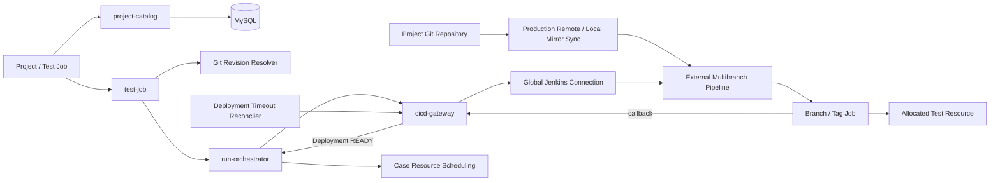
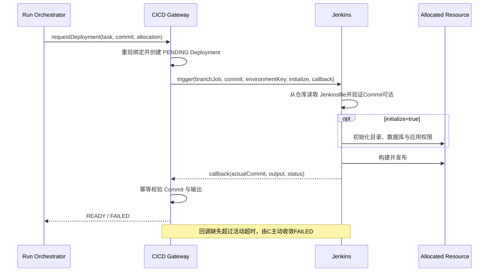

# TestForge 被测项目与 Jenkins 发布架构设计

## 1. 总体架构



```text
被测项目交付域
├─ Project
│  ├─ Git repository / default branch / application type
│  └─ ProjectPipelineBinding
├─ Revision Selection
│  ├─ BRANCH / TAG / COMMIT
│  └─ Resolved Commit Snapshot
└─ EnvironmentDeployment
   ├─ Jenkins Queue / Build
   ├─ actualCommit / output
   └─ PENDING -> QUEUED -> BUILDING -> READY | FAILED

独立执行资源域
└─ Environment / Agent / AllocatableResource / ResourceClaim
```

## 2. 关键规则

| 对象/场景 | 规则 | 生效条件 |
| --- | --- | --- |
| Project | 一个项目对应一个 Git 被测项目；ID 由服务端生成 | 创建、更新 |
| Jenkins Connection | server、folder、credentialRef 属于平台运行配置 | Pipeline 读取、触发 |
| Pipeline Binding | 只保存 Project 到外部 Job 的稳定绑定，不保存 Jenkinsfile 路径或 SCM 配置 | 同步、重验 |
| Revision | 任意选择都解析为完整 Commit，并保存类型、引用名、来源分支和描述 | 任务保存 |
| Deployment | 冻结 Project、Pipeline、Commit 与实际资源发布键 | 执行 |
| READY | actualCommit 与 resolvedCommit 一致且输出契约完整 | 回调 |
| 初始化 | `INITIALIZE_ENVIRONMENT` 来自资源状态；READY 后一次性消费 | 首次部署、重置 |
| 初始化凭据 | Pipeline 从 Jenkins Agent/凭据绑定读取管理员秘密，只把非敏感目标信息传给初始化脚本 | 首次部署、重置 |
| 资源边界 | 项目不保存环境；Deployment 只引用执行资源域分配结果 | 资源调度 |
| SCM 可达性 | 正式环境由项目远端仓库保证；本机演示由 Git hook 同步裸镜像并校验 Commit object | Commit/合并后、Build checkout |
| 失败收敛 | FAILED 回调使用 Jenkins 环境变量直接发送，不读取 checkout 工作区；活动 Deployment 超时仍无回调则失败 | checkout/构建/回调故障 |
| Pipeline 环境兼容 | `Environment.config.pipelineJobNames` 非空时是显式兼容清单；有精确匹配则排除其他池，无精确匹配时仅允许未声明清单的遗留环境 | 自动分配发布环境 |
| 发布键 | 单一 Provider Key 的资源池传实际 `providerEnvironmentKey`；包含多个实例发布键的池传 `resourcePoolKey` 供 Jenkins 二次分配 | 触发 Jenkins |

## 3. 模块职责边界

| 模块 | 职责 | 数据/依赖 |
| --- | --- | --- |
| `project-catalog` | Project、Git 元数据、默认分支和状态 | MySQL、Git |
| `cicd-gateway/catalog` | Pipeline 绑定、Jenkins 目录读取、分支/Tag Job 解析 | Jenkins REST API |
| `cicd-gateway/deployment` | 触发、状态机、回调幂等、Commit/输出校验 | MySQL、Jenkins Adapter |
| `test-job` | 固定 Project、Pipeline、RevisionSnapshot 与 WorkflowVersion | project/cicd/workflow |
| `run-orchestrator` | 请求资源、等待 Deployment READY、释放可执行节点 | cicd/resource/dispatcher |
| `testforge-client/projects` | Project 表单与只读 Pipeline 目录 | REST API |
| Jenkins | SCM 扫描、Jenkinsfile、Agent、构建、初始化、发布和清理 | Git、目标资源 |
| `infra/jenkins` | 本机演示 SCM 裸镜像同步与可达性校验 | 工作仓库、Git daemon 裸仓库 |
| `DeploymentExpiryScheduler` | READY 过期回收和活动 Deployment 超时失败 | DeploymentRepository、事件 |

## 4. 核心数据模型

### 4.1 `Project`

| 字段 | 类型 | 必填 | 说明 |
| --- | --- | --- | --- |
| id | UUID | 是 | 稳定主键，页面只读 |
| name | String | 是 | 用户可见名称 |
| applicationType | Enum | 是 | HTTP_SERVICE、WEB、DESKTOP、MOBILE |
| repositoryUrl | URI/path | 是 | Git 仓库地址或本地仓库路径 |
| defaultBranch | String | 是 | 默认分支 |
| state | Enum | 是 | ACTIVE、ARCHIVED |

### 4.2 `ProjectPipelineBinding`

| 字段 | 类型 | 必填 | 说明 |
| --- | --- | --- | --- |
| id | UUID | 是 | 稳定绑定 ID |
| projectId | UUID | 是 | 被测项目 |
| pipelineExternalId | String | 是 | Jenkins 外部稳定标识 |
| multibranchFullName | String | 是 | Multibranch Project 全名 |
| enabled | boolean | 是 | 是否允许新任务使用 |
| configDigest | String | 是 | 最近一次读取的配置摘要 |

### 4.3 `RevisionSnapshot`

| 字段 | 类型 | 必填 | 说明 |
| --- | --- | --- | --- |
| selectorType | Enum | 是 | BRANCH、TAG、COMMIT |
| selectorValue | String | 是 | 分支名、Tag 名或 Commit 输入 |
| sourceBranch | String | 条件必填 | COMMIT 的 Pipeline 分支上下文 |
| resolvedCommit | String | 是 | 完整 Commit SHA |
| subject | String | 是 | Commit 描述 |
| resolvedAt | Instant | 是 | 冻结时间 |

### 4.4 `EnvironmentDeployment`

| 字段 | 类型 | 必填 | 说明 |
| --- | --- | --- | --- |
| id / deploymentKey | UUID / String | 是 | 记录与幂等复用键 |
| testJobId / taskId | UUID | 是 | 测试意图与等待节点 |
| allocationId | UUID | 是 | 执行资源域分配结果 |
| resolvedCommit / actualCommit | String | 是/READY 时是 | 请求版本与实际发布版本 |
| pipelineExternalId / branchJob | String | 是 | 父 Pipeline 与实际子 Job |
| providerRunId / providerRunUrl | String / URI | 触发后 | Jenkins Queue/Build 证据 |
| initializationRequested | boolean | 是 | 本次是否执行初始化 |
| state | Enum | 是 | PENDING、QUEUED、BUILDING、READY、FAILED、EXPIRED |
| endpoint / artifactUri / digest | URI/String | 按应用类型 | 发布输出 |

### 4.5 `Environment` Pipeline 兼容配置

| 字段 | 类型 | 必填 | 说明 |
| --- | --- | --- | --- |
| config.pipelineJobNames | String[] | 否 | 可发布到该环境的 Jenkins Job 全名；空或缺失表示遗留兼容环境 |
| providerEnvironmentKey | String | 是 | 单实例或同键资源池传给 Jenkins 的实际发布键 |
| resourcePoolKey | String | 是 | 同类环境聚合键；多发布键资源池由 Jenkins 按该键二次分配 |

## 5. 核心流程

### 5.1 项目、Pipeline 与版本冻结

```text
保存 Project
  -> 从全局 Jenkins Connection 读取绑定 Pipeline
  -> 测试任务选择 BRANCH / TAG / COMMIT
  -> 解析完整 Commit + 描述 + 来源分支
  -> 保存不可变 RevisionSnapshot
```

### 5.2 Jenkins 发布门禁



## 6. 模块目录

标记：`[+]` 新增　`[~]` 修改　`[-]` 删除

```text
testforge-platform
├─ testforge-app
│  ├─ project-catalog/src/main/java/io/testforge/projectcatalog
│  │  ├─ entity/[~] TestProjectEntity.java
│  │  ├─ revision/[~] {RevisionSelector,GitRevisionResolver}.java
│  │  └─ service/[~] ProjectCatalogService.java
│  ├─ cicd-gateway/src/main/java/io/testforge/cicdgateway
│  │  ├─ catalog/[~] {PipelineCatalogService,PipelineRef}.java
│  │  └─ deployment/[~] {JenkinsDeploymentProvider,TargetDeploymentEntity,DeploymentService,DeploymentExpiryScheduler}.java
│  ├─ test-job/src/main/java/io/testforge/testjob/[~] service/TestJobService.java
│  └─ run-orchestrator/src/main/java/io/testforge/runorchestrator/[~] deployment/
├─ testforge-client/src
│  ├─ projects/[~] {AssetManagement.vue,index.ts}
│  └─ jobs/[~] TestJobManagement.vue
├─ contracts/openapi/v1/[~] testforge.yaml
├─ infra/jenkins/[+] sync-local-scm-mirror.ps1
└─ ../.githooks/[+] {post-commit,post-merge}
```

## 7. 数据与迁移

| 类型 | 归属 | 处理方式 |
| --- | --- | --- |
| Project Git 字段 | `project_catalog_project` | JPA DDL update；旧 code 保留只读兼容，新增记录使用 UUID |
| Revision 快照 | Test Job 配置版本 | 普通字段/JSON 由 JPA DDL update 承接 |
| Deployment | `cicd_target_deployment` | JPA DDL update；旧环境字段映射为 allocation 引用 |
| 旧 Target/Environment 所有权 | Project Catalog | 历史记录只读兼容；新 Project 不创建私有环境 |
