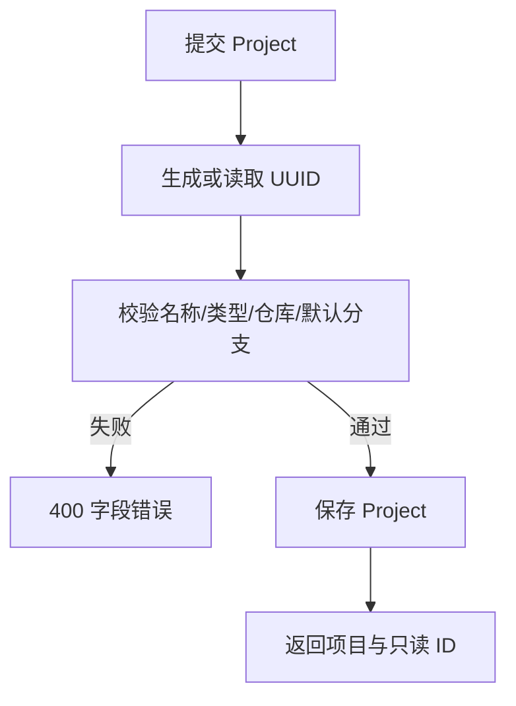
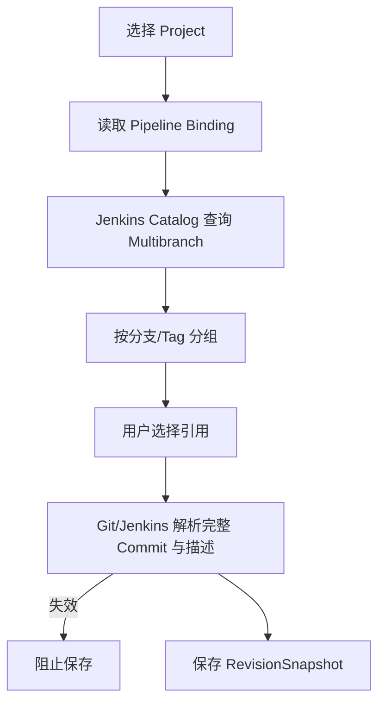
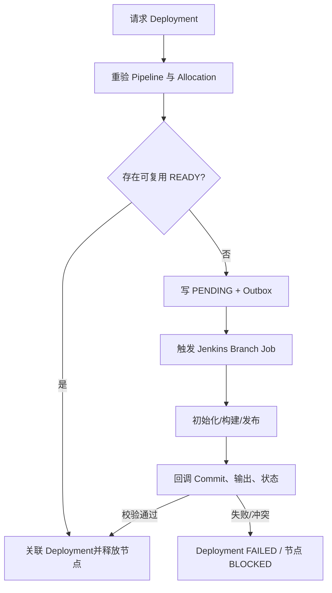
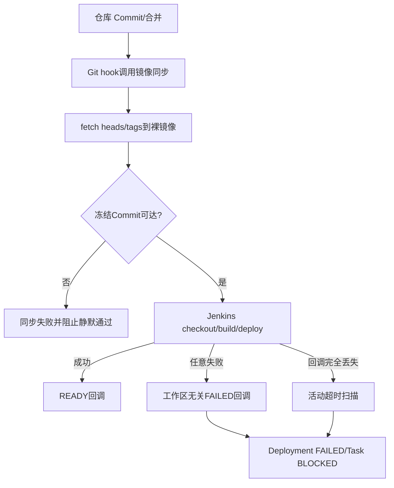
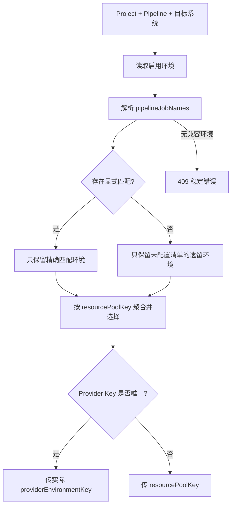

# TestForge 被测项目与 Jenkins 发布开发方案

## 1. 开发目标

| 编号 | 对应需求 | 开发目标 |
| --- | --- | --- |
| PD-G1 | PD-IN1、PD-IN6 | 收敛 Project 字段和页面职责 |
| PD-G2 | PD-IN2、PD-IN3 | 读取外部 Pipeline，并把任意版本选择冻结为可读 Commit 快照 |
| PD-G3 | PD-IN4、PD-IN5 | 通过 Jenkins 完成初始化和真实发布，并以 READY 控制测试执行 |
| PD-G4 | PD-IN7 | 保证冻结 Commit 对 Jenkins 可达，并让 checkout、回调或 Jenkins 失联都能收敛为明确失败 |
| PD-G5 | PD-IN9 | 在同平台多资源池中按 Pipeline 兼容清单选择发布环境，并传递正确发布键 |

## 2. 功能清单与实施顺序

| 顺序 | 功能 | 前置依赖 | 核心产出 |
| --- | --- | --- | --- |
| 1 | Project 管理 | Git 访问配置 | 精简 Project API 与页面 |
| 2 | Pipeline 目录与版本冻结 | 全局 Jenkins Connection | PipelineRef、RevisionSnapshot |
| 3 | Deployment 与 READY 门禁 | 资源 Allocation、项目 Jenkinsfile | 状态机、回调、测试释放 |
| 4 | SCM 同步与失败收敛 | 本地 Git daemon、Jenkins Callback、Deployment 状态机 | 自动镜像同步、独立失败回调、超时失败 |
| 5 | Pipeline 兼容环境路由 | Pipeline 目录、共享环境配置 | 兼容环境组、实际 Provider 发布键 |

## 3. 功能开发设计

### 3.1 Project 管理

#### 3.1.1 功能说明

| 项 | 内容 |
| --- | --- |
| 触发入口 | Project 创建/编辑页面与 API |
| 前置条件 | 仓库地址和默认分支可解析 |
| 最终结果 | 保存项目业务字段和自动生成 ID，不写 Jenkins 连接或环境字段 |

#### 3.1.2 技术流程图

#### 3.1.3 流程节点实现

| 步骤 | 代码落点 | 输入 | 处理逻辑 | 数据/状态变化 | 输出/异常 |
| --- | --- | --- | --- | --- | --- |
| 1 | Project Controller | name、applicationType、repositoryUrl、defaultBranch | DTO 校验，不接收 code/环境/Jenkins 字段 | 无 | Command/400 |
| 2 | ProjectCatalogService | Command | 新建时生成 UUID，校验仓库元数据 | Project ACTIVE | View/409 |
| 3 | AssetManagement.vue | Project View | 展示业务字段和只读 Pipeline 目录 | 页面状态 | 成功/错误提示 |

#### 3.1.4 关键接口

| 接口/能力 | 方法/动作 | 请求字段 | 返回字段 | 错误码/异常 |
| --- | --- | --- | --- | --- |
| 创建 Project | POST `/api/v1/projects` | name、applicationType、repositoryUrl、defaultBranch | id、业务字段、state | 400/409 |
| 更新 Project | PUT `/api/v1/projects/{id}` | 同创建 | Project View | 400/404/409 |

### 3.2 Pipeline 目录与版本冻结

#### 3.2.1 功能说明

| 项 | 内容 |
| --- | --- |
| 触发入口 | 选择 Project 或展开“被测版本”下拉菜单 |
| 前置条件 | Project ACTIVE 且存在启用的 Pipeline Binding |
| 最终结果 | 分支/Tag 列表可读；选择项解析为 Commit、描述和来源上下文 |

#### 3.2.2 技术流程图

#### 3.2.3 流程节点实现

| 步骤 | 代码落点 | 输入 | 处理逻辑 | 数据/状态变化 | 输出/异常 |
| --- | --- | --- | --- | --- | --- |
| 1 | PipelineCatalogService | projectId | 查询外部 Job 并过滤绑定范围 | 不持久化 Job 配置 | PipelineRef[] |
| 2 | GitRevisionResolver | selector、sourceBranch | 解析 SHA、subject、author/time | 无 | RevisionSnapshot/404 |
| 3 | TestJobService | project/pipeline/revision | 启用前重验并保存不可变配置版本 | TestJobConfigVersion | 409 |

#### 3.2.4 关键接口

| 接口/能力 | 方法/动作 | 请求字段 | 返回字段 | 错误码/异常 |
| --- | --- | --- | --- | --- |
| Pipeline 目录 | GET `/api/v1/projects/{id}/pipelines` | projectId | externalId、name、state | 404/502 |
| 版本目录 | GET `/api/v1/projects/{id}/revisions` | kind、query?、pipelineId | ref、commit、subject、sourceBranch | 400/404/502 |
| 解析版本 | POST `/api/v1/projects/{id}/revisions:resolve` | pipelineId、type、value、sourceBranch? | RevisionSnapshot | 400/404/409 |

### 3.3 Jenkins Deployment 与 READY 门禁

#### 3.3.1 功能说明

| 项 | 内容 |
| --- | --- |
| 触发入口 | 可执行节点需要已发布的被测应用 |
| 前置条件 | RevisionSnapshot、Pipeline Binding 和资源 Allocation 有效 |
| 最终结果 | Jenkins 发布指定 Commit；回调校验通过后节点才进入可执行状态 |

#### 3.3.2 技术流程图

#### 3.3.3 流程节点实现

| 步骤 | 代码落点 | 输入 | 处理逻辑 | 数据/状态变化 | 输出/异常 |
| --- | --- | --- | --- | --- | --- |
| 1 | DeploymentService | task、snapshot、allocation | 计算 deploymentKey，创建或复用 | PENDING/READY | Deployment |
| 2 | JenkinsDeploymentProvider | Outbox message | 选择子 Job 并传递参数 | QUEUED/BUILDING | queue/build URL |
| 3 | DeploymentCallbackService | callbackKey、status、actualCommit、outputs | 验签引用、幂等、状态 CAS、输出校验 | READY/FAILED | applied/duplicate/conflict |
| 4 | RunOrchestrator | Deployment event | READY 释放节点，FAILED 阻断节点 | Task READY/BLOCKED | 运行事件 |

#### 3.3.4 Jenkins 参数契约

| 字段 | 类型 | 必填 | 说明 |
| --- | --- | --- | --- |
| TESTFORGE_DEPLOYMENT_ID | UUID | 是 | 回调关联键 |
| COMMIT_SHA | String | 是 | TestForge 冻结 Commit |
| DEPLOY_ENVIRONMENT | String | 是 | Allocation 提供的发布键 |
| INITIALIZE_ENVIRONMENT | boolean | 是 | 是否先执行应用级初始化 |

初始化脚本必须幂等创建目录、应用数据库与最小应用权限。管理员密码只允许从 Jenkins 受控环境变量或凭据绑定读取；缺失时初始化阶段立即失败，不得把秘密硬编码进 Jenkinsfile、项目脚本或 TestForge 环境 JSON。

Windows 宿主上的长期服务不得直接作为 Jenkins `powershell` step 的子进程常驻。Pipeline 通过 Task Scheduler 启动环境级后台任务，发布脚本只负责创建/更新任务、触发运行并等待健康检查；这样 durable-task step 能在 READY 后正常退出，同时后台服务继续运行。
| CALLBACK_URL | URI | 是 | Deployment 回调地址 |

#### 3.3.5 并发实现方式

| 项 | 实现方式 |
| --- | --- |
| 并发不变量 | 同一 deploymentKey 最多一个活动 Build；同一回调只应用一次；READY 只释放一次节点 |
| 竞争资源 | Deployment 行、初始化标记、资源 Allocation |
| 控制粒度 | deploymentKey、callbackKey、allocationId |
| 实现机制 | 唯一键、状态版本 CAS、事务 Outbox |
| 事务边界 | Deployment 创建与 Outbox 同事务；外部 Jenkins 调用在提交后执行 |
| 幂等方式 | 重复请求回读同一 Deployment；重复回调按 callbackKey/payloadHash 分类 |
| 竞争失败处理 | 不重复触发 Build，返回既有记录或 409 冲突 |
| 超时与恢复 | 扫描长期 QUEUED/BUILDING，查询 Jenkins 后收敛或标记 EXPIRED |

### 3.4 SCM 同步与失败收敛

#### 3.4.1 功能说明

| 项 | 内容 |
| --- | --- |
| 触发入口 | 本地仓库 Commit/合并；Jenkins 任意阶段失败；Deployment 活动超时扫描 |
| 前置条件 | 本地演示裸镜像路径和 Git daemon 已配置；Deployment 已保存回调地址 |
| 最终结果 | Jenkins 能读取冻结 Commit；失败始终回传或由超时扫描收敛，等待节点进入 BLOCKED |

#### 3.4.2 技术流程图

#### 3.4.3 流程节点实现

| 步骤 | 代码落点 | 输入 | 处理逻辑 | 数据/状态变化 | 输出/异常 |
| --- | --- | --- | --- | --- | --- |
| 1 | `.githooks/post-commit`、`post-merge` | repository root | 调用本地镜像同步脚本 | 裸镜像 refs 更新 | hook 状态 |
| 2 | `sync-local-scm-mirror.ps1` | source、mirror、commit | 带互斥锁 fetch heads/tags，`cat-file` 校验 commit | 无业务数据 | commit/非零退出 |
| 3 | `skill-sandbox/Jenkinsfile` | CALLBACK_URL、BUILD_URL、COMMIT_SHA | post failure 直接构造 JSON 并发送，不读取工作区文件 | Deployment callback | HTTP/日志 |
| 4 | `DeploymentExpiryScheduler` | activeTimeout | 查询过期 PENDING/TRIGGERED/BUILDING，CAS 式改为 FAILED 并发布事件 | Deployment FAILED、Task BLOCKED | 变更数量 |

#### 3.4.4 关键配置与模型

| 字段/配置 | 类型 | 必填 | 用途与约束 |
| --- | --- | --- | --- |
| `testforge.cicd.active-timeout` | Duration | 是 | 活动发布无回调的最大时长，默认 PT30M |
| `summary` | String | FAILED 时是 | 保存 checkout/build 原因或回调超时原因 |
| mirror commit verification | 40 hex | 是 | 同步后必须可由裸镜像 `cat-file` 解析为 commit |

#### 3.4.5 并发实现方式

| 项 | 实现方式 |
| --- | --- |
| 并发不变量 | 同一裸镜像同一时刻仅一个 fetch；终态 Deployment 不被超时扫描覆盖 |
| 竞争资源 | 裸镜像 refs、Deployment 行 |
| 控制粒度 | 本机命名互斥锁、Deployment 乐观锁 |
| 实现机制 | PowerShell Mutex、JPA `@Version` 与状态前置判断 |
| 事务边界 | 每轮超时扫描在事务中保存 FAILED 并发布 DeploymentChangedEvent |
| 幂等方式 | 重复同步相同 refs 无变化；重复扫描终态记录不处理 |
| 竞争失败处理 | 同步锁超时报错；Deployment 乐观锁冲突下一轮重试 |
| 超时与恢复 | 活动状态超过配置时限转 FAILED，保留初始化标记供下一次发布重试 |

### 3.5 Pipeline 兼容环境路由

#### 3.5.1 功能说明

| 项 | 内容 |
| --- | --- |
| 触发入口 | Test Job 激活或执行前的 Pipeline/平台校验 |
| 前置条件 | Project Pipeline 可读，目标系统至少存在一个启用环境 |
| 最终结果 | 选择兼容资源池，并向 Jenkins 传递可执行的发布键；没有兼容环境时稳定失败 |

#### 3.5.2 技术流程图

#### 3.5.3 流程节点实现

| 步骤 | 代码落点 | 输入 | 处理逻辑 | 数据/状态变化 | 输出/异常 |
| --- | --- | --- | --- | --- | --- |
| 1 | `PipelineCatalogService.validateForPlatform` | projectId、pipelineExternalId、platform | 读取 Pipeline Job 与启用环境 | 无 | 候选环境/409 |
| 2 | `configuredPipelineJobs` | Environment.config | 兼容 String 或 String[]，清理空值 | 无 | Job 全名列表 |
| 3 | `validateForPlatform` | 兼容环境列表 | 显式匹配优先；否则保留遗留环境；按资源池聚合 | Test Job 环境快照 | PipelineEnvironmentRef |
| 4 | `JenkinsDeploymentProvider` | providerKey | 作为 `DEPLOY_ENVIRONMENT` 触发 Jenkins | Deployment QUEUED | Queue item/Provider 错误 |

#### 3.5.4 关键配置模型

| 数据模型 | 字段 | 类型 | 必填 | 用途与约束 |
| --- | --- | --- | --- | --- |
| Environment.config | pipelineJobNames | String[]/String | 否 | Jenkins Job 全名精确匹配；显式清单不会被其他 Pipeline 回退使用 |
| PipelineEnvironmentRef | providerKey | String | 是 | 单发布键池使用实际键，多发布键池使用资源池键 |

## 4. 公共实现规则

| 规则类型 | 统一实现 | 适用功能 |
| --- | --- | --- |
| 外部标识 | 数据库保存 Jenkins externalId，显示名只作快照 | Pipeline、Deployment |
| 密钥 | 只保存 credentialRef；日志、事件和回调摘要不输出密钥 | 全部 |
| 版本 | 用户可见 ref、完整 Commit 和描述同时保存 | 版本冻结、报告 |
| 状态 | 外部动作经 Outbox，回调以状态版本和幂等键收敛 | Deployment |
