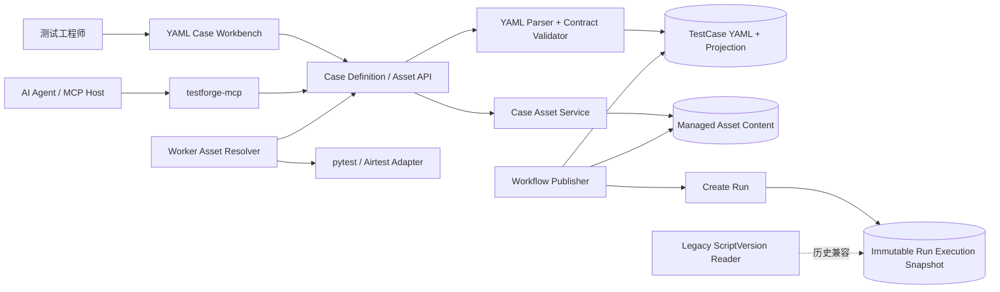

# TestForge YAML Case 与托管测试资源架构设计

## 1. 总体架构



```text
TestCase
├─ definitionYaml                 # 唯一可编辑真相源
├─ definitionDigest
├─ projection                     # name/kind/tags/timeout/execution
└─ script
   ├─ inline -> 保存时物化为托管 Asset
   └─ asset  -> testforge://assets/{assetId}#entrypoint

WorkflowVersion
└─ displaySnapshot                # 固化 DAG 拓扑与 caseId 引用；不可变

Run
└─ workflowSnapshot               # 创建时固化 Case + Asset 摘要；不可变
```

## 2. 关键规则

| 对象/场景 | 规则 | 生效条件 |
| --- | --- | --- |
| Case YAML | 仅接受 `testforge.io/v1alpha1` + `TestCase`；未知顶层结构拒绝 | 校验、保存 |
| Case Projection | name、kind、tags、timeout、ExecutionRequirement 和 parameters 由 YAML 解析，不接受双写 | 保存 |
| CaseAsset | 内容不可变；同项目相同 SHA-256 去重；URI 不携带宿主机路径 | 上传、下载 |
| Inline Script | 保存 Case 时物化为 Asset，执行快照仍只携带托管 URI 与摘要 | 保存、执行创建 |
| Airtest Bundle | ZIP 安全扫描且只允许一个 `.air` 主入口；ZIP 文件名不可作为入口；Worker 在 Attempt 临时目录解包 | 上传、执行 |
| Workflow Case 节点 | 草稿不选择脚本版本；Run 创建时解析当前 Case，Run Snapshot 成为版本边界 | 执行创建 |
| Legacy ScriptVersion | 只用于旧 Case/旧快照读取；新建、编辑、MCP 均不再写入 | 兼容 |

## 3. 模块职责边界

| 模块 | 职责 | 数据/依赖 |
| --- | --- | --- |
| `case-catalog/testcase` | YAML 解析、Schema 校验、Case 投影、定义摘要 | MySQL、Project Catalog |
| `case-catalog/asset` | 文件上传、摘要、归属、内容读取、ZIP 元数据校验 | MySQL BLOB（Demo 托管存储） |
| `case-catalog/workflow` | 发布 DAG 拓扑；Run 创建时将当前 Case 与 Asset 元数据解析为执行快照 | Case/Asset Service |
| `testforge-client/catalog` | YAML 编辑器、当前 Case 脚本面板、上传/替换并插入引用；不展示项目历史 Asset 库 | REST API |
| `testforge-worker/executor` | 解析平台 URI、下载校验、安全解包、把本地入口交给 Adapter | Gateway API、Attempt 目录 |
| `testforge-mcp` | 受控工作区脚本读取、YAML validate/apply 与 Case 专属 Asset 上传绑定 | 公开 REST API；完整边界见 `docs/10-mcp-integration` |
| `run-orchestrator/dispatcher` | 保存并传递 Run 快照中的 sourceRef/checksum，不解释 YAML | Run execution snapshot |

## 4. 核心数据模型

### 4.1 `TestCase`

| 字段 | 类型 | 必填 | 说明 |
| --- | --- | --- | --- |
| id | UUID | 是 | Case 稳定身份 |
| projectId | UUID | 是 | 所属项目 |
| definitionYaml | TEXT | 新模型是 | 原始 YAML，唯一编辑源 |
| definitionDigest | String | 新模型是 | 规范化定义 SHA-256 |
| name/kind/tags | 投影 | 是 | 从 YAML 解析，用于列表和检索 |
| parameterSchema | JSON 投影 | 是 | `spec.parameters` |
| executionRequirement | JSON 投影 | 是 | `spec.execution` |
| scriptAssetId | UUID | 新模型是 | 内联或上传内容的托管 Asset |
| scriptEntrypoint | String | 是 | 文件或包内入口 |
| scriptChecksum | String | 是 | Asset 内容 SHA-256 |

### 4.2 `CaseAsset`

| 字段 | 类型 | 必填 | 说明 |
| --- | --- | --- | --- |
| id | UUID | 是 | 资源 ID |
| projectId | UUID | 是 | 归属项目 |
| fileName | String | 是 | 原始安全文件名 |
| contentType | String | 是 | 媒体类型 |
| sizeBytes | long | 是 | 1～20 MiB |
| sha256 | String | 是 | `sha256:<hex>` |
| content | BLOB | 是 | Demo 平台托管内容 |
| entrypoints | List<String>（派生） | 是 | 必须恰好包含一个 `.air` 根或顶层 `.py` 主入口 |
| createdAt | Instant | 是 | 上传时间 |

### 4.3 YAML 契约

```yaml
apiVersion: testforge.io/v1alpha1
kind: TestCase
metadata:
  name: Windows 正常命中
  tags: [airtest, regression]
spec:
  type: assertion
  timeoutSeconds: 90
  execution:
    executor: airtest
    interaction: UI
    capabilities: [WINDOWS_UI]
    resourceProfile: ui-default
    leaseScope: CASE
  parameters:
    type: object
    additionalProperties: true
  script:
    type: asset
    asset: testforge://assets/63bfe9ab-7ee8-4db6-8ad9-a81ca1a7ca11
    entrypoint: c02-aim-deviation.air
```

## 5. 核心流程

### 5.1 上传并保存 YAML Case

```text
上传文件
  -> Project 归属 + 大小 + 文件名 + ZIP 安全校验
  -> 识别唯一 `.air` 根目录或顶层 Python 主入口
  -> 零入口或多主入口直接拒绝上传
  -> 唯一候选自动选择；多候选由编辑器要求用户选择
  -> 计算 SHA-256；同项目去重
  -> 返回 testforge:// URI
  -> 编辑器插入 spec.script
  -> YAML Parser 解析并解析 Asset
  -> 保存 YAML、摘要、投影和 assetId
```

### 5.2 拓扑发布与执行创建

```text
Workflow 草稿引用 caseId
  -> 发布 Workflow 时只保存 DAG 拓扑与 caseId
  -> 创建 Run 时读取 Case 当前 YAML
  -> 校验 Asset 仍存在且属于 Project
  -> 固化 sourceRef/checksum/execution/parameters 到 CompiledNode
  -> Worker 领取 Task
  -> ManagedAssetResolver 下载并校验
  -> 安全解包并返回本地 entrypoint
  -> pytest/Airtest 执行
```

Case 的主入口必须表达该 Case 自己的测试意图。公共执行框架和辅助模块可以随包携带，但不得让多个 Case 共用同一主入口，再通过 `scenarioId` 等运行参数切换断言逻辑。

## 6. 模块目录

标记：`[+]` 新增　`[~]` 修改　`[-]` 删除

```text
testforge-platform
├─ testforge-app/case-catalog
│  ├─ [~] build.gradle
│  └─ src/main/java/io/testforge/casecatalog
│     ├─ asset
│     │  ├─ [+] ctrl/CaseAssetController.java
│     │  ├─ [+] entity/CaseAssetEntity.java
│     │  ├─ [+] model/CaseAssetView.java
│     │  ├─ [+] repo/CaseAssetRepository.java
│     │  └─ [+] service/CaseAssetService.java
│     ├─ testcase
│     │  ├─ [~] entity/TestCaseEntity.java
│     │  ├─ [+] model/CaseDefinition.java
│     │  ├─ [+] service/CaseDefinitionParser.java
│     │  ├─ [~] service/TestCaseService.java
│     │  └─ [~] ctrl/TestCaseController.java
│     └─ workflow/service/[~] WorkflowReferenceResolver.java
├─ testforge-client/src/catalog
│  ├─ [~] CaseAssetWorkbench.vue
│  └─ [~] index.ts
├─ testforge-worker/testforge_worker/executor
│  ├─ [+] asset_resolver.py
│  ├─ [~] adapters.py
│  ├─ [~] airtest/adapter.py
│  └─ [~] pytest_http/{entry,runner}.py
├─ testforge-mcp
│  ├─ [~] internal/application/service.go
│  ├─ [~] internal/testforge/client.go
│  └─ [~] README.md
└─ contracts/openapi/v1/[~] testforge.yaml
```

## 7. 数据与迁移

| 类型 | 归属 | 处理方式 |
| --- | --- | --- |
| `CaseAsset` 新表 | case-catalog | JPA DDL update 创建，不使用 simple-migration |
| TestCase YAML/摘要/Asset 字段 | case-catalog | JPA DDL update 增加 nullable 字段，旧行允许为空 |
| 旧 ScriptVersion | case-catalog | 表与实体保留为 legacy reader；新入口不再写入 |
| 旧 Case 转换 | case-catalog | 首次显式保存 YAML 时转换；不在启动阶段批量猜测脚本内容，因此不写兼容 SQL |
| 旧无 display snapshot 的 Workflow/Run | workflow/run | 不迁移，继续按既有 compiled snapshot 执行 |
