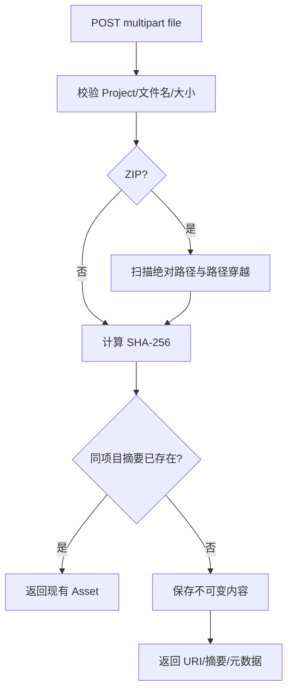
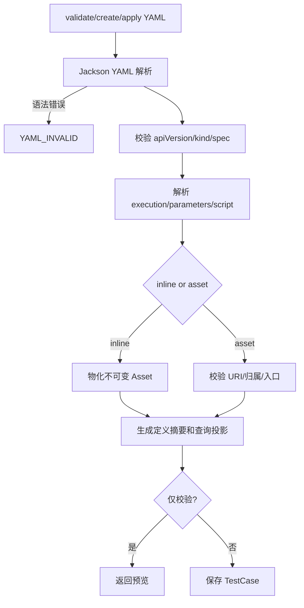
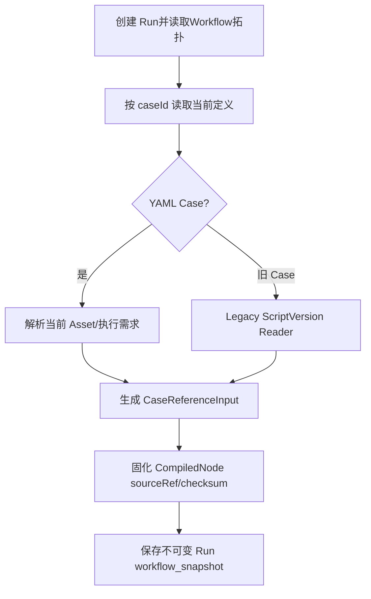
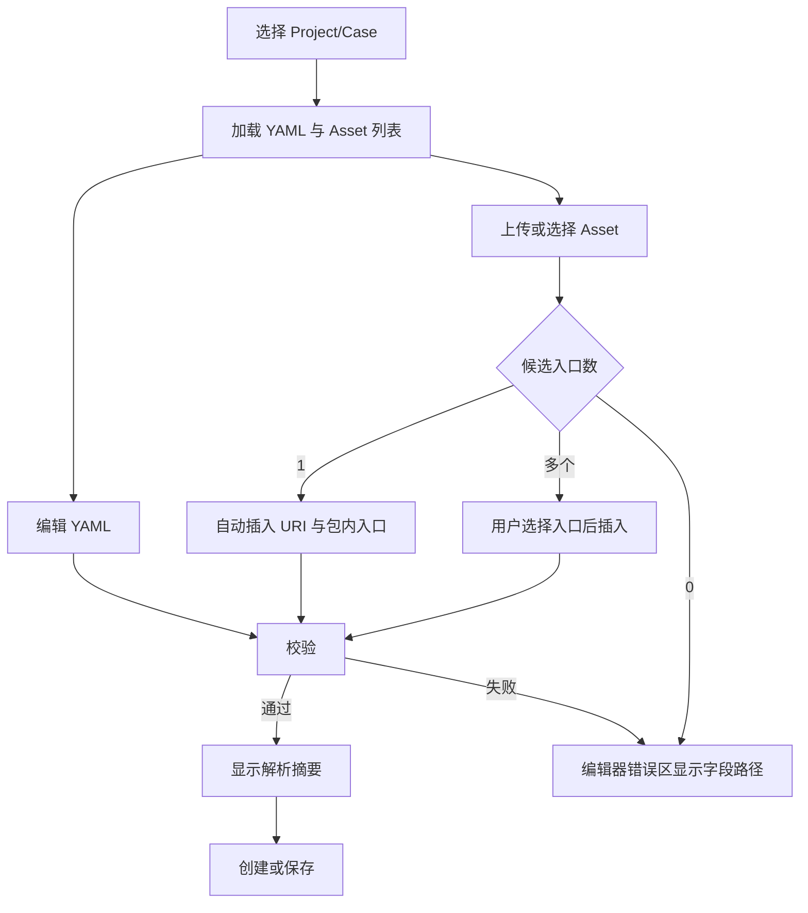
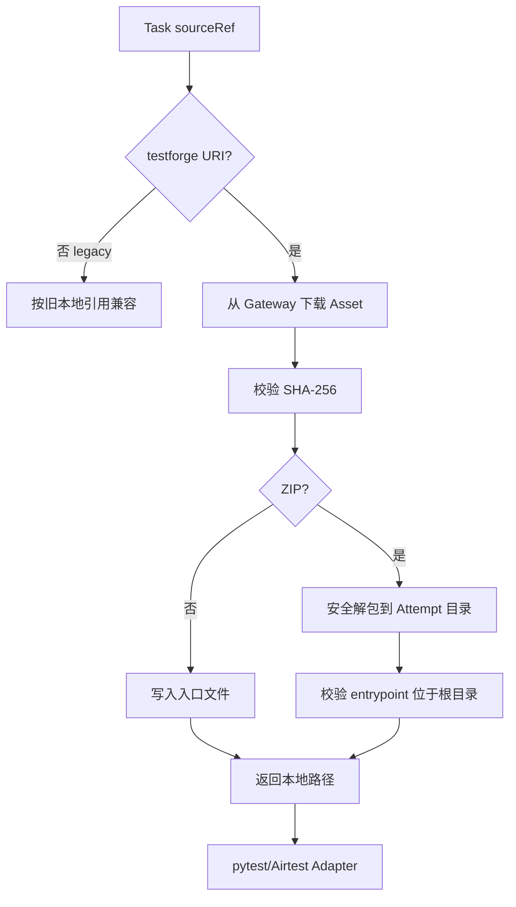
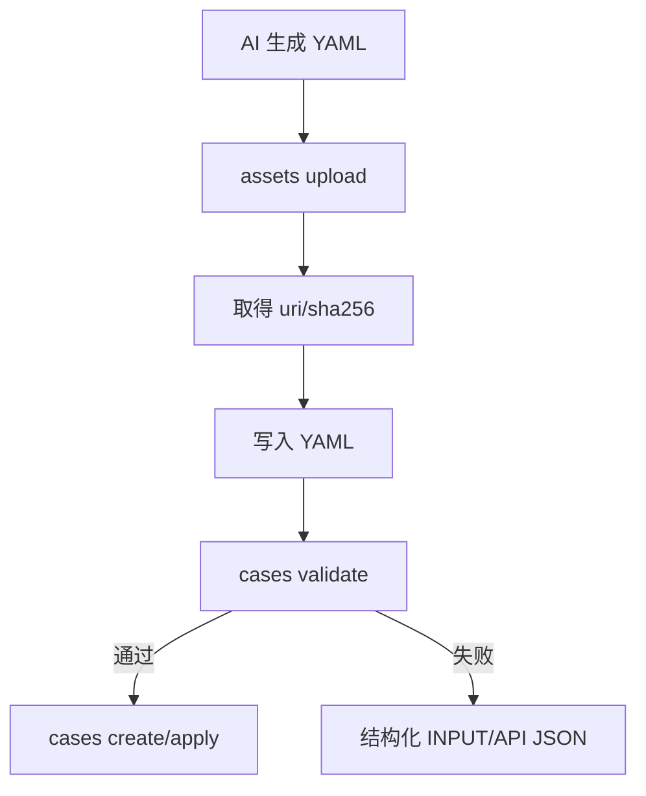

# TestForge YAML Case 与托管测试资源开发方案

## 1. 开发目标

| 编号 | 对应需求 | 开发目标 |
| --- | --- | --- |
| TA-G1 | TA-IN1、TA-IN7 | 建立 YAML Case 保存与旧 Case 兼容读取 |
| TA-G2 | TA-IN2 | 提供平台托管 Asset 上传、下载、摘要和安全校验 |
| TA-G3 | TA-IN3、TA-IN4 | 建立 YAML 编辑工作台并把不可变执行边界收敛到 Run execution snapshot |
| TA-G4 | TA-IN5、TA-IN6 | Worker 与 CLI 完成托管资源端到端调用 |

## 2. 功能清单与实施顺序

| 顺序 | 功能 | 前置依赖 | 核心产出 |
| --- | --- | --- | --- |
| 1 | Asset 托管与 URI | Project Catalog | CaseAsset API |
| 2 | YAML Case 校验与保存 | Asset API | TestCase definition/projection |
| 3 | Run 执行快照适配 | YAML Case + Workflow topology | 无 ScriptVersion 的当前 Case 解析 |
| 4 | YAML 编辑工作台 | 前三项 API | 上传、插入、校验、保存 |
| 5 | Worker 资源物化 | Asset content API | pytest/Airtest 本地入口 |
| 6 | CLI YAML/Asset 命令 | 公开 API | AI 可调用闭环 |

## 3. 功能开发设计

### 3.1 Asset 上传与读取

| 步骤 | 代码落点 | 输入 | 处理逻辑 | 数据/状态变化 | 输出/异常 |
| --- | --- | --- | --- | --- | --- |
| 1 | `CaseAssetController` | projectId、MultipartFile | 参数和上传限制 | 无 | 请求/400/413 |
| 2 | `CaseAssetService` | 文件名、媒体类型、bytes | SHA-256、ZIP entry 安全校验、包内 `.air`/`.py` 入口识别、项目内去重 | CaseAsset 新增或回读 | View/ASSET_INVALID |
| 3 | `CaseAssetController.content` | assetId | 读取不可变 bytes，设置长度、类型、文件名 | 无 | 二进制/404 |

| 接口/能力 | 方法/动作 | 请求字段 | 返回字段 | 错误码/异常 |
| --- | --- | --- | --- | --- |
| 上传 Asset | POST `/api/v1/projects/{projectId}/assets` multipart | file | id、projectId、fileName、contentType、sizeBytes、sha256、uri、entrypoints、createdAt | 400/404/413 |
| 列表 | GET `/api/v1/projects/{projectId}/assets` | projectId | Asset[] | 404 |
| 元数据 | GET `/api/v1/assets/{assetId}` | assetId | Asset | 404 |
| 内容 | GET `/api/v1/assets/{assetId}/content` | assetId | binary | 404 |

#### 3.1.1 并发实现方式

| 项 | 实现方式 |
| --- | --- |
| 并发不变量 | 同一 Project、同一 SHA-256 只保留一个逻辑 Asset |
| 竞争资源 | `(projectId, sha256)` |
| 控制粒度 | 数据库唯一约束 |
| 实现机制 | 先查后写；唯一约束冲突后回读 |
| 事务边界 | 摘要计算在事务外，元数据与内容保存同事务 |
| 幂等方式 | projectId + sha256 |
| 竞争失败处理 | 捕获冲突并回读同摘要实体 |
| 超时与恢复 | 上传失败不产生半记录 |

### 3.2 YAML Case 校验与保存

| 步骤 | 代码落点 | 输入 | 处理逻辑 | 数据/状态变化 | 输出/异常 |
| --- | --- | --- | --- | --- | --- |
| 1 | `CaseDefinitionParser` | projectId、yaml | 严格读取结构，生成 Definition | 无 | Definition/字段错误 |
| 2 | `CaseAssetService` | inline/asset spec | inline 写入 Asset；asset 校验归属 | Asset 可新增 | Asset/YAML_ASSET_INVALID |
| 3 | `TestCaseService` | Definition | 校验重名并保存原文、摘要和投影 | TestCase 新增/更新 | TestCaseView/409 |

| 接口/能力 | 方法/动作 | 请求字段 | 返回字段 | 错误码/异常 |
| --- | --- | --- | --- | --- |
| 校验 YAML | POST `/api/v1/projects/{projectId}/case-definitions/validate` | yaml | valid、digest、preview、normalizedScript | YAML_INVALID/ASSET_INVALID |
| 创建 YAML Case | POST `/api/v1/projects/{projectId}/case-definitions` | yaml | TestCaseView | 400/404/409 |
| 更新 YAML Case | PUT `/api/v1/cases/{caseId}/definition` | yaml | TestCaseView | 400/404/409 |
| 导出 YAML | GET `/api/v1/cases/{caseId}/definition` | caseId | yaml、digest | 404/409 legacy |

### 3.3 Run 执行快照

Case 节点的 `referenceVersion` 在新写路径固定为兼容值 `1`，不代表脚本版本；Subflow 仍使用真实 Workflow 拓扑版本。旧无 display snapshot 的发布版本继续按历史 compiled snapshot 解析。

### 3.4 YAML 编辑工作台

页面采用左侧 Case 列表、中央 YAML 编辑区、右侧“当前 Case 脚本”区。移除 ScriptVersion 列表、sourceRef 与 checksum 输入框。右侧只显示当前 Case 已绑定或刚上传待保存的 Asset；上传表示替换当前 Case 的 YAML 绑定，不展示项目历史 Asset 库，也不影响其他 Case。平台显示识别出的包内入口，禁止把 `.zip` 文件名直接写入 `entrypoint`。

### 3.5 Worker 资源物化

Worker 不缓存可变路径；每个 Attempt 使用独立目录。pytest 资源直接作为 pytest 入口执行，Airtest 包解压后把 `.air`/Python 入口交给 Airtest Adapter。

### 3.6 CLI 接入

| 命令 | 参数 | API | 结果 |
| --- | --- | --- | --- |
| `assets upload` | `--project --file` | multipart upload | Asset JSON + YAML snippet |
| `assets list/get` | projectId/assetId | Asset query | Asset JSON |
| `cases validate` | `--project --file` | validate | preview/digest |
| `cases create` | `--project --file` | create | TestCase |
| `cases apply` | caseId + file | update | TestCase |
| `cases export` | caseId | definition | YAML envelope |

## 4. 公共实现规则

| 规则类型 | 统一实现 | 适用功能 |
| --- | --- | --- |
| 摘要 | 所有内容摘要统一为 `sha256:<64 lowercase hex>` | 3.1～3.6 |
| 归属 | Asset/Case/Workflow 在服务端逐次校验 Project，不信任前端 URI | 3.1～3.4 |
| 版本 | Case/Asset 可编辑关系不提供版本列表；WorkflowVersion 冻结拓扑，Run execution snapshot 冻结实际执行内容 | 3.2～3.4 |
| 兼容 | 本机路径和 ScriptVersion 仅由 legacy reader 消费，新 API 拒绝产生 | 3.2、3.3、3.5 |
