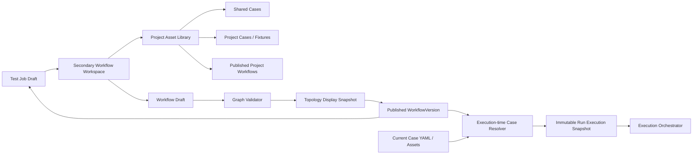
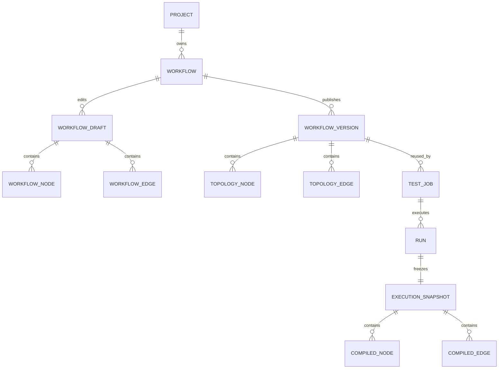

# TestForge 项目工作流编排架构设计

## 1. 总体架构



```text
Workflow Workspace（固定 projectId/testJobDraftId）
├─ 左侧节点资产：SHARED Case / PROJECT Case / Fixture / Subflow
├─ 中央 DAG：Node / Edge / Position
├─ 右侧属性：版本 / required / timeout / parameterOverrides / leaseScope
└─ 发布结果：WorkflowTopologyVersion + topology checksum
```

## 2. 关键规则

| 对象/场景 | 规则 | 生效条件 |
| --- | --- | --- |
| Workflow | 强归属 Project；名称在项目内可识别 | 创建、查询 |
| Node | 新类型 CASE/FIXTURE/SUBFLOW；引用必须来自项目化资产目录 | 编辑、发布 |
| Edge | predecessor→successor；条件为 ON_SUCCESS/ON_COMPLETION；不得形成环 | 保存、发布 |
| Subflow | 只引用同项目 PublishedWorkflowVersion；递归展开并拒绝循环引用 | 编译 |
| Topology snapshot | display 保存用户图、Case/Subflow 引用和坐标；发布后不可变 | 发布 |
| Execution snapshot | 创建 Run 时解析 Case 当前 YAML、脚本、SHA-256、资源需求并展开 Subflow | 执行创建 |
| Version | WorkflowVersion 只表示拓扑版本；Case 保存不生成新版本 | 发布、执行 |
| Runtime view | 真实边影响调度；虚拟起止/汇总边只用于解释并行结构 | 回放 |
| Legacy Suite | 只由 legacy resolver 编译，不进入新草稿写路径 | 兼容 |

## 3. 模块职责边界

| 模块 | 职责 | 数据/依赖 |
| --- | --- | --- |
| `test-job` | 提供 projectId、草稿上下文并接收发布版本 | TestJobConfigVersion |
| `case-catalog/testcase` | 返回当前项目可见 Case/Fixture | Project Catalog |
| `case-catalog/workflow` | 草稿、版本、节点边、校验和发布 | MySQL |
| `workflow/compile` | 发布时校验拓扑；执行创建时展开 Subflow、复制 Case 执行内容并计算 checksum | Case/Script/Workflow |
| `workflow/legacy` | 旧 SUITE 节点只读解析 | Legacy Suite |
| `testforge-client/workflows` | 二级工作台、Vue Flow、局部滚动和即时校验 | REST API |
| `run-orchestrator` | 请求 execution snapshot 并在 Run 创建事务中保存；后续只消费该快照 | WorkflowVersion、Case current definition |

## 4. 核心数据模型

### 4.1 编辑模型与执行快照



### 4.2 关键字段

| 模型 | 字段 | 类型 | 必填 | 说明 |
| --- | --- | --- | --- | --- |
| Workflow | id、projectId、name、state | UUID/String/Enum | 是 | 项目内工作流身份 |
| WorkflowDraft | revision、nodes、edges | long/JSON/JSON | 是 | 乐观锁草稿 |
| WorkflowNode | id、type、referenceId、referenceVersion、required、timeout、parameterOverrides、position | 混合 | 是 | 真实资产引用 |
| WorkflowEdge | id、source、target、condition | 混合 | 是 | 有向依赖 |
| WorkflowVersion | version、displaySnapshot、topologyChecksum | 混合 | 是 | 不可变 DAG 拓扑版本；旧 compiledSnapshot 仅作兼容读取 |
| Run | workflowVersion、workflowSnapshot、workflowChecksum | 混合 | 是 | 创建时冻结的实际执行版本 |
| CompiledNode | sourcePath、caseId、scriptVersionId、sourceRef、scriptChecksum、executionRequirement、parameters | 混合 | 是 | Run 内不可变可执行叶节点 |

## 5. 核心流程

### 5.1 发布拓扑与创建执行快照

```text
Test Job 选择 Project
  -> 创建/打开 Workflow Draft
  -> 从真实资产目录添加节点与边
  -> 前端即时校验
  -> 后端按 expectedRevision 保存
  -> 发布时重新校验归属、引用、参数、DAG 和 Subflow
  -> 保存 displaySnapshot
  -> 发布不可变 WorkflowTopologyVersion 并回填 Test Job
  -> Case 后续保存只更新 Case 当前定义
  -> 创建 Run 时读取所选拓扑版本
  -> 递归展开 Subflow，并重新读取每个 Case 当前定义
  -> 生成 executionSnapshot 与 execution checksum
  -> 在同一事务保存 Run、Task、依赖和派发意图
```

### 5.2 运行图解释

```text
compiledSnapshot 有真实边
  -> 按真实边渲染实线，状态来自 Task

compiledSnapshot 多个无入边根节点且无显式边
  -> 生成虚拟 Start
  -> Start 以虚线连接所有根节点
  -> 所有叶节点以虚线汇入 Join
  -> Join 连接 End
  -> 虚拟边不写数据库、不参与调度
```

## 6. 模块目录

标记：`[+]` 新增　`[~]` 修改　`[-]` 删除

```text
testforge-platform
├─ testforge-app/case-catalog/src/main/java/io/testforge/casecatalog/workflow
│  ├─ entity/[~] {TestWorkflowEntity,WorkflowDraftEntity,WorkflowVersionEntity}.java
│  ├─ graph/[~] {WorkflowNode,WorkflowEdge,EdgeCondition}.java
│  ├─ validation/[~] WorkflowGraphValidator.java
│  ├─ compile/[~] {WorkflowSnapshotCompiler,WorkflowReferenceResolver}.java
│  ├─ legacy/[~] SuiteNodeResolver.java
│  └─ service/[~] {WorkflowDraftService,WorkflowPublishService}.java
├─ testforge-client/src
│  ├─ jobs/[~] TestJobManagement.vue
│  └─ workflows/[~] {WorkflowDesigner.vue,index.ts}
└─ contracts/openapi/v1/[~] testforge.yaml
```

## 7. 数据与迁移

| 类型 | 归属 | 处理方式 |
| --- | --- | --- |
| Workflow projectId、草稿和版本 | case-catalog JPA 实体 | JPA DDL update |
| 旧 SUITE 节点 | 既有 snapshot | 不改写；legacy resolver 按旧版本读取 |
| 新发布版本 | WorkflowVersion | 永远不覆盖旧版，按 topology version/checksum 新增 |
| 新执行 | Run.workflowSnapshot | 在 Run 创建时一次性写入；任何后续 Case 修改都不回写 |
