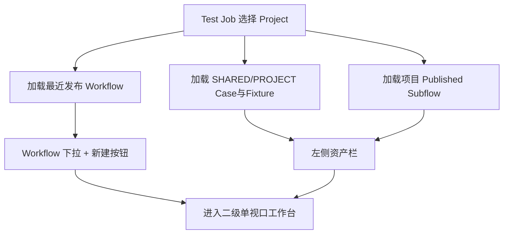
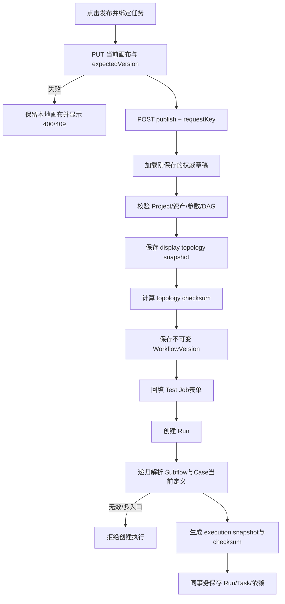
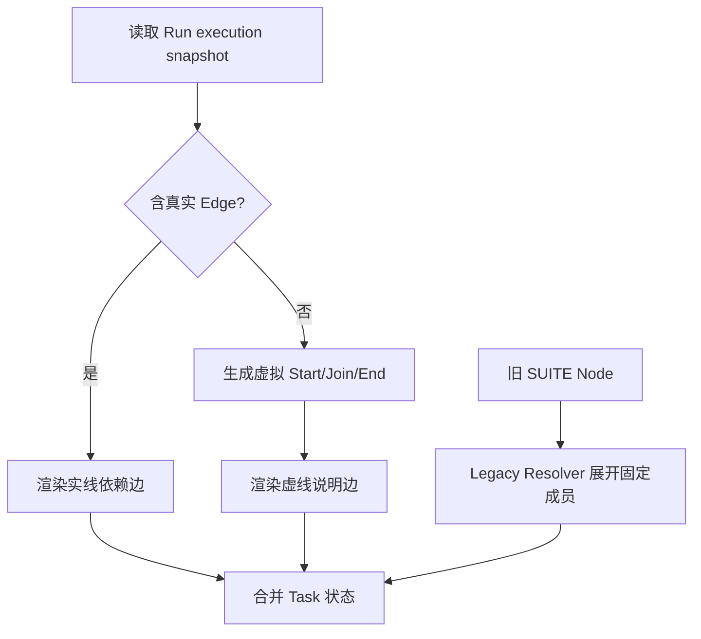

# TestForge 项目工作流编排开发方案

## 1. 开发目标

| 编号 | 对应需求 | 开发目标 |
| --- | --- | --- |
| WF-G1 | WF-IN1～WF-IN3 | 在 Test Job 二级工作台使用真实项目资产编辑 DAG |
| WF-G2 | WF-IN4、WF-IN5 | 后端权威校验并发布不可变拓扑；创建执行时解析 Case 当前定义并固化执行快照 |
| WF-G3 | WF-IN6、WF-IN7 | 运行图解释并保留旧 Suite 执行兼容 |

## 2. 功能清单与实施顺序

| 顺序 | 功能 | 前置依赖 | 核心产出 |
| --- | --- | --- | --- |
| 1 | 项目化节点库与二级工作台 | Test Job Project | Workflow Workspace |
| 2 | 草稿编辑、保存与校验 | 真实资产目录 | Draft revision、合法 DAG |
| 3 | Workflow 拓扑发布 | 合法草稿 | WorkflowTopologyVersion |
| 4 | Run 执行快照解析 | 拓扑版本、当前 Case | immutable executionSnapshot |
| 5 | 运行图与旧数据兼容 | Published Version、执行状态 | 可解释 DAG、Legacy Resolver |

## 3. 功能开发设计

### 3.1 项目化节点库与二级工作台



| 步骤 | 代码落点 | 输入 | 处理逻辑 | 数据/状态变化 | 输出/异常 |
| --- | --- | --- | --- | --- | --- |
| 1 | TestJobManagement.vue | projectId | 加载默认 Workflow 与资产目录 | 草稿上下文 | loading/error |
| 2 | WorkflowDesigner.vue | projectId、testJobDraftId | 切换独立工作台，管理局部滚动 | 前端编辑状态 | workspace |
| 3 | Workflow asset API | projectId | 合并通用/项目资产和 Subflow | 无 | NodeAsset[] |

### 3.2 草稿编辑、保存与校验

```mermaid
flowchart TD
    A[点击真实资产] --> B[创建 Node(referenceId)]
    B --> C[编辑属性/位置]
    C --> D[连接依赖边]
    D --> E[前端即时校验]
    E -->|失败| X[标记节点/边]
    E -->|通过| F[PUT graph + expectedVersion]
    F --> G[后端权威校验]
    G --> H[revision+1]
```

| 接口/能力 | 方法/动作 | 请求字段 | 返回字段 | 错误码/异常 |
| --- | --- | --- | --- | --- |
| 创建 Workflow | POST `/api/v1/projects/{projectId}/workflows` | name、targetId? | workflowId、draftRevision | 400/404/409 |
| 保存并权威校验草稿 | PUT `/api/v1/workflows/{id}/graph` | expectedVersion、nodes、edges | WorkflowView、draftRevision | 400/404/409 |
| 发布已保存草稿 | POST `/api/v1/workflows/{id}/publish` | requestKey | PublishedWorkflowVersionView | 400/404/409 |

工作台中的“发布并绑定任务”不是单独的盲发布：前端必须先用当前画布调用 `PUT /graph`，收到新 `draftRevision` 后再调用 `POST /publish`，最后才向 Test Job 表单发送 `published` 事件并回填 `workflowId`。保存失败时禁止继续发布；“绑定”只更新尚未保存的 Test Job 表单，不隐式保存或激活测试任务。

#### 3.2.1 并发实现方式

| 项 | 实现方式 |
| --- | --- |
| 并发不变量 | 草稿 revision 单调；旧 revision 不覆盖新图 |
| 竞争资源 | workflowId 当前 Draft |
| 控制粒度 | workflowId |
| 实现机制 | expectedRevision + 乐观锁 |
| 事务边界 | 节点、边和 revision 同事务保存 |
| 幂等方式 | 相同 revision/checksum 重复保存回读 |
| 竞争失败处理 | 返回 409 和最新 revision，前端保留本地草稿 |
| 超时与恢复 | 自动保存失败不清空本地图，显式提示重试 |

### 3.3 Workflow 拓扑发布与执行快照



| 步骤 | 代码落点 | 输入 | 处理逻辑 | 数据/状态变化 | 输出/异常 |
| --- | --- | --- | --- | --- | --- |
| 1 | WorkflowDesigner | 当前 nodes/edges、expectedVersion | 先保存当前画布，保存失败则停止 | draftRevision+1 | 400/404/409 |
| 2 | TestWorkflowService / WorkflowPublishService | workflowId、requestKey、已保存 Draft graph | 锁定草稿、重验并保存拓扑发布版本 | PublishedVersion | 400/404/409 |
| 3 | WorkflowReferenceResolver | Run 创建 + topology | 递归解析 Case/Fixture/Subflow 当前执行定义 | Reference Catalog | 404/409 |
| 4 | WorkflowSnapshotCompiler | Resolved references | 展开 Subflow、复制资源需求并生成执行快照 | CompiledWorkflowSnapshot | compile error |
| 5 | RunTaskService | execution snapshot/checksum | 同事务保存 Run/Task/依赖/派发意图 | Run | 409 |

| 数据模型 | 字段 | 类型 | 必填 | 用途与约束 |
| --- | --- | --- | --- | --- |
| SaveGraphRequest | expectedVersion | int | 是 | 防止旧草稿覆盖当前 revision |
| PublishRequest | requestKey | UUID | 是 | 发布幂等键；发布对象始终是服务端已保存草稿 |
| WorkflowVersion | version、displaySnapshot、topologyChecksum | 混合 | 是 | 发布后不可修改的 DAG 拓扑 |
| Run | workflowVersion、workflowSnapshot、workflowChecksum | 混合 | 是 | 执行创建后不可修改 |
| CompiledNode | caseId、scriptVersionId、sourceRef、scriptChecksum、executionRequirement、sourcePath | 混合 | 是 | 本次执行唯一输入 |

#### 3.3.1 并发实现方式

| 项 | 实现方式 |
| --- | --- |
| 并发不变量 | 同一 Workflow 版本号唯一；发布使用指定草稿 revision |
| 竞争资源 | workflowId 当前版本号、draft revision |
| 控制粒度 | workflowId |
| 实现机制 | 行锁/乐观锁 + 唯一约束 |
| 事务边界 | 发布事务保存拓扑版本；Run 事务保存执行快照、Task、依赖和派发意图 |
| 幂等方式 | requestKey/checksum 相同发布回读原版本 |
| 竞争失败处理 | 冲突方读取已发布版本或重新基于最新草稿发布 |
| 超时与恢复 | 编译失败事务回滚，不产生半版本 |

### 3.4 运行图与旧数据兼容



| 步骤 | 代码落点 | 输入 | 处理逻辑 | 数据/状态变化 | 输出/异常 |
| --- | --- | --- | --- | --- | --- |
| 1 | RunGraphController/RunCenter.vue | Run execution snapshot、Task states | 真实边实线，虚拟说明边虚线；不回读 Case 当前定义 | 只读页面 | graph |
| 2 | VirtualGraphDecorator | root/leaf nodes | 仅生成展示 Start/Join/End | 不持久化 | decorated graph |
| 3 | Legacy SuiteNodeResolver | old node snapshot | 按固定成员展开 | 无 | compiled leaves/错误 |

### 3.5 DAG 后继任务派发

前置 Task 进入终态时，`DagReleaseService` 只负责以 CAS 将满足条件的后继节点从
`WAITING_DEPENDENCY` 推进到 `QUEUED/BLOCKED`。对本轮真正进入 `QUEUED` 的
`releasedTaskIds`，配额服务必须在同一事务中登记 `TaskDispatchRegistration`；不能只改
Task 状态，否则页面会显示有可用设备但后继 Case 永久排队。重复终态回调不会再次释放
同一 Task，因此也不会重复登记 Outbox。

## 4. 公共实现规则

| 规则类型 | 统一实现 | 适用功能 |
| --- | --- | --- |
| 真相源 | 后端校验和发布结果权威；前端即时校验只改善反馈 | 3.2、3.3 |
| 归属 | 所有引用以 Workflow.projectId 校验 | 3.1～3.3 |
| 快照 | Workflow display 用于拓扑；Run compiled snapshot 用于执行和历史回放 | 3.3、3.4 |
| DAG 派发 | 状态释放与 Outbox 登记同事务；只有 CAS 实际释放的后继节点登记一次 | 3.5 |
| 布局 | 主视口固定，左右侧栏内部滚动，画布自适应 | 3.1、3.4 |
