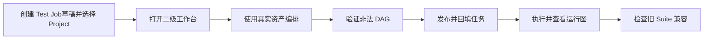

# TestForge 项目工作流编排验收方案

## 1. 验收流程

### 1.1 验收准备

| 项目 | 要求 |
| --- | --- |
| 验收版本 | 固定后端、前端与 OpenAPI Commit |
| 验收环境 | 两个 Project、SHARED/PROJECT Case、Fixture、已发布 Subflow、一个旧 Suite 快照 |
| 浏览器 | 桌面宽屏和 900px 视口 |
| 证据目录 | `acceptance/evidence/workflow-orchestration/` |

### 1.2 执行顺序

## 2. 流程验收场景

| 场景编号 | 覆盖的成功标准 | 前置条件 | 操作 | 预期结果 | 已知相邻影响检查 | 证据要求 |
| --- | --- | --- | --- | --- | --- | --- |
| WF-AC-01 | WF-S1 | 两 Project 有不同资产 | 未选、选择并切换 Project | 未选时禁用；选择后只显示通用和当前项目资产 | Test Job 其他字段保留 | DOM、API、录屏 |
| WF-AC-02 | WF-S2 | 节点库已加载 | 点击 Case/Fixture/Subflow，连边并保存 | 节点带真实引用，无手填 UUID | 属性面板可编辑参数 | 草稿响应、截图 |
| WF-AC-03 | WF-S3 | 可修改图 | 分别提交自依赖、重复边、环、跨项目、递归 Subflow | 后端拒绝并定位具体节点/边/引用链 | 合法草稿仍在 | 错误响应、前端提示 |
| WF-AC-04 | WF-S4 | Workflow v1 已发布且 Case 绑定脚本 A | 创建执行 A；修改 Case 为脚本 B；再次用同一 Workflow v1 创建执行 B | Workflow 仍为 v1；执行 A 快照仍是 A；执行 B 快照为 B | A 处于 QUEUED/RUNNING 时也不得漂移 | Workflow/Run/Task 快照与 checksum |
| WF-AC-05 | WF-S5 | v1 已发布 | 创建两个 Test Job 均选择 v1，并在两次执行之间修改 Case | 两任务引用同一拓扑版本；各自 Run 固化创建时 Case | 两任务 Commit 各自固定 | API、数据库 |
| WF-AC-06 | WF-S6 | 八个无边根 Case | 执行并打开运行中心 | 显示虚拟开始、并行虚线、汇总和完成；Task 实际并行 | 结果数与 Case 数一致 | 页面、图数据、时间线 |
| WF-AC-07 | WF-S7 | 资产数量超过侧栏高度 | 在两个视口打开工作台并滚动资产/属性 | 页面主视口无纵向滚动，左右栏独立滚动 | 画布缩放与拖动正常 | 双视口截图/录屏 |
| WF-AC-08 | WF-S7 | 旧 Suite 快照存在 | 查询并执行旧版本 | 新节点库无 Suite；旧版本仍可编译运行并标记兼容 | 新草稿不能保存 SUITE | DOM、API、执行结果 |
| WF-AC-09 | WF-S8 | 准备无入口与含两个 `.air` 根的 ZIP | 上传并尝试保存 Case/创建执行 | 平台拒绝无脚本、零入口和多主入口；数据库无半成品 | 单入口 ZIP 与单 `.py` 正常 | 400 响应、数据库核对 |
| WF-AC-10 | WF-S2、WF-S3 | 新 Workflow 为 `draft r0`，画布已加入节点但尚未手动保存 | 点击“发布并绑定任务” | 请求顺序严格为 `PUT /graph` 后 `POST /publish`；发布版本包含当前画布；保存失败时不调用 publish；空服务端草稿直接发布返回结构化 400 而非 500 | Test Job 只回填 workflowId，不被隐式保存或激活 | 组件请求顺序、API 响应、浏览器结果 |
| WF-AC-11 | WF-S3 | 两个 UI Case 以 `ON_SUCCESS` 相连，前置 Case 可成功 | 执行测试任务并等待前置回调 | 前置成功后，后继从 `WAITING_DEPENDENCY` 进入 `QUEUED` 且同事务产生一次 Outbox；Worker 自动领取，Run 最终 2/2 成功 | 重复前置终态回调不重复派发 | 配额集成测试、Redis Stream、真实 Run |

## 3. 并发验收

| 项目 | 验收口径 |
| --- | --- |
| 并发不变量 | 旧草稿 revision 不覆盖新 revision；同一版本号只发布一次 |
| 负载模型 | 两个浏览器同时编辑同一 Workflow，并发提交同一 revision；随后并发发布 |
| 并发量与持续时间 | 每类两个请求，重复 20 轮 |
| 执行步骤 | A/B 同时保存；胜者成功，失败者带旧 revision；再并发发布 |
| 达标指标 | 丢失更新=0、重复版本号=0、半快照=0 |
| 已知相邻影响检查 | Test Job 只回填一个完整 Workflow 拓扑版本；执行快照只生成一次 |
| 证据要求 | 请求响应、版本表、Run workflow_snapshot/checksum 和前端冲突提示 |

## 4. 执行记录与证据

| 场景编号 | 状态 | 实际结果 | 执行命令或操作 | 证据路径 | 执行人 / 时间 |
| --- | --- | --- | --- | --- | --- |
| WF-AC-01～WF-AC-09 | NOT_RUN | 文档合并后待按当前工作流模型执行 | 依场景执行 | `acceptance/evidence/workflow-orchestration/` | 待填写 |
| WF-AC-10 | PASS | 前端定向测试确认保存先于发布且保存失败不发布；后端重启后真实空草稿发布返回 400 `VALIDATION_ERROR` | Vitest、case-catalog test、Invoke-WebRequest | TFP-069 执行记录 | Codex / 2026-09-26 |
| WF-AC-11 | PASS | 前置成功后后继自动登记 Outbox 并由另一台 VM 领取；无人工队列补偿的 Run `d3562515-b6a7-47ca-9595-a907b8d2b2a8` 2/2 SUCCEEDED | RunConcurrencyQuotaServiceIntegrationTest、真实 Jenkins/双 VM Run | TFP-073 执行记录 | Codex / 2026-09-26 |

### 验收结论

| 项目 | 结论 |
| --- | --- |
| 核心流程 | NOT_RUN |
| 并发要求 | NOT_RUN |
| 阻塞问题 | 待真实 API 与浏览器验收 |
| 最终结论 | 待执行后填写 |

> 历史记录说明：上述既有执行结果来自独立仓库建立前的开发环境，原始材料不随公开仓库分发，不能作为本次公开版本的验收结论。当前验证范围见 [公开准备记录](../reference/公开准备记录.md).
