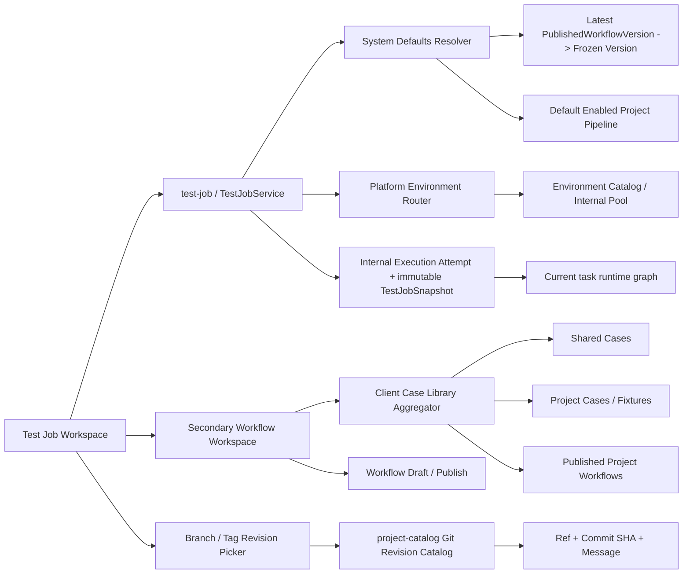
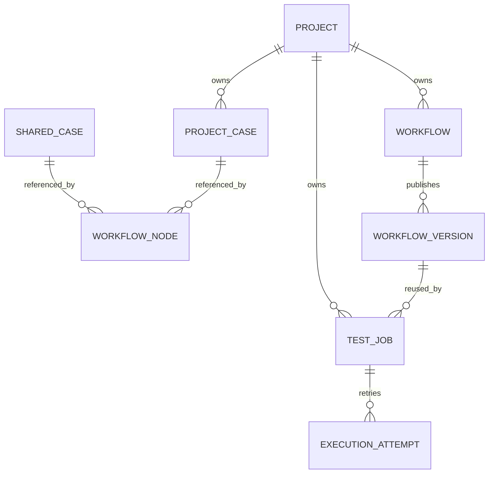

# TestForge 测试任务管理架构设计

## 1. 总体架构



## 2. 关键关系



| 关系 | 约束 |
| --- | --- |
| Project → Workflow | 一对多，Workflow 不允许跨 Project 迁移 |
| Test Job → WorkflowVersion | 每个 Job 恰好一个固定拓扑版本；不冻结 Case 内容 |
| Test Job → Commit | 保存草稿时解析并固化；确认后不可修改 |
| Test Job → ExecutionAttempt | 一对多内部历史；用户界面只突出当前 Attempt |
| WorkflowVersion → Test Job | 一对多，可作为模板被多个 Job 复用 |
| Workflow → Subflow | 同 Project 的发布版本引用；递归展开且拒绝环 |
| Case → Workflow | 通用 Case 可跨 Project 引用；项目 Case 仅可被所属 Project 引用 |
| Suite | 仅历史兼容，不进入新建关系 |

## 3. 模块职责

| 模块 | 职责 | 不负责 |
| --- | --- | --- |
| `test-job` | 用户可见测试任务、UUID、固定 WorkflowTopologyVersion/Commit、复制和配置冻结 | 编辑节点、冻结 Case 内容、让用户指定具体环境或并发 |
| `case-catalog/testcase` | 通用与项目 Case 元数据、可执行脚本版本 | 流程依赖 |
| `case-catalog/workflow` | Project 内草稿、DAG 校验、发布快照、遗留 Suite 兼容 | Test Job 生命周期 |
| `testforge-client/src/jobs` | 任务主入口、二级 Workflow 工作台切换、级联资源加载与发布结果回填 | 手填内部 ID |
| `run-orchestrator` | 为任务创建内部 Attempt、限制单活动执行、返回当前运行图与重试历史 | 修改任务测试对象或 Workflow |

## 4. 页面结构

```text
主导航
├─ 01 测试任务（默认）
│  ├─ 任务列表
│  └─ 任务草稿
│     ├─ 基本信息与 Project
│     ├─ Workflow：选择已有 / 进入二级工作台
│     └─ Git 版本、目标系统与普通/紧急优先级
│
│  二级 Workflow 工作台（单视口）
│  ├─ 返回测试任务 / Workflow 身份
│  ├─ 左侧节点资产（内部滚动）
│  ├─ 中央 DAG 画布（自适应剩余空间）
│  ├─ 右侧节点属性（内部滚动）
│  └─ 固定底部保存与发布操作
├─ 02 实时运行中心
│  ├─ 左侧测试任务
│  ├─ 右侧当前执行图与结果
│  └─ 折叠重试历史（内部 Attempt）
├─ 03 被测项目
└─ 04 环境资源
```

## 5. 兼容策略

| 数据 | 新行为 | 兼容行为 |
| --- | --- | --- |
| Suite 资产 | 不再创建、不在编辑器展示 | API/表暂不删除 |
| SUITE 节点 | 新草稿不能新增 | 旧草稿与发布快照可加载、编译、运行 |
| Workflow 工作台 | 不出现在顶层导航，通过 Test Job 进入二级全屏工作台 | 组件仍受当前 Project/Test Job 上下文约束 |
| 已发布版本 | 选择 Workflow 时保存最新发布拓扑版本 | 拓扑不漂移；每次 Run 创建时固化 Case 当前定义，Run 创建后不漂移 |
| Test Job 编码 | 后端生成 UUID，UI 隐藏 | 旧的人类可读编码继续保留 |
| 并发字段 | 不再由用户填写，后端写入系统安全上限 | 旧 Run 快照继续读取原值；实际执行始终受资源租约约束 |
| Git 版本 | UI 选择 BRANCH/TAG 并展示当前 Commit 元数据 | 历史 DEFAULT_BRANCH/COMMIT 任务可读；编辑时归一为分支/Tag 选择器 |
| 历史 Run | 不再作为用户主模型；新页面称为执行 Attempt | 原表、API 与报告关联保留，避免破坏历史证据 |

## 6. 模块目录

```text
testforge-platform
├─ contracts/openapi/v1
│  └─ [~] testforge.yaml
├─ testforge-app/test-job/src/main/java/io/testforge/testjob
│  ├─ [~] ctrl/TestJobController.java
│  ├─ [~] entity/TestJobEntity.java
│  ├─ [~] model/TestJobView.java
│  └─ [~] service/TestJobService.java
├─ testforge-app/run-orchestrator/src/main/java/io/testforge/runorchestrator
│  └─ job
│     ├─ [~] TestJobLaunchService.java
│     └─ [~] TestJobRunQueryService.java
├─ testforge-app/project-catalog/src/main/java/io/testforge/projectcatalog/revision
│  ├─ [~] RevisionResolver.java
│  ├─ [~] GitRevisionResolver.java
│  └─ [+] RevisionOption.java
├─ testforge-app/case-catalog
│  └─ testcase
│     ├─ model/CaseScope.java
│     ├─ service/TestCaseService.java
│     └─ ctrl/TestCaseController.java
├─ testforge-client/src
│  ├─ app/App.vue
│  ├─ app/styles.css
│  ├─ [~] jobs/TestJobManagement.vue
│  ├─ [~] jobs/TestJobManagement.test.ts
│  ├─ [+] jobs/RevisionPicker.vue
│  ├─ [+] jobs/RevisionPicker.test.ts
│  ├─ [~] jobs/index.ts
│  ├─ [~] runs/RunCenter.vue
│  ├─ [~] workflows/WorkflowDesigner.vue
│  └─ projects/AssetManagement.vue
└─ docs
   ├─ 04-test-job-management/
   ├─ tasks/TFP-057.md
   ├─ tasks/TFP-059.md
   ├─ tasks/TFP-060.md
   ├─ tasks/TFP-061.md
   └─ [+] tasks/TFP-062.md
```

## 7. 数据与迁移

| 类型 | 归属 | 处理方式 |
| --- | --- | --- |
| 普通实体字段 | `test_job.resolved_commit`、`test_job.commit_message`、`test_job.revision_resolved_at` | 由 JPA DDL update 增加；旧任务首次执行时补固化，不进入 simple-migration |
| 历史运行数据 | `run_orchestrator_run` | 原表保留并作为内部 Attempt 读取，不删除、不搬迁 |
