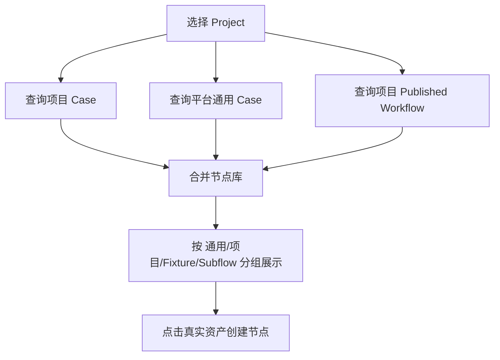
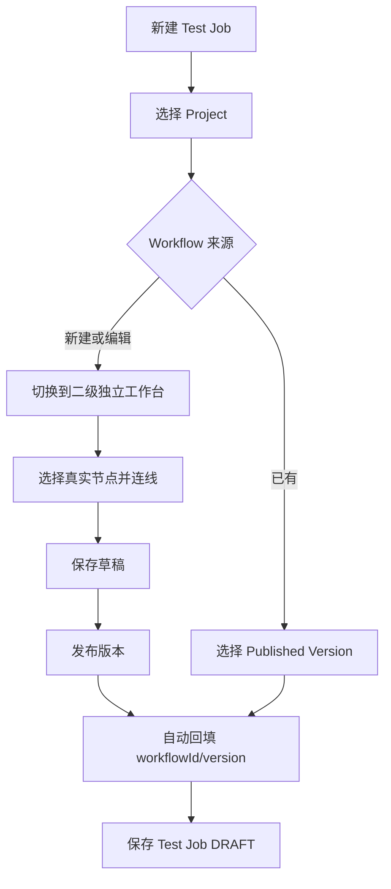
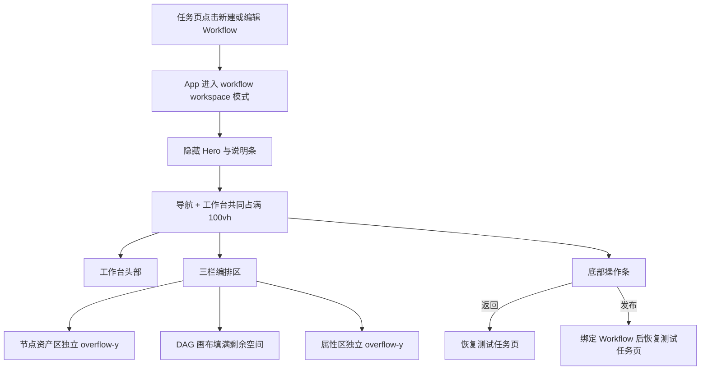
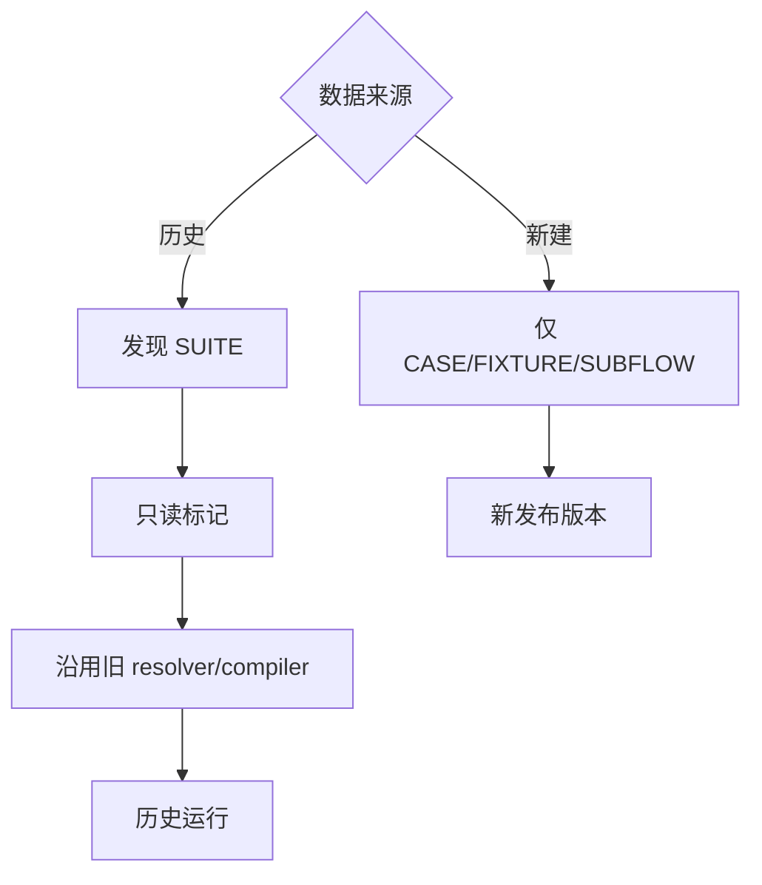
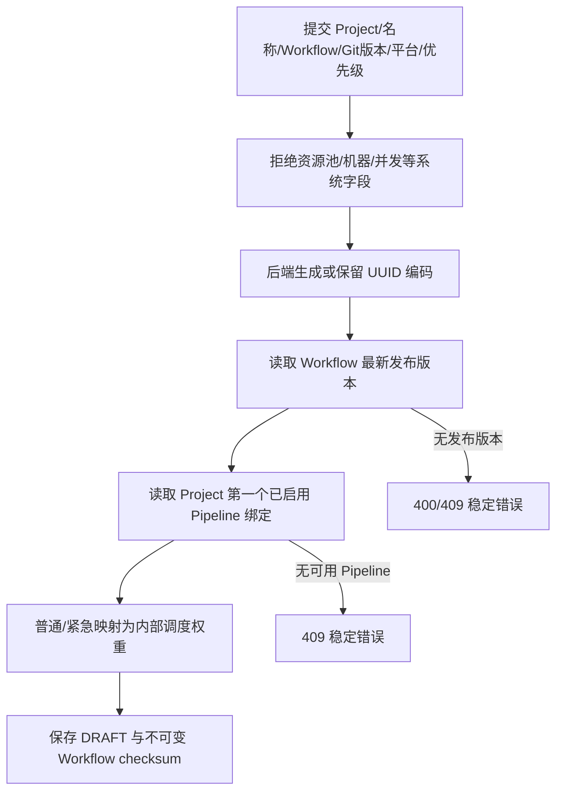
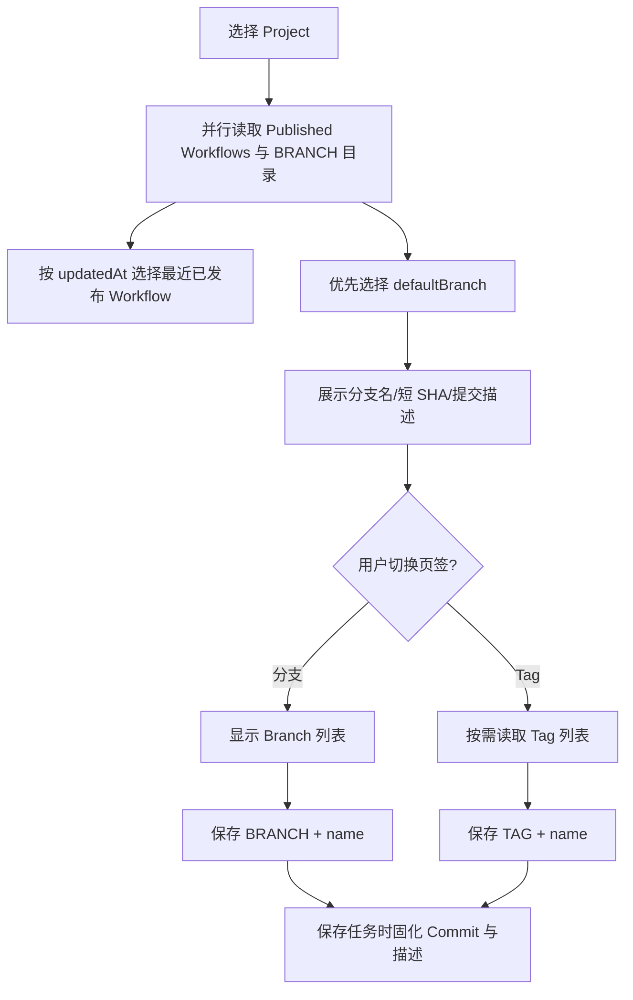
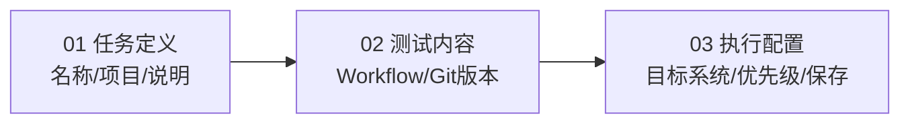
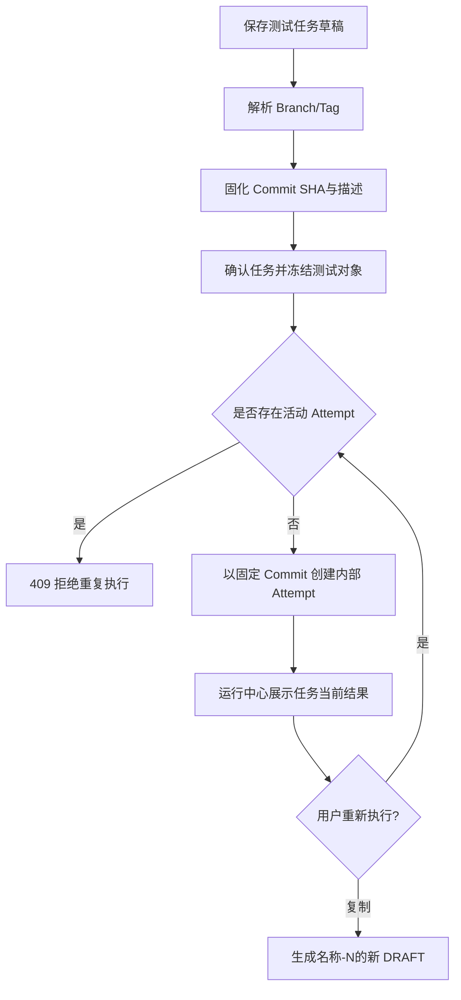
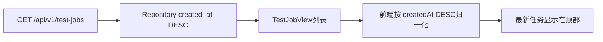

# TestForge 测试任务管理开发方案

## 1. 开发目标

| 编号 | 目标 |
| --- | --- |
| TJ-G1 | 将测试任务调整为默认入口，并从任务草稿进入二级 Workflow 工作台 |
| TJ-G2 | 建立通用 Case + 项目 Case 的可查询节点库，禁止随机引用 |
| TJ-G3 | 收敛 Suite，明确一 Job 一 WorkflowVersion 与版本复用关系 |
| TJ-G4 | 将创建表单收敛为业务意图输入，并由后端解析 UUID、最新 Workflow、默认 Pipeline 与调度默认值 |

## 2. 实施顺序

| 顺序 | 功能 | 产出 |
| --- | --- | --- |
| 1 | Case 作用域与节点库查询 | SHARED/PROJECT Case 及项目节点库 API |
| 2 | Workflow 编辑器受控化 | 由父页面传入 Project/Workflow，资产选择式加节点，提供二级页返回事件 |
| 3 | Test Job 草稿集成 | 选择已有版本或进入独立工作台，新建、保存、发布并自动回填 |
| 4 | 导航与 Suite 收敛 | Test Job 首屏，移除顶层 Workflow 与 Suite 新建 UI |
| 5 | 兼容与测试 | 遗留 SUITE 后端路径不删除；补齐单测与构建验证 |
| 6 | 表单与默认值收敛 | 移除系统字段和并发输入；增加后端默认解析与负载驱动验证 |
| 7 | Git 版本与 Workflow 默认选择 | 分支/Tag 目录、Commit 元数据、Azure 风格选择器与最新 Workflow 默认值 |
| 8 | 创建表单视觉分区 | 任务定义、测试内容、执行配置三区布局及响应式降级 |
| 9 | 单层测试任务执行 | 固化 Commit、冻结任务、复制任务、单活动 Attempt 与两栏运行中心 |
| 10 | 任务列表排序 | 后端按 createdAt 降序查询，前端归一化为最新任务优先 |

## 3. 功能开发设计

### 3.1 项目化节点库

| 步骤 | 代码落点 | 处理 |
| --- | --- | --- |
| 1 | `TestCaseEntity/Service` | 增加 CaseScope；项目 Case 保持 Project/Target 约束，通用 Case 不绑定项目 Target |
| 2 | `TestCaseController` | 提供 shared 列表；沿用 project cases 查询 |
| 3 | `WorkflowDesigner.vue` | 聚合 shared cases、project cases 和 project workflows，展示名称、来源和版本；删除随机 UUID 新节点逻辑 |
| 4 | `WorkflowReferenceResolver` | CASE/FIXTURE 允许同项目或 SHARED；SUBFLOW 仍只允许同项目 |

### 3.2 任务内编排

| 步骤 | 代码落点 | 处理 |
| --- | --- | --- |
| 1 | `TestJobManagement.vue` | Project 选择后加载 Workflows 与节点库 |
| 2 | `WorkflowDesigner.vue` | 通过 props 接受 projectId/workflowId，以单根视口布局呈现，通过 emits 返回、创建与发布结果 |
| 3 | `TestJobManagement.vue` | 进入编排时隐藏任务列表与表单；发布成功刷新列表、绑定版本并返回任务页 |
| 4 | `TestJobService` | 继续校验 Workflow 属于 Project 且版本存在；数据结构保持单值绑定 |

### 3.3 二级单视口布局

| 步骤 | 代码落点 | 处理 |
| --- | --- | --- |
| 1 | `TestJobManagement.vue` | 用互斥视图替代内嵌编辑器；进入/退出时向 App 发出工作台状态 |
| 2 | `App.vue` | 工作台状态下保留主导航，隐藏 Hero/说明条；切换顶层模块时退出工作台模式 |
| 3 | `WorkflowDesigner.vue` | 增加返回头部，拆分节点库滚动区与固定工具区，发布后回传绑定结果 |
| 4 | `styles.css` | 用 `100vh + minmax(0, 1fr) + overflow:hidden` 锁定外层，只开放局部滚动 |

### 3.4 Suite 收敛与历史兼容

| 新建路径 | 历史路径 |
| --- | --- |
| Asset 页面不显示 Suite 表单 | Suite API 和表保留 |
| 编辑器不提供 SUITE 按钮或类型切换 | 旧节点可加载、编译、运行 |
| Workflow 直接编排多个 Case | 不自动篡改旧发布快照 |

#### 3.4.1 并发实现方式

本改动不新增调度并发模型。Workflow 草稿继续使用 `draftRevision` 乐观锁；两个页面同时编辑同一草稿时，后提交者收到版本冲突并重新加载。发布版本不可变，多个 Test Job 并发引用同一版本只读，不产生锁竞争。

### 3.5 系统参数自动解析

| 步骤 | 代码落点 | 输入 | 处理逻辑 | 输出/异常 |
| --- | --- | --- | --- | --- |
| 1 | `TestJobManagement.vue` | 用户表单 | 只提交业务字段，优先级限制为普通/紧急 | 精简 SaveTestJobRequest |
| 2 | `TestJobService` | code 为空 | 创建时生成 UUID；更新时保留原编码 | 稳定系统标识 |
| 3 | `WorkflowPublishService.list` | workflowId | 取版本号最大的已发布版本并固化 checksum | 无版本则拒绝保存 |
| 4 | `PipelineCatalogService.list` | projectId | 选择第一个已启用项目绑定 | 无可用项则拒绝保存 |
| 5 | `TestJobService` | priority | NORMAL=5、URGENT=9；其他值拒绝 | 内部调度权重 |

#### 并发实现方式

| 项 | 实现方式 |
| --- | --- |
| 并发不变量 | 同一 Test Job 配置版本只接受一次有效更新；用户输入永远不能写入资源池、机器或并发上限 |
| 竞争资源 | Test Job 草稿的 configVersion |
| 控制粒度 | testJobId |
| 实现机制 | expectedConfigVersion + 乐观锁；资源字段不在新请求模型中 |
| 事务边界 | Test Job 配置和固定 Workflow/Revision 快照同事务保存 |
| 幂等方式 | requestKey/config checksum 相同请求回读 |
| 竞争失败处理 | 返回 409 和最新版本，不覆盖胜者 |
| 超时与恢复 | 保存失败保留客户端草稿，重新加载后再提交 |

### 3.6 Git 版本选择与 Workflow 默认值

| 步骤 | 代码落点 | 输入 | 处理逻辑 | 输出/异常 |
| --- | --- | --- | --- | --- |
| 1 | `GitRevisionResolver.list` | repositoryUrl、defaultBranch、BRANCH/TAG | 本地仓库读取 refs 与 commit subject；远程仓库使用临时 bare clone 后读取 | `RevisionOption[]` / Git 稳定错误 |
| 2 | `ProjectCatalogController` | projectId、type | 解析项目执行仓库并返回版本目录 | 分支/Tag 目录 |
| 3 | `RevisionPicker.vue` | projectId、当前选择 | 默认加载分支；Tag 页签按需加载；选中后回传类型和名称 | 可读版本摘要 |
| 4 | `TestJobManagement.vue` | Workflows、Project 默认分支 | 自动选择最近更新的已发布 Workflow；新建按钮与选择器同行 | Test Job 表单默认值 |

| 接口 | 方法 | 请求字段 | 返回字段 | 异常 |
| --- | --- | --- | --- | --- |
| `/api/v1/projects/{projectId}/revisions` | GET | `type=BRANCH|TAG` | type、name、commitSha、commitMessage、committedAt、defaultBranch | 项目/仓库不存在、Git 不可达、非法 type |

### 3.7 创建表单信息层级

| 视口 | 布局 | 重点 |
| --- | --- | --- |
| 宽屏 | 任务定义与测试内容左右并排，执行配置横跨底部 | 测试内容使用白底与青色引导线强调 |
| 中窄屏 | 两个主区纵向排列，执行配置保持独立 | 操作顺序不变，避免压缩 Workflow 和版本摘要 |
| 小屏 | Workflow 操作和保存区改为单列 | 控件不重叠、不产生横向滚动 |

### 3.8 测试任务固化与内部 Attempt

| 步骤 | 代码落点 | 输入 | 处理逻辑 | 数据/状态变化 | 输出/异常 |
| --- | --- | --- | --- | --- | --- |
| 1 | `TestJobService.create/update` | Branch/Tag、Workflow、平台 | 解析引用并保存 Commit 元数据 | `resolvedCommit` 等字段写入 | Git 不可达返回稳定错误 |
| 2 | `TestJobService.update` | 已确认任务 | 只允许 DRAFT 修改测试对象 | ACTIVE/DISABLED 保持不变 | 409，提示复制任务 |
| 3 | `TestJobService.copy` | 原任务 ID | 复制固定快照并寻找首个可用 `name-N` | 新建 DRAFT、configVersion=1 | 返回新任务 |
| 4 | `TestJobLaunchService.launch` | 任务 ID、requestKey | 检查无活动 Attempt，直接使用固化 Commit | 新增内部执行记录 | 活动执行冲突返回 409 |
| 5 | `RunCenter.vue` | 执行摘要 | 默认打开当前/最新 Attempt，历史折叠展示 | 无前端业务写入 | SSE 继续按内部执行 ID 校正 |

| 接口/能力 | 方法/动作 | 请求字段 | 返回字段 | 错误码/异常 |
| --- | --- | --- | --- | --- |
| 保存任务 | `POST/PUT /api/v1/test-jobs` | Project、名称、Workflow、Branch/Tag、平台、优先级 | 固定 Commit 的 TestJobView | 400/409 |
| 复制任务 | `POST /api/v1/test-jobs/{id}/copies` | 无 | 名称带 `-N` 的 DRAFT | 404/409 |
| 执行任务 | `POST /api/v1/test-jobs/{id}/execute` | requestKey | 当前执行 Attempt | 409 活动执行冲突 |
| 执行历史 | `GET /api/v1/test-jobs/{id}/attempts` | taskId | 内部 Attempt 列表 | 404 |

| 数据模型 | 字段 | 类型 | 必填 | 用途与约束 |
| --- | --- | --- | --- | --- |
| TestJob | resolvedCommit | String(40/64) | 是（新任务） | 保存时固化，确认后不可修改 |
| TestJob | commitMessage | String(500) | 否 | 创建页与运行中心可读摘要 |
| TestJob | revisionResolvedAt | Instant | 是（新任务） | 记录固化时间 |
| ExecutionAttempt | testJobId | UUID | 是 | 关联唯一用户任务 |
| ExecutionAttempt | createdAt/state | Instant/Enum | 是 | 重试历史与当前结果 |

#### 并发实现方式

| 项 | 实现方式 |
| --- | --- |
| 并发不变量 | 同一 Test Job 同时最多一个非终态 ExecutionAttempt |
| 竞争资源 | 同一 testJobId 的启动请求 |
| 控制粒度 | 创建 Attempt 前的任务级检查与 requestKey 唯一约束 |
| 实现机制 | 查询已有非终态执行；requestKey 保持幂等；冲突时不创建第二条 |
| 事务边界 | 内部执行 Attempt 创建沿用现有事务；任务快照在创建时一次固化 |
| 幂等方式 | 相同 requestKey 返回原 Attempt；不同 requestKey 遇活动 Attempt 返回 409 |
| 竞争失败处理 | 调用方刷新当前任务状态，不进入并行执行 |
| 超时与恢复 | 内部 Attempt 继续沿用租约、Reaper 与状态机恢复 |

### 3.9 测试任务列表顺序

| 步骤 | 代码落点 | 处理 |
| --- | --- | --- |
| 1 | `TestJobRepository` | 全局和 Project 过滤查询均使用 `OrderByCreatedAtDesc` |
| 2 | `TestJobService.list` | 保持 Repository 返回顺序并补齐固定版本信息 |
| 3 | `testJobApi.list` | 对旧后端、缓存或测试桩的无序响应按 ISO `createdAt` 再次降序排序 |
| 4 | `TestJobManagement.vue` | 直接渲染已归一化列表；新建、复制、刷新后最新任务保持第一项 |

复制任务的名称后缀扫描仍使用创建时间升序读取历史名称；展示排序与名称分配是两个独立语义，不复用同一 Repository 方法。

## 4. 接口与数据

| 能力 | 接口 | 关键返回 |
| --- | --- | --- |
| 通用 Case | `GET /api/v1/cases/shared` | CaseView[]，含 scope |
| 项目 Case | `GET /api/v1/projects/{projectId}/cases` | 当前项目 Case/Fixture |
| 项目 Subflow | `GET /api/v1/projects/{projectId}/workflows` | 有发布版本的 Workflow |
| 项目 Workflow | `GET/POST /api/v1/projects/{projectId}/workflows` | WorkflowView |
| 发布 Workflow | `POST /api/v1/workflows/{id}/publish` | PublishedWorkflowVersionView |
| 保存 Test Job | `POST/PUT /api/v1/test-jobs` | 输入 Project、名称、Workflow、Git 版本、平台、普通/紧急；返回自动编码、固化版本和默认 Pipeline |

Test Job 同时提交 `platform`，不提交 `code`、`workflowVersion`、`pipelineExternalId`、`processConcurrency`、`deviceConcurrency`、`environmentExternalId` 或 `resourcePoolKey`；资源分配流程见 [执行资源与 Case 级调度](../06-execution-resources/01-需求分析.md)。为兼容旧调用方，服务端可以读取旧字段，但新执行不会把这些并发值作为容量承诺。
