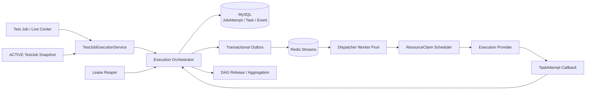
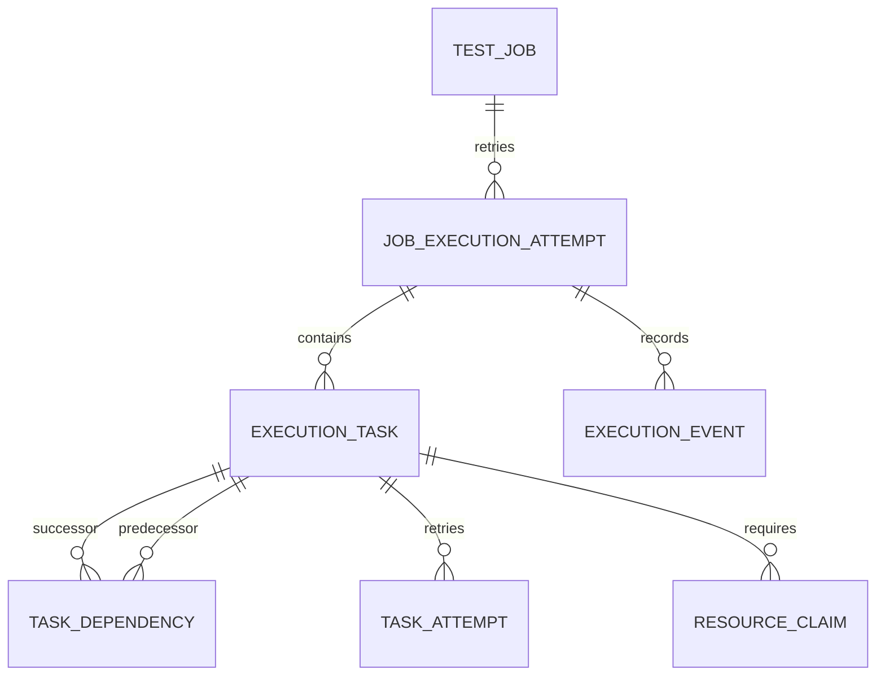

# TestForge 执行编排与可靠性架构设计

## 1. 总体架构



```text
TestJob（用户对象）
└─ JobExecutionAttempt（内部执行历史；兼容表名 TestRun）
   ├─ ExecutionTask（Workflow 节点）
   │  ├─ ResourceClaim
   │  └─ TaskAttempt（领取/重试历史）
   ├─ TaskDependency
   └─ ExecutionEvent
```

## 2. 关键规则

| 对象/场景 | 规则 | 生效条件 |
| --- | --- | --- |
| TestJob | 用户可见的执行和结果主体；固定测试对象 | 执行、重跑 |
| JobExecutionAttempt | 同一 Job 最多一个活动记录；终态后可创建下一次 | 启动 |
| ExecutionTask | 初态由 DAG 入度决定；每个节点引用发布快照中的执行需求 | 拆解 |
| TaskAttempt | 同一 Task 只有一个有效执行权，重试保留旧记录 | 领取、恢复 |
| DAG | ON_SUCCESS/ON_COMPLETION 由不可变 Workflow 拓扑版本决定；叶节点内容来自 Run execution snapshot | Task 终态 |
| Outbox | 与 Task/事件同事务写入；Redis 可重放、不是状态真相源 | 派发 |
| ResourceClaim | 由 READY Task 创建；并行度和运行基座由执行资源域决定 | 调度 |
| Recovery | LOST、重试、取消和回调竞争均使用状态版本与 leaseToken 收敛 | 故障 |
| Deployment 占用 | Run 取消后检查同一 Deployment 的全部 Task 引用；仅当不存在其他非终态引用时，将活动 Deployment 置为 FAILED | 等待发布取消 |

## 3. 模块职责边界

| 模块 | 职责 | 数据/依赖 |
| --- | --- | --- |
| `test-job` | 加载 ACTIVE 任务、固定配置和当前结果指针 | TestJobConfigVersion |
| `run-orchestrator/job` | 创建内部执行 Attempt、限制单活动执行、解析当前 Case 并固化快照 | TestJob、WorkflowTopologyVersion、Case current definition |
| `run-orchestrator/task` | Task/Dependency、状态机、DAG 释放和聚合 | MySQL |
| `run-orchestrator/resource` | READY Task 转 ResourceClaim | 执行需求快照 |
| `dispatcher/outbox` | 事务派发意图、Relay、Redis 消息和退避 | MySQL、Redis |
| `worker-gateway` | TaskAttempt start/heartbeat/callback 和 leaseToken 校验 | Provider/Agent |
| `observability` | 同事务执行事件、历史与 SSE | MySQL |
| `testforge-client/runs` | 任务列表、当前工作流图和折叠执行历史 | REST/SSE |

## 4. 核心数据模型

### 4.1 运行聚合关系



| 模型 | 关键字段 | 约束 |
| --- | --- | --- |
| JobExecutionAttempt | id、testJobId、attemptNo、requestKey、testJobSnapshot、state、version | testJobId 仅一个非终态；testJobId+attemptNo 唯一 |
| ExecutionTask | id、executionId、workflowNodeId、state、version、retryPolicy、blockedBy | 节点引用不可变快照 |
| TaskDependency | predecessorTaskId、successorTaskId、condition | 对应编译 DAG 边 |
| TaskAttempt | id、taskId、attemptNo、state、leaseToken、leaseUntil、allocationId | 同 Task 仅一个有效记录 |
| OutboxEvent | id、aggregateId、payload、status、attempts | 可重放 |

### 4.2 状态机

```text
JobExecutionAttempt:
CREATED -> RUNNING -> SUCCEEDED | FAILED | CANCELLING -> CANCELED

ExecutionTask:
WAITING_DEPENDENCY -> READY -> RESOURCE_WAITING -> DISPATCHED -> RUNNING -> SUCCEEDED
          |              |                                  |          \-> FAILED
          \-> BLOCKED    \----------------------------------\-> CANCELED

TaskAttempt:
CREATED -> CLAIMED -> RUNNING -> SUCCEEDED | FAILED | LOST | CANCELED
```

## 5. 核心流程

### 5.1 正常执行

```text
执行 Test Job
  -> 校验无活动 JobExecutionAttempt
  -> 复制不可变 TestJobSnapshot
  -> 创建 Task/Dependency
  -> READY Task + ExecutionEvent + Outbox 同事务提交
  -> ResourceClaim 分配成功后创建 TaskAttempt
  -> Provider 执行并回调
  -> DAG 释放后继或传播 BLOCKED
  -> 全部 Task 终态后更新 Test Job 当前结果
```

### 5.2 失联与重复输入恢复

```text
leaseUntil 过期
  -> TaskAttempt=LOST
  -> 释放/恢复 ResourceClaim
  -> RetryPolicy 允许则 Task=READY + 新 Outbox
  -> 新 TaskAttempt 执行

重复消息/回调
  -> state+version / callbackKey / leaseToken 校验
  -> 相同输入回读原结果
  -> 冲突或旧执行只追加审计事件

取消等待发布的执行
  -> WAITING_DEPLOYMENT Task=CANCELLED
  -> 查询同一 Deployment 的其他 Task 引用
  -> 有其他活动引用：保留 Deployment
  -> 无其他活动引用：Deployment=FAILED，立即释放环境初始化/容量锁
  -> 定时 reconciliation 重扫历史终态引用，修复取消进程中断造成的孤儿 Deployment
```

## 6. 模块目录

标记：`[+]` 新增　`[~]` 修改　`[-]` 删除

```text
testforge-platform/testforge-app
├─ test-job/src/main/java/io/testforge/testjob
│  ├─ service/[~] TestJobService.java
│  └─ entity/[~] TestJobEntity.java
├─ run-orchestrator/src/main/java/io/testforge/runorchestrator
│  ├─ job/[~] {TestJobLaunchService,TestJobRunQueryService}.java
│  ├─ run/[~] {TestRunEntity,RunTaskService,RunAggregationPolicy}.java
│  ├─ task/[~] {TestTaskEntity,TaskDependencyEntity,TaskStateMachine}.java
│  ├─ task/dag/release/[~] DagReleaseService.java
│  ├─ entity/attempt/[~] TaskAttemptEntity.java
│  └─ service/reliability/[~] ExecutionReliabilityService.java
├─ dispatcher/src/main/java/io/testforge/dispatcher
│  ├─ outbox/[~] {OutboxEventEntity,OutboxClaimService}.java
│  ├─ relay/[~] OutboxRelay.java
│  └─ reliability/[~] {LeaseReaper,RetryCoordinator}.java
└─ worker-gateway/src/main/java/io/testforge/workergateway/[~] callback/
```

## 7. 数据与迁移

| 类型 | 归属 | 处理方式 |
| --- | --- | --- |
| 历史 Run 表 | `run_orchestrator_run` | 继续作为内部 JobExecutionAttempt 存储，不新增用户层级 |
| Task/Attempt/Dependency | 对应 JPA 实体 | JPA DDL update；保留既有证据引用 |
| 旧并发字段 | Run/TestJob | 只读兼容；新执行不读取为资源上限 |
| Redis Stream | dispatcher | 可由 MySQL Outbox 重建，不作为迁移真相源 |
