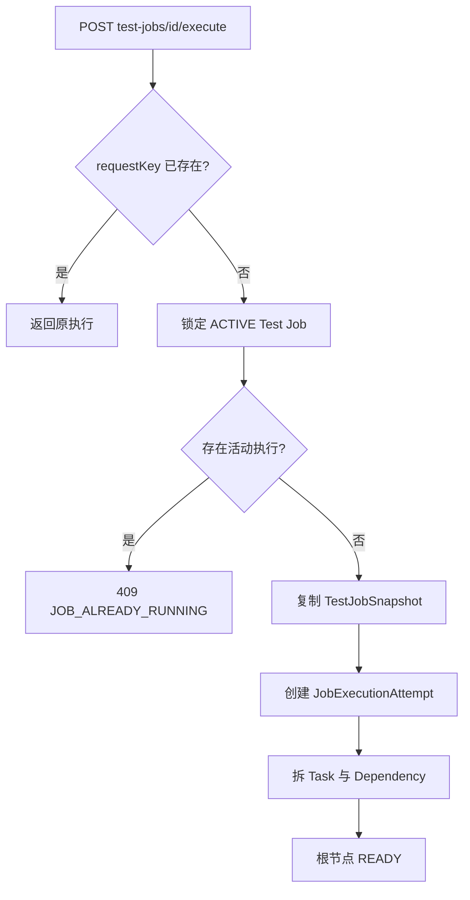
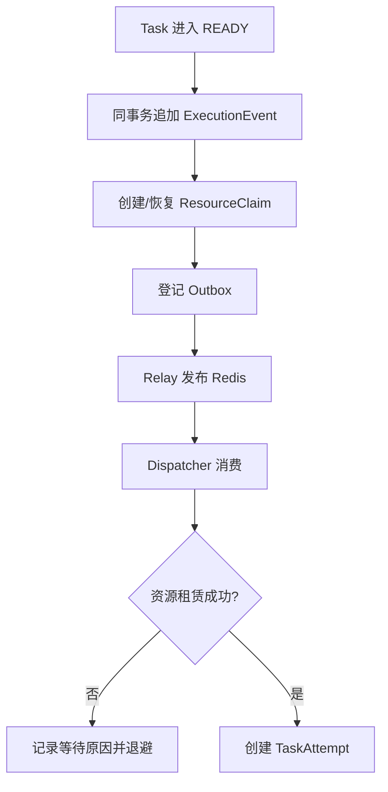
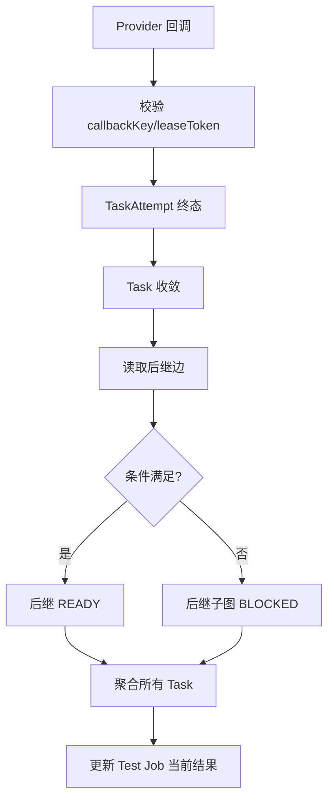
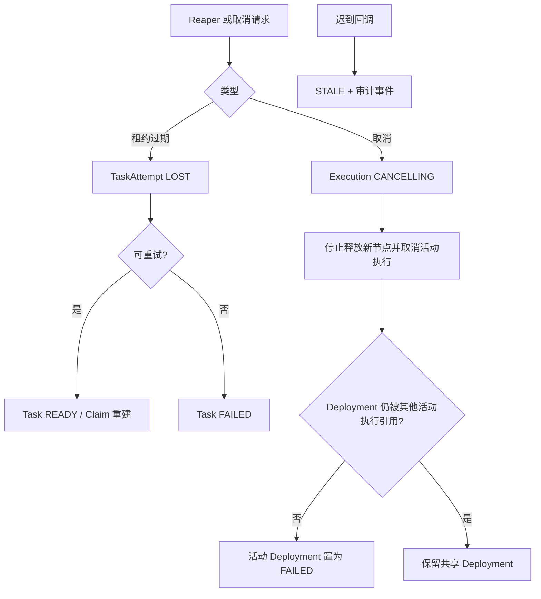

# TestForge 执行编排与可靠性开发方案

## 1. 开发目标

| 编号 | 对应需求 | 开发目标 |
| --- | --- | --- |
| EO-G1 | EO-IN1、EO-IN2 | 从固定 Test Job 创建内部执行 Attempt，并按 DAG 收敛 |
| EO-G2 | EO-IN3、EO-IN4 | 可靠派发并保证每个 Task 只有一个有效执行结果 |
| EO-G3 | EO-IN5、EO-IN6 | 与 ResourceClaim 协同，处理失联、重试、取消和迟到输入 |

## 2. 功能清单与实施顺序

| 顺序 | 功能 | 前置依赖 | 核心产出 |
| --- | --- | --- | --- |
| 1 | 创建内部执行 Attempt | ACTIVE Test Job | JobExecutionAttempt、Task、Dependency |
| 2 | READY 节点与可靠派发 | DAG、Outbox | Event、Outbox、ResourceClaim |
| 3 | TaskAttempt 与 DAG 收敛 | Claim/Provider 回调 | 唯一结果、后继释放、任务结果 |
| 4 | 故障恢复与取消 | 状态机、租约 | LOST、重试、STALE、CANCELED |

## 3. 功能开发设计

### 3.1 创建内部执行 Attempt

| 步骤 | 代码落点 | 输入 | 处理逻辑 | 数据/状态变化 | 输出/异常 |
| --- | --- | --- | --- | --- | --- |
| 1 | TestJobController | testJobId、requestKey | 映射执行命令 | 无 | Command/400 |
| 2 | TestJobLaunchService | Command | 幂等、ACTIVE、单活动执行和固定快照校验 | 新执行记录 | 409 |
| 3 | RunTaskService | Snapshot | 拆解 Task 与 Dependency | READY/WAITING_DEPENDENCY | Execution View |

| 接口/能力 | 方法/动作 | 请求字段 | 返回字段 | 错误码/异常 |
| --- | --- | --- | --- | --- |
| 执行任务 | POST `/api/v1/test-jobs/{id}/execute` | requestKey | testJob、currentExecution、graph | 404/409 |
| 重新执行 | POST `/api/v1/test-jobs/{id}/retry` | requestKey | currentExecution | 404/409 |

#### 3.1.1 并发实现方式

| 项 | 实现方式 |
| --- | --- |
| 并发不变量 | 同一 Test Job 最多一个非终态执行；同一 requestKey 只创建一次 |
| 竞争资源 | TestJob 当前执行指针、JobExecutionAttempt 唯一键 |
| 控制粒度 | testJobId、requestKey |
| 实现机制 | 行锁/条件更新 + 唯一约束 |
| 事务边界 | 执行记录、Task、Dependency、根节点事件同事务 |
| 幂等方式 | testJobId+requestKey 冲突后回读 |
| 竞争失败处理 | 返回现有执行或 409，不创建半套 Task |
| 超时与恢复 | 启动事务失败整体回滚 |

### 3.2 READY 节点与可靠派发

| 步骤 | 代码落点 | 输入 | 处理逻辑 | 数据/状态变化 | 输出/异常 |
| --- | --- | --- | --- | --- | --- |
| 1 | DagReleaseService | READY Task | 调用资源规划与派发 Port | Task/Claim/Event/Outbox | 事务回滚 |
| 2 | OutboxRelay | PENDING Outbox | 租约认领、编码、发布、退避 | publishedAt/attempts | Redis 错误 |
| 3 | ResourceClaimService | Claim Candidate | 原子分配 Provider/资源 | LEASED/WAITING | waitReason |
| 4 | Attempt Service | Allocation | 创建唯一有效 TaskAttempt | CLAIMED | 409 |

#### 3.2.1 并发实现方式

| 项 | 实现方式 |
| --- | --- |
| 并发不变量 | Outbox 可重复发布；Task 只产生一个有效 TaskAttempt；资源不超卖 |
| 竞争资源 | Outbox、Task、Claim、Allocation |
| 控制粒度 | outboxId、taskId、claimId、resourceId |
| 实现机制 | claim lease、state+version、资源行 CAS |
| 事务边界 | Claim 租赁、Allocation 与 TaskAttempt 创建同事务 |
| 幂等方式 | 消息 ID、taskId+attemptNo、runtimeKey |
| 竞争失败处理 | 失败方回读胜者；无资源保持等待，不创建 Attempt |
| 超时与恢复 | Relay/Claim/TaskAttempt 分别由 Reaper 回收 |

### 3.3 Task 结果、DAG 释放与聚合

| 接口/能力 | 方法/动作 | 请求字段 | 返回字段 | 错误码/异常 |
| --- | --- | --- | --- | --- |
| 完成回调 | POST `/api/v1/task-attempts/{id}/complete` | leaseToken、callbackKey、payloadHash、result、artifacts | APPLIED/DUPLICATE/STALE | 404/409/410 |
| 当前执行图 | GET `/api/v1/test-jobs/{id}/execution` | testJobId | graph、task states、current result | 404 |
| 执行历史 | GET `/api/v1/test-jobs/{id}/attempts` | page/size | 内部执行摘要 | 404 |

#### 3.3.1 并发实现方式

| 项 | 实现方式 |
| --- | --- |
| 并发不变量 | 后继只释放一次；BLOCKED 不被逆转；任务当前结果只指向一个终态执行 |
| 竞争资源 | Task、后继 Task、JobExecutionAttempt、TestJob 当前结果 |
| 控制粒度 | taskId、executionId、testJobId |
| 实现机制 | 状态机 + version 条件更新；释放与 Outbox 同事务 |
| 幂等方式 | callbackKey/payloadHash 和终态回读 |
| 竞争失败处理 | 重读 DAG 快照后幂等收敛 |
| 超时与恢复 | 未完整聚合记录由 reconciliation job 重算 |

### 3.4 失联、重试与取消

| 项 | 实现方式 |
| --- | --- |
| 并发不变量 | Reaper、正常回调和取消竞争时只有一条合法迁移成功 |
| 竞争资源 | TaskAttempt、Task、Claim、Execution |
| 控制粒度 | attemptId + version + leaseToken |
| 实现机制 | 状态机、条件更新、租约截止时间 |
| 事务边界 | LOST/重排/事件/Outbox 同事务；外部终止命令异步 |
| 幂等方式 | 终态回读；旧 token 永不恢复执行权 |
| 竞争失败处理 | 返回当前分类，不覆盖胜者 |
| 超时与恢复 | 定时扫描直到 Task 与资源均达到稳定状态 |
| 发布锁释放 | 取消事务保存 Task 后，按 deploymentId 检查所有 Task；无其他非终态引用时调用 DeploymentService.failActive，避免等待全局超时 |
| 孤儿恢复 | 定时扫描所有被 Task 引用的 Deployment；当全部引用 Task 已终态时幂等执行 failActive，覆盖进程在取消事务前后中断的情况 |

## 4. 公共实现规则

| 规则类型 | 统一实现 | 适用功能 |
| --- | --- | --- |
| 真相源 | MySQL 保存状态、事件和派发意图；Redis 仅作队列 | 全部 |
| 术语 | UI 使用“测试任务/本次执行”；内部区分 JobExecutionAttempt 与 TaskAttempt | 全部 |
| 资源 | 调度只消费 ExecutionRequirement/ResourceClaim，不读取任务并发参数 | 3.2～3.4 |
| 证据 | 所有失败、重试、迟到和取消都追加可回放事件 | 3.3、3.4 |
