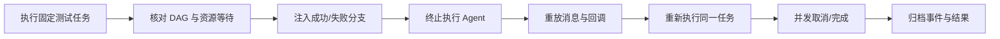

# TestForge 执行编排与可靠性验收方案

> 验收以测试任务为入口；内部执行与 TaskAttempt 只用于证明重跑、DAG、幂等和恢复，不恢复独立 Run 主模型。

## 1. 验收流程

### 1.1 验收准备

| 项目 | 要求 |
| --- | --- |
| 验收版本 | 固定 TestForge、Worker/Agent、消息契约和数据库版本 |
| 验收环境 | MySQL、Redis、至少两个 Dispatcher、可执行 Provider 与监控 |
| 测试数据 | 一个固定 Commit 的 ACTIVE Test Job；Workflow 含并行、ON_SUCCESS、ON_COMPLETION 和失败分支 |
| 故障注入 | 可停止 Agent/Provider、重放消息/回调、并发启动和取消 |
| 证据目录 | `acceptance/evidence/execution-orchestration/` |

### 1.2 执行顺序

## 2. 流程验收场景

| 场景编号 | 覆盖的成功标准 | 前置条件 | 操作 | 预期结果 | 已知相邻影响检查 | 证据要求 |
| --- | --- | --- | --- | --- | --- | --- |
| EO-AC-01 | EO-S1 | 有两个历史执行 | 打开实时运行中心并选择任务 | 只显示任务和当前执行图；历史折叠可查，无 Runs 主栏 | 报告链接仍可用 | 页面截图、API |
| EO-AC-02 | EO-S2 | 固定任务已确认 | 并发发送两个执行请求；终态后修改 Case 再执行一次 | 首轮只创建一个活动执行；第二轮 Commit/WorkflowTopologyVersion 相同，但执行快照使用更新后的 Case；首轮不漂移 | Jenkins Build 使用同一 Commit | 请求、两次 Run 快照、Build |
| EO-AC-03 | EO-S3 | 混合依赖 DAG 已发布 | 让一个节点失败并执行到终态 | ON_SUCCESS 后继阻断，ON_COMPLETION 后继释放，无关分支继续 | 图与报告一致 | Workflow、事件、Task 终态 |
| EO-AC-04 | EO-S4 | 固定 requestKey、消息和回调载荷 | 重复创建、派发、领取与回调 | 不产生第二个有效执行或结果 | 事件允许记录重复分类 | 唯一键、消息、回调响应 |
| EO-AC-05 | EO-S5 | TaskAttempt 正在执行 | 连续三轮终止 Agent，等待重调度，再提交旧回调 | 每轮旧 Attempt LOST，新 Attempt 收敛，旧回调 STALE | ResourceClaim 最终释放 | Agent/Lease/事件/报告 |
| EO-AC-06 | EO-S6 | 有活动 Task | 同时发送完成与取消 | 只有一个合法终态；不再释放新节点；资源最终归零 | Test Job 当前结果一致 | 并发响应、状态与资源快照 |
| EO-AC-07 | EO-S7 | Test Job 正在等待 Jenkins 发布且环境处于初始化锁定 | 从 UI 取消任务后立即创建并执行同环境的新任务 | 旧 Run=CANCELLED、旧 Deployment=FAILED；新任务不返回 423 并可触发新 Jenkins Build | 共享 Deployment 仍有其他活动引用时不得失败 | UI、Deployment 时间线、Jenkins Build |

## 3. 并发验收

| 项目 | 验收口径 |
| --- | --- |
| 并发不变量 | 同一任务一个活动执行；同一 Task 一个有效 TaskAttempt；后继只释放一次；终态唯一 |
| 负载模型 | 20 路启动同一任务、两个 Dispatcher 重复消费、20 路重复/冲突回调、取消与完成竞态 |
| 并发量与持续时间 | 每类竞争至少 20 次，等待状态和资源完全收敛 |
| 执行步骤 | 并发启动、重放 Stream、并发回调、并发取消；导出执行/Task/Attempt/Claim/Event |
| 达标指标 | 活动执行峰值=1、重复有效 TaskAttempt=0、重复后继释放=0、资源泄漏=0、终态冲突=0 |
| 已知相邻影响检查 | Jenkins 不重复发布；报告只引用权威 TaskAttempt；SSE 与 REST 最终一致 |
| 证据要求 | 原始响应、数据库导出、Redis Pending、事件、资源摘要和最终报告 |

## 4. 执行记录与证据

| 场景编号 | 状态 | 实际结果 | 执行命令或操作 | 证据路径 | 执行人 / 时间 |
| --- | --- | --- | --- | --- | --- |
| EO-AC-01～EO-AC-06 | NOT_RUN | 文档合并后待按单层测试任务模型重新执行 | 依场景执行 | `acceptance/evidence/execution-orchestration/` | 待填写 |
| EO-AC-07 | PASS | 取消等待发布的平台自测后，未共享 Deployment 立即进入 FAILED 并释放环境锁；后续自测-6～-9 均能触发新 Jenkins Build，无 423 | TestForge UI 取消后连续创建执行 | `acceptance/evidence/tfp-075/README.md` | Codex / 2026-09-27 |

### 验收结论

| 项目 | 结论 |
| --- | --- |
| 核心流程 | NOT_RUN |
| 并发要求 | NOT_RUN |
| 阻塞问题 | 待系统级真实验收 |
| 最终结论 | 待执行后填写 |

> 历史记录说明：上述既有执行结果来自独立仓库建立前的开发环境，原始材料不随公开仓库分发，不能作为本次公开版本的验收结论。当前验证范围见 [公开准备记录](../reference/公开准备记录.md).
