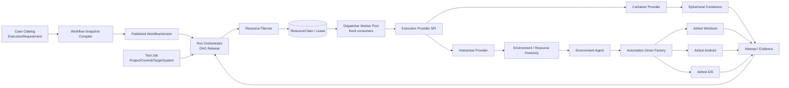

# TestForge 执行资源与 Case 级调度架构设计

## 1. 总体架构



```text
TestForge 资源域
├─ 控制面
│  ├─ Dispatcher Worker Pool      固定数量、平台无关
│  ├─ Resource Planner            Case 需求 × Job 目标系统 × 平台策略
│  ├─ Resource Scheduler          匹配、评分、原子租赁
│  └─ Execution Provider SPI      选择运行基座
├─ 计算执行面
│  └─ Container Provider
│     ├─ Docker Node
│     └─ Ephemeral Container
└─ 交互执行面
   ├─ Environment                 VM/Node/设备宿主机
   ├─ Environment Agent          环境内执行代理
   ├─ Allocatable Resource       Desktop/Emulator/Device
   └─ Automation Driver SPI      Airtest Adapter
```

## 2. 关键规则

| 对象/场景 | 规则 | 生效条件 |
| --- | --- | --- |
| Case | 保存执行能力需求；不保存具体资源和并发 | 创建、更新 |
| WorkflowVersion | 固化每个 CompiledNode 的 ExecutionRequirementSnapshot | 发布 |
| Test Job | 固定项目、版本、WorkflowVersion、目标系统和优先级 | 保存、执行 |
| Resource Planner | 只有节点满足 DAG 依赖后才生成 ResourceClaim | Task 进入 READY |
| ResourceClaim | 描述需要什么，不指定由哪台机器提供；一个活动 Task 最多一个活动 Claim | 规划、恢复 |
| Dispatcher Worker | 固定控制面消费者，数量由平台部署配置；不注册设备、不绑定平台 | 队列消费 |
| Environment Agent | 绑定运行时 Environment，负责上报资源并执行 Provider 命令；失联后可被新实例接管 | 心跳、执行 |
| Container Provider | 根据 Profile 创建一次性容器并实施 CPU/内存限制 | HEADLESS Case |
| Interactive Provider | 对 Desktop/Emulator/Device 建立不可重复 Lease，再命令 Agent 启动 Driver | UI Case |
| Lease Scope | 默认 CASE；SUBFLOW 由 Fixture 建立 sessionKey 并由后继节点复用 | 工作流编排 |
| 调度容量 | 可计量资源按余量扣减；离散资源按单位租赁；不存在任务级“独占”布尔值 | 资源分配 |
| 阻塞原因 | 无 Provider、能力不匹配、容量不足、Agent 离线、Session 失效分别编码 | 等待 |

## 3. 模块职责边界

| 模块 | 职责 | 数据/依赖 |
| --- | --- | --- |
| `case-catalog/testcase` | YAML Case 执行需求的维护、校验和发布快照引用 | Case/Managed Asset |
| `case-catalog/workflow/compile` | 将 Case 需求固化到 CompiledNode，校验 Fixture/session 范围 | PublishedWorkflowVersion |
| `run-orchestrator/resource` | 由可运行 Task 生成 Claim，维护状态、Lease 和恢复 | Task/Attempt/Workflow Snapshot |
| `run-orchestrator/scheduling` | 公平排序、Provider 候选匹配和原子分配 | Claim/Inventory |
| `dispatcher` | 固定 Worker Pool 消费统一待执行消息，不按旧 ResourceMode 拆业务队列 | Redis Streams/Outbox |
| `execution-provider` | Container/Interactive Provider SPI 及运行时生命周期 | Docker Engine、Agent Gateway |
| `worker-gateway/agent` | Environment Agent 注册、心跳、命令和结果回调 | Environment Catalog |
| `worker-gateway/resource` | 可分配资源上报、Lease、续约、释放和回收 | MySQL |
| `testforge-worker` | 环境 Agent 与 Automation Driver Factory；不承担控制面 Worker 含义 | Airtest/pytest 适配器 |
| `testforge-client/resources` | 计算容量、交互目标、Agent 状态、等待 Case 与阻塞原因 | Resource API/SSE |

## 4. 核心数据模型

### 4.1 `ExecutionRequirement`

| 项 | 内容 |
| --- | --- |
| 代码位置 | `testforge-app/case-catalog/.../testcase/model/ExecutionRequirement.java` |
| 数据表/存储 | `case_catalog_test_case.execution_requirement_json` |

| 字段 | 类型 | 必填 | 说明 |
| --- | --- | --- | --- |
| executorType | String | 是 | `PYTEST_HTTP`、`AIRTEST` 等执行器稳定键 |
| interaction | Enum | 是 | `HEADLESS` 或 `UI`，只描述交互特征 |
| capabilities | Set<String> | 是 | 例如 `DESKTOP`、`ADB`、`IOS_SIMULATOR` |
| resourceProfile | String | 是 | 平台维护的资源规格键，例如 `script-small`、`ui-default` |
| leaseScope | Enum | 是 | `CASE` 或 `SUBFLOW` |
| sessionKey | String | 否 | SUBFLOW 共享环境会话的逻辑键 |

| 约束 | 规则 |
| --- | --- |
| 归属 | Case 定义保存能力需求，具体 targetPlatform 可由 Test Job 目标系统补足 |
| 快照 | Workflow 发布时完整复制，不在运行时回读 Case 当前值 |

### 4.2 `ResourceClaim`

| 项 | 内容 |
| --- | --- |
| 代码位置 | `testforge-app/run-orchestrator/.../resource/entity/ResourceClaimEntity.java` |
| 数据表/存储 | `run_resource_claim` |

| 字段 | 类型 | 必填 | 说明 |
| --- | --- | --- | --- |
| id | UUID | 是 | Claim ID |
| taskId | UUID | 是 | 所属可执行 Task |
| attemptId | UUID | 否 | 成功分配后绑定 Attempt |
| providerType | Enum | 是 | `CONTAINER`、`INTERACTIVE_AGENT` |
| targetPlatform | Enum | 否 | WINDOWS、ANDROID、IOS；纯平台无关脚本可空 |
| resourceProfile | String | 是 | CPU/内存或交互目标策略键 |
| capabilities | JSON | 是 | 必须满足的能力集合 |
| leaseScope | Enum | 是 | CASE、SUBFLOW |
| sessionKey | String | 否 | 会话亲和键 |
| state | Enum | 是 | PENDING、LEASED、RELEASED、EXPIRED、FAILED |
| allocationId | UUID | 否 | 实际分配记录 |
| leaseToken | UUID | 否 | 续约和回调凭据 |
| leaseUntil | Instant | 否 | 租约截止时间 |
| version | Long | 是 | 乐观并发版本 |

### 4.3 `Environment`

| 字段 | 类型 | 必填 | 说明 |
| --- | --- | --- | --- |
| id | UUID | 是 | VM、Node 或设备宿主机的稳定 ID |
| name | String | 是 | 用户可见名称 |
| hostPlatform | Enum | 是 | WINDOWS、LINUX、MACOS |
| providerEnvironmentKey | String | 是 | Jenkins/Provider 使用的发布键 |
| endpoint | URI | 否 | 当前可用访问地址，可由发布结果更新 |
| enabled | boolean | 是 | 是否接受新 Claim |
| initializeOnNextDeploy | boolean | 是 | 下次项目发布前是否执行一次初始化 |
| config / secretRefs | JSON | 是 | 非敏感配置和密钥引用 |

### 4.4 `EnvironmentAgent`

| 字段 | 类型 | 必填 | 说明 |
| --- | --- | --- | --- |
| agentId | String | 是 | Agent 实例标识，重启可变化 |
| environmentId | UUID | 是 | 稳定环境 ID |
| sessionId | UUID | 是 | 本次启动会话 |
| hostPlatform | String | 是 | Agent 宿主系统，不作为被测平台匹配条件 |
| capabilities | Set<String> | 是 | Agent 支持的 Provider/Driver 能力 |
| status | Enum | 是 | ONLINE、DRAINING、OFFLINE |
| lastHeartbeatAt | Instant | 是 | 在线判定依据 |

### 4.5 `AllocatableResource`

| 字段 | 类型 | 必填 | 说明 |
| --- | --- | --- | --- |
| id | UUID | 是 | 稳定资源 ID |
| environmentId | UUID | 是 | 所属环境 |
| managedByAgentId | String | 否 | 当前管理 Agent，可随重启变化 |
| resourceType | String | 是 | `CPU_MILLI`、`MEMORY_MB`、`WINDOWS_DESKTOP`、`ANDROID_DEVICE`、`IOS_DEVICE` |
| targetPlatform | Enum | 否 | 交互目标系统 |
| capacity | Long | 是 | 总容量；离散资源通常为 1 |
| allocated | Long | 是 | 当前已租赁容量 |
| capabilities | JSON | 是 | 分辨率、Driver、设备特性等 |
| status | Enum | 是 | AVAILABLE、BUSY、DRAINING、OFFLINE |

## 5. 核心流程

### 5.1 Case 到运行时 Claim

```text
保存 Case ExecutionRequirement
  -> Workflow 发布时复制为 ExecutionRequirementSnapshot
  -> Test Job 固定 WorkflowVersion + TargetSystem
  -> DAG 释放某个 CompiledNode
  -> Resource Planner 合并节点需求、TargetSystem、ResourceProfile
  -> 持久化 PENDING ResourceClaim
  -> Dispatcher Worker 进入候选匹配
```

### 5.2 Provider 分配

```text
PENDING Claim
  -> 查找满足 targetPlatform/capabilities/profile 的 Provider
  ├─ CONTAINER
  │    -> 原子预留 CPU/内存
  │    -> 创建一次性 Container
  │    -> 绑定 Attempt 并执行脚本
  └─ INTERACTIVE_AGENT
       -> 原子租赁 Desktop/Emulator/Device
       -> 找到当前在线 Environment Agent
       -> Agent 的 Driver Factory 创建平台 Adapter
       -> 绑定 Attempt 并执行 UI Case
  -> Attempt 终态
  -> CASE Lease 释放；SUBFLOW Lease 按 session 生命周期释放
```

### 5.3 Agent 失联恢复

```text
Agent 心跳过期
  -> Agent=OFFLINE
  -> 其活动 Allocation 进入恢复
  -> Attempt=LOST
  -> CASE Lease 释放或等待安全回收期
  -> Claim 重新变为 PENDING
  -> 调度到新 Agent/资源
  -> 旧 leaseToken 回调只留审计
```

## 6. 模块目录

标记：`[+]` 新增　`[~]` 修改　`[-]` 删除

```text
testforge-platform
├─ docs
│  ├─ [~] 06-execution-resources/
│  ├─ [+] tasks/TFP-063.md
│  └─ [~] README.md
├─ testforge-app
│  ├─ case-catalog/src/main/java/io/testforge/casecatalog
│  │  ├─ testcase/model/[+] {ExecutionRequirement,InteractionMode,LeaseScope}.java
│  │  ├─ testcase/entity/[~] TestCaseEntity.java
│  │  ├─ testcase/model/[~] {CreateTestCaseCommand,TestCaseView}.java
│  │  └─ workflow/compile/model/[~] CompiledNode.java
│  ├─ run-orchestrator/src/main/java/io/testforge/runorchestrator
│  │  ├─ resource/entity/[+] ResourceClaimEntity.java
│  │  ├─ resource/model/[+] {ResourceClaimState,ResourceRequest}.java
│  │  ├─ resource/service/[+] {ResourcePlanner,ResourceClaimService}.java
│  │  ├─ service/scheduling/[~] FairSchedulingPolicy.java
│  │  ├─ run/entity/[~] {TestRunEntity,TestTaskEntity}.java
│  │  └─ task/model/[-] ResourceMode.java
│  ├─ dispatcher/src/main/java/io/testforge/dispatcher
│  │  ├─ stream/[~] {RedisStreamRouteResolver,TaskMessageEncoder}.java
│  │  └─ provider/[+] ExecutionProvider.java
│  ├─ worker-gateway/src/main/java/io/testforge/workergateway
│  │  ├─ agent/[+] registry/
│  │  ├─ resource/[+] {registry,lease}/
│  │  ├─ registry/[~] WorkerRegistryService.java
│  │  └─ device/[~] legacy/
│  └─ app/src/main/java/io/testforge/app
│     └─ monitoring/[~] PlatformMonitoringService.java
├─ testforge-worker/testforge_worker
│  ├─ agent/[+] service.py
│  ├─ provider/[+] {spi.py,container.py,interactive.py}
│  ├─ executor/[~] spi.py
│  └─ consumer/[~] worker.py
├─ testforge-client/src
│  ├─ projects/[~] AssetManagement.vue
│  ├─ cases/[+] CaseExecutionRequirementForm.vue
│  ├─ resources/[+] {ResourceOperations.vue,index.ts}
│  ├─ runs/[~] RunCenter.vue
│  └─ workers/[-] index.ts
└─ contracts/openapi/v1/[~] testforge.yaml
```

## 7. 数据与迁移

| 类型 | 归属 | 处理方式 |
| --- | --- | --- |
| Case 执行需求 | `case_catalog_test_case` | 新增普通 JSON 字段，由 JPA DDL update 承接 |
| ResourceClaim/Agent/Resource | 新实体表 | 由 JPA DDL update 建表，不写入 simple-migration |
| 旧 Case | Case Catalog | 缺少执行需求时按 runner 映射一次，并在下次保存或发布时写入新快照 |
| 旧 `resourceMode` | Run/Task | 历史记录只读保留；新执行由 ExecutionRequirementSnapshot 生成 Claim |
| 旧并发字段 | TestJob/Run/API | 历史响应兼容读取；新任务不接收、不展示、不参与资源上限计算 |
| 旧 Worker/DeviceSlot | Worker Gateway | WorkerNode 迁移为 Agent 语义；DeviceSlot 映射为离散 AllocatableResource，保留历史 Attempt 引用 |
