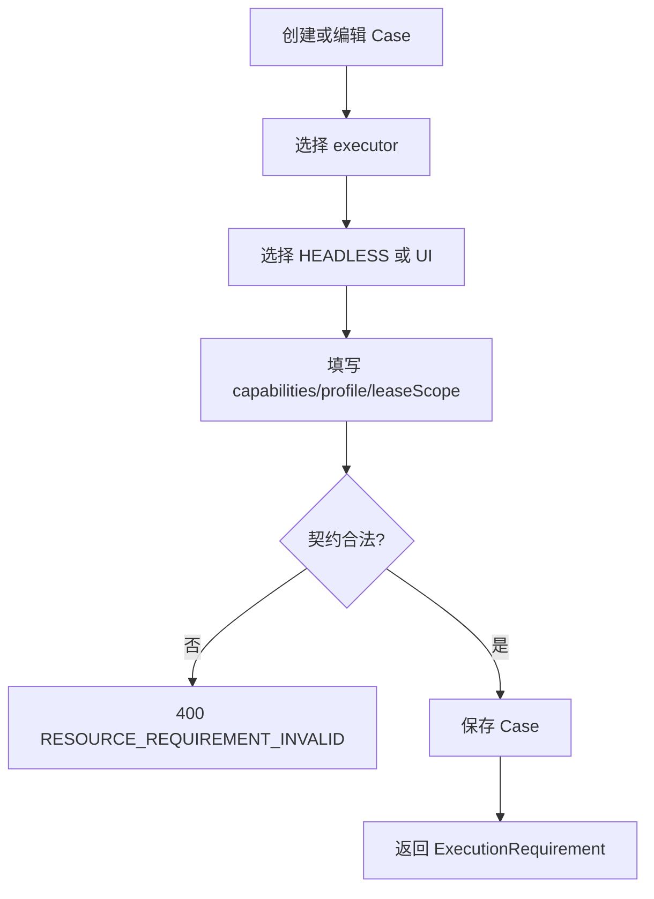
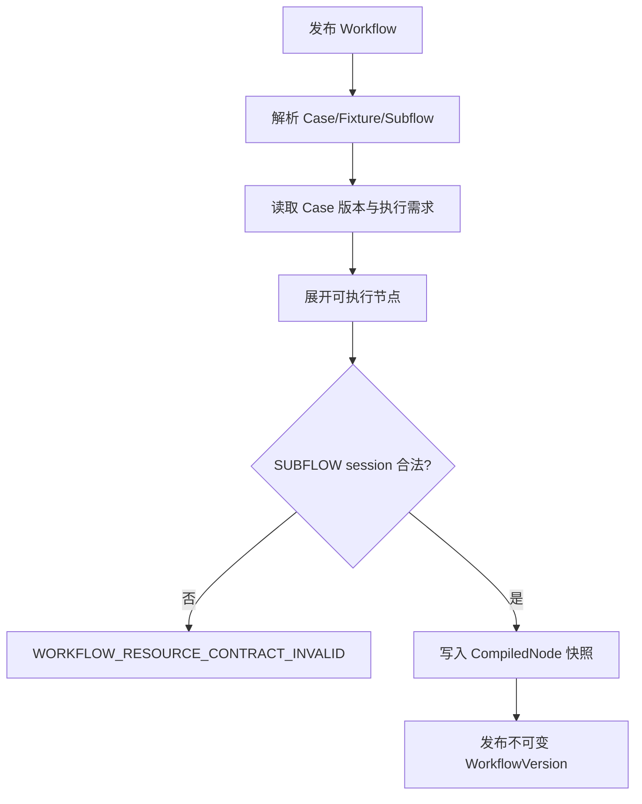
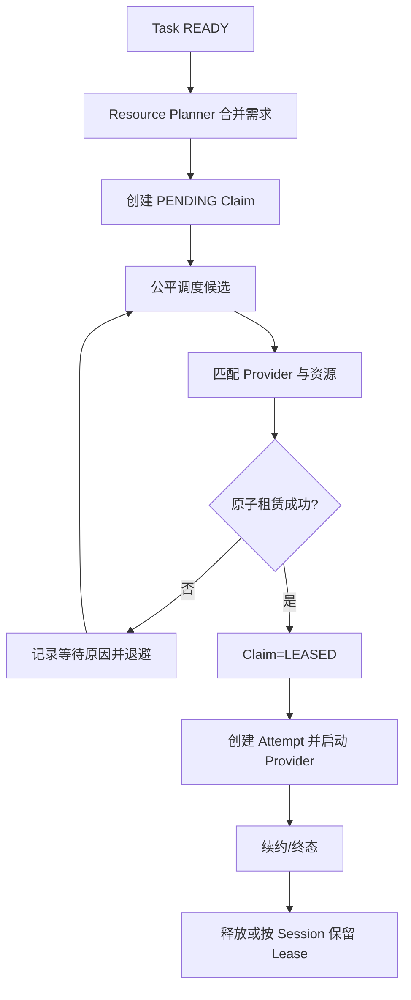
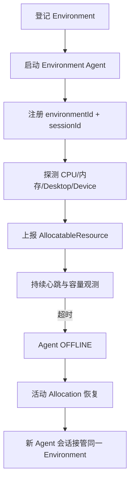
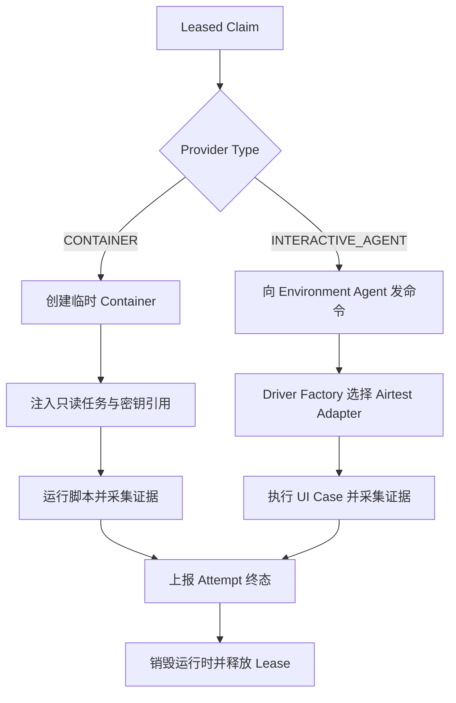
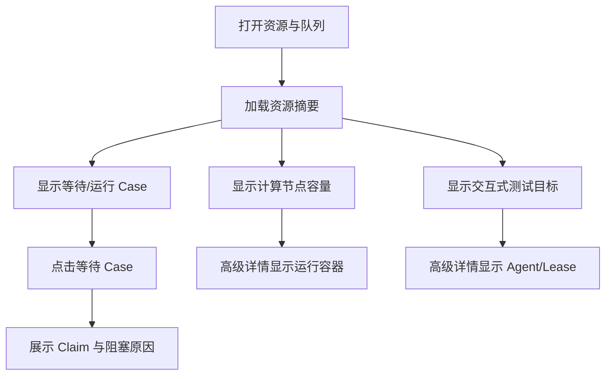

# TestForge 执行资源与 Case 级调度开发方案

## 1. 开发目标

| 编号 | 对应需求 | 开发目标 |
| --- | --- | --- |
| CR-G1 | CR-IN1、CR-IN2 | 将资源需求下沉到 Case，并固化到 WorkflowVersion |
| CR-G2 | CR-IN3、CR-IN6 | 在节点就绪时生成 ResourceClaim，以实时资源决定并行度 |
| CR-G3 | CR-IN4、CR-IN5 | 建立 Provider SPI，拆分 Dispatcher Worker 与 Environment Agent |
| CR-G4 | CR-IN7 | 重做资源与队列页面，展示容量、目标、运行实例和阻塞原因 |

## 2. 功能清单与实施顺序

| 顺序 | 功能 | 前置依赖 | 核心产出 |
| --- | --- | --- | --- |
| 1 | Case 执行需求 | YAML Case 与 Managed Asset | ExecutionRequirement API 与页面 |
| 2 | Workflow 资源快照 | Case 执行需求 | CompiledNode 固化需求 |
| 3 | ResourceClaim 与资源调度 | Workflow 快照、DAG | 动态 Claim、统一 Lease 和等待原因 |
| 4 | Container/Interactive Provider | Claim 调度 | Docker 脚本沙箱、Agent UI 执行 |
| 5 | Environment 与 Agent 生命周期 | 全局环境目录 | 注册会话、心跳、资源上报和失联恢复 |
| 6 | 资源与队列操作台 | Resource/Claim/Agent API | 新容量视图和历史数据降噪 |

## 3. 功能开发设计

### 3.1 Case 执行需求

#### 3.1.1 功能说明

| 项 | 内容 |
| --- | --- |
| 触发入口 | Case 创建/编辑页面和 Case API |
| 前置条件 | 执行器已在平台注册对应能力 |
| 最终结果 | Case 保存可复用的执行能力需求，不保存资源实例或并发数 |

#### 3.1.2 技术流程图

#### 3.1.3 流程节点实现

| 步骤 | 代码落点 | 输入 | 处理逻辑 | 数据/状态变化 | 输出/异常 |
| --- | --- | --- | --- | --- | --- |
| 1 | `CreateTestCaseRequest` | executionRequirement | 映射并校验枚举、能力和 sessionKey | 无 | Command/400 |
| 2 | `TestCaseService` | Case Command | 校验 executor 与 interaction 组合 | Case 新增/更新 | TestCaseView/409 |
| 3 | `TestCaseEntity` | requirement JSON | 保存标准化契约 | `execution_requirement_json` | Entity |
| 4 | Case 页面 | executor/interaction/profile | 仅展示业务可理解选项 | 表单状态 | 保存结果 |

#### 3.1.4 关键接口

| 接口/能力 | 方法/动作 | 请求字段 | 返回字段 | 错误码/异常 |
| --- | --- | --- | --- | --- |
| 创建 Case | POST `/api/v1/projects/{projectId}/cases` | 既有字段；executionRequirement.executorType、interaction、capabilities、resourceProfile、leaseScope、sessionKey? | Case 全字段 | 400/404/409 |
| 更新 Case | PUT `/api/v1/cases/{caseId}` | 同创建 | Case 全字段 | 400/404/409 |
| 查询 Case | GET `/api/v1/cases/{caseId}` | caseId | executionRequirement | 404 |

#### 3.1.5 关键数据模型

| 数据模型 | 字段 | 类型 | 必填 | 用途与约束 |
| --- | --- | --- | --- | --- |
| ExecutionRequirement | executorType | String | 是 | 执行器注册键 |
| ExecutionRequirement | interaction | Enum | 是 | HEADLESS/UI |
| ExecutionRequirement | capabilities | Set<String> | 是 | 可为空集合，但字段必须存在 |
| ExecutionRequirement | resourceProfile | String | 是 | 平台规格键 |
| ExecutionRequirement | leaseScope | Enum | 是 | CASE/SUBFLOW |
| ExecutionRequirement | sessionKey | String | 条件必填 | SUBFLOW 时必填且仅在所属 Workflow 范围唯一 |

### 3.2 Workflow 资源快照

#### 3.2.1 功能说明

| 项 | 内容 |
| --- | --- |
| 触发入口 | 发布 Workflow |
| 前置条件 | 引用 Case 和 Fixture 可读取且执行需求合法 |
| 最终结果 | 每个 CompiledNode 固化 ExecutionRequirementSnapshot，后续 Case 修改不影响该版本 |

#### 3.2.2 技术流程图

#### 3.2.3 流程节点实现

| 步骤 | 代码落点 | 输入 | 处理逻辑 | 数据/状态变化 | 输出/异常 |
| --- | --- | --- | --- | --- | --- |
| 1 | `WorkflowReferenceResolver` | Case 引用 | 读取固定脚本版本和需求 | 无 | ReferenceCatalog |
| 2 | `WorkflowSnapshotCompiler` | Validated Graph | 展开节点并复制需求 | CompiledSnapshot | CompileException |
| 3 | `WorkflowPublishService` | Snapshot | 校验 session 范围并持久化 | PublishedVersion | 409 |

#### 3.2.4 关键接口

| 接口/能力 | 方法/动作 | 请求字段 | 返回字段 | 错误码/异常 |
| --- | --- | --- | --- | --- |
| 发布 Workflow | POST `/api/v1/workflows/{workflowId}/publish` | expectedDraftRevision | version、checksum、compiledSnapshot | 400/404/409 |
| 查看发布版本 | GET `/api/v1/workflows/{workflowId}/versions/{version}` | workflowId、version | 节点执行需求快照 | 404 |

#### 3.2.5 关键数据模型

| 数据模型 | 字段 | 类型 | 必填 | 用途与约束 |
| --- | --- | --- | --- | --- |
| CompiledNode | executionRequirement | Snapshot | 是 | 发布时复制，运行期不可变 |
| CompiledNode | sessionKey | String | 否 | 标识共享 Lease 的子流程会话 |

### 3.3 ResourceClaim 与动态调度

#### 3.3.1 功能说明

| 项 | 内容 |
| --- | --- |
| 触发入口 | DAG 将 Task 释放为 READY |
| 前置条件 | Task 带有发布版本中的 ExecutionRequirementSnapshot |
| 最终结果 | 生成一个可恢复 Claim，成功租赁后才创建有效 Attempt 并启动 Provider |

#### 3.3.2 技术流程图

#### 3.3.3 流程节点实现

| 步骤 | 代码落点 | 输入 | 处理逻辑 | 数据/状态变化 | 输出/异常 |
| --- | --- | --- | --- | --- | --- |
| 1 | `ResourcePlanner` | CompiledNode、TargetSystem | 应用 Profile，生成标准 Claim | Claim=PENDING | Claim/契约错误 |
| 2 | `FairSchedulingPolicy` | PENDING Claim | 按优先级、等待时间、公平性排序 | 无 | Candidate |
| 3 | `ResourceClaimService` | Candidate/Inventory | 原子扣减资源、创建 Allocation | Claim=LEASED | 等待原因 |
| 4 | Attempt Service | Leased Claim | 创建唯一有效 Attempt | Attempt=CLAIMED | 409 |
| 5 | Claim Reaper | leaseUntil | 过期回收并触发 Attempt 恢复 | EXPIRED/PENDING | Recovery event |

平台合并遵循“任务选择、Case 约束”的方向：Test Job 提供 `requestedPlatform`；Case 当前定义通常只声明 executor/capabilities，不重复声明平台。遗留 Case 的 `parameters.platform` 缺失或为 `ANY` 时，Task 继承并标准化为 Test Job 平台；只有显式 Case 平台与任务平台不一致时抛出 `RunValidationException`。不得把 Java `null` 当作平台值参与字符串比较。

#### 3.3.4 关键接口

| 接口/能力 | 方法/动作 | 请求字段 | 返回字段 | 错误码/异常 |
| --- | --- | --- | --- | --- |
| 资源申请详情 | GET `/api/v1/resource-claims/{claimId}` | claimId | Claim、Allocation、阻塞原因 | 404 |
| Task 资源时间线 | GET `/api/v1/tasks/{taskId}/resource-claims` | taskId | Claim[] | 404 |
| Agent 续约 | POST `/api/v1/resource-claims/{claimId}/heartbeat` | leaseToken、observedAt | leaseUntil、state | 404/409/410 |

#### 3.3.5 关键数据模型

| 数据模型 | 字段 | 类型 | 必填 | 用途与约束 |
| --- | --- | --- | --- | --- |
| ResourceClaim | taskId | UUID | 是 | 同一 Task 最多一个活动 Claim |
| ResourceClaim | providerType/targetPlatform | Enum | 是/条件必填 | Provider 和平台约束 |
| ResourceClaim | capabilities/resourceProfile | JSON/String | 是 | 匹配条件 |
| ResourceClaim | state/leaseToken/leaseUntil | Enum/UUID/Instant | 是/条件必填 | 生命周期和防迟到凭据 |
| ResourceAllocation | environmentId/agentId/resourceIds | UUID/String/List | 是 | 实际分配证据 |

#### 3.3.6 并发实现方式

| 项 | 实现方式 |
| --- | --- |
| 并发不变量 | 一个 Task 最多一个活动 Claim；一个离散资源最多一个有效 Lease；计量资源 allocated 不超过 capacity |
| 竞争资源 | Claim 行、AllocatableResource 容量、SUBFLOW sessionKey |
| 控制粒度 | Claim ID + Resource ID；会话复用按 runId/sessionKey |
| 实现机制 | Claim 条件更新、资源行版本控制、同事务 Allocation 写入和 Outbox |
| 事务边界 | 资源扣减、Claim=LEASED、Allocation 创建和 Attempt claim 在一次事务完成 |
| 幂等方式 | taskId + attemptNo + claim generation；leaseToken 防止旧执行续约或回调 |
| 竞争失败处理 | 不创建 Attempt，Claim 保持 PENDING，写入稳定等待原因并退避 |
| 超时与恢复 | Reaper 先令旧 Attempt LOST，再释放 Allocation 并重建/恢复 Claim |

### 3.4 Environment 与 Agent 生命周期

#### 3.4.1 功能说明

| 项 | 内容 |
| --- | --- |
| 触发入口 | 环境资源页创建 Environment；环境内 Agent 启动、心跳与上报 |
| 前置条件 | VM/Node/设备宿主机已具备网络、凭据和 Agent 启动条件 |
| 最终结果 | 稳定 Environment 关联当前 Agent 会话和真实资源清单，Agent 重启不复制环境容量 |

#### 3.4.2 技术流程图

#### 3.4.3 关键接口

| 接口/能力 | 方法/动作 | 请求字段 | 返回字段 | 错误码/异常 |
| --- | --- | --- | --- | --- |
| 环境目录 | POST `/api/v1/environments` | name、hostPlatform、providerEnvironmentKey、endpoint?、config、secretRefs | Environment | 400/409 |
| Agent 注册 | POST `/api/v1/environment-agents/register` | environmentId、sessionId、hostPlatform、capabilities、resources | agentId、heartbeatInterval | 400/409 |
| Agent 心跳 | POST `/api/v1/environment-agents/{id}/heartbeat` | sessionId、observedAt、resourceVersions | acceptedAt | 404/409 |
| 资源上报 | PUT `/api/v1/environment-agents/{id}/resources` | sessionId、ResourceObservation[] | acceptedAt | 400/409 |

#### 3.4.4 并发实现方式

| 项 | 实现方式 |
| --- | --- |
| 并发不变量 | 同一 Environment 只有一个当前 Agent session；同一资源观测版本只应用一次 |
| 竞争资源 | environmentId、sessionId、resourceId |
| 控制粒度 | Environment 行和 Resource 行 |
| 实现机制 | session CAS、resource version、心跳截止时间 |
| 事务边界 | Agent session 切换与资源归属更新同事务 |
| 幂等方式 | environmentId+sessionId、resourceId+observedVersion |
| 竞争失败处理 | 旧 session 返回 409，不覆盖新 Agent 观测 |
| 超时与恢复 | 心跳超时标记 OFFLINE，触发 Allocation/Attempt 恢复 |

### 3.5 Execution Provider 执行

#### 3.5.1 功能说明

| 项 | 内容 |
| --- | --- |
| 触发入口 | Claim 成功租赁 |
| 前置条件 | Provider 健康，Allocation 与 leaseToken 有效 |
| 最终结果 | HEADLESS Case 在一次性容器执行；UI Case 由 Agent 的 Automation Driver 执行 |

#### 3.5.2 技术流程图

#### 3.5.3 流程节点实现

| 步骤 | 代码落点 | 输入 | 处理逻辑 | 数据/状态变化 | 输出/异常 |
| --- | --- | --- | --- | --- | --- |
| 1 | `ExecutionProviderRegistry` | providerType | 选择 Provider | 无 | Provider/无匹配 |
| 2 | `ContainerExecutionProvider` | image/profile/task payload | 创建、监控、销毁容器 | RuntimeInstance | Provider failure |
| 3 | `InteractiveExecutionProvider` | environment/agent/resources | 发送命令并校验 Agent session | Agent command | Agent offline |
| 4 | `AutomationDriverFactory` | executor/platform/capabilities | 选择 Airtest Adapter | Driver process | unsupported |
| 5 | Artifact/Callback | Attempt result | 上传证据、幂等回调 | Attempt terminal | stale callback |

#### 3.5.4 关键接口

| 接口/能力 | 方法/动作 | 请求字段 | 返回字段 | 错误码/异常 |
| --- | --- | --- | --- | --- |
| Agent 注册 | POST `/api/v1/environment-agents/register` | environmentId、sessionId、hostPlatform、capabilities、resources | agentId、heartbeatInterval | 400/409 |
| Agent 领取命令 | POST `/api/v1/environment-agents/{agentId}/commands:claim` | sessionId、capabilities | command/empty | 404/409 |
| Agent 上报资源 | PUT `/api/v1/environment-agents/{agentId}/resources` | sessionId、ResourceObservation[] | acceptedAt | 400/409 |

#### 3.5.5 并发实现方式

| 项 | 实现方式 |
| --- | --- |
| 并发不变量 | Provider 只能启动持有有效 Allocation 的 Attempt；容器和 Agent 命令均不能突破已租赁容量 |
| 竞争资源 | Provider runtime ID、Agent command、资源 Lease |
| 控制粒度 | Allocation ID |
| 实现机制 | 启动前二次校验 leaseToken；Provider start 使用幂等 runtimeKey |
| 事务边界 | 平台状态事务与外部 Provider 调用分离，以 Outbox/命令状态衔接 |
| 幂等方式 | runtimeKey=allocationId；重复 start 返回同一运行实例 |
| 竞争失败处理 | 外部启动失败回写 Claim/Attempt 基础设施错误并安全释放 |
| 超时与恢复 | Provider 超时销毁容器或撤销 Agent 命令；Reaper 最终兜底 |

### 3.6 资源与队列操作台

#### 3.6.1 功能说明

| 项 | 内容 |
| --- | --- |
| 触发入口 | 实时运行中心“资源与队列”区域 |
| 前置条件 | Resource Summary、Claim 和 Agent API 可用 |
| 最终结果 | 用户从需求、供给和阻塞原因三个视角理解容量，不直接面对旧 Worker/DeviceSlot 列表 |

#### 3.6.2 技术流程图

#### 3.6.3 关键接口

| 接口/能力 | 方法/动作 | 请求字段 | 返回字段 | 错误码/异常 |
| --- | --- | --- | --- | --- |
| 资源摘要 | GET `/api/v1/resources/summary` | platform?、providerType? | queued、running、computeCapacity、interactiveTargets、onlineAgents | 400 |
| 等待 Claim | GET `/api/v1/resource-claims` | state=PENDING、platform? | claimId、task/case、waitDuration、reason | 400 |
| 环境资源详情 | GET `/api/v1/environments/{id}/resources` | environmentId | Agent、Resource、Allocation | 404 |

#### 3.6.4 并发实现方式

| 项 | 实现方式 |
| --- | --- |
| 并发不变量 | 页面旧请求或 SSE 事件不得覆盖更新版本的 Claim/Resource 状态 |
| 竞争资源 | REST 快照与 SSE 增量 |
| 控制粒度 | resourceId/claimId + version |
| 实现机制 | 首次 REST 快照后按 version 合并 SSE；断线按 lastEventId 续传 |
| 事务边界 | 只读，不写资源状态 |
| 幂等方式 | 事件 ID 去重，实体 version 单调更新 |
| 竞争失败处理 | 丢弃旧版本事件并保留最近快照 |
| 超时与恢复 | SSE 断开退避重连，失败时保留最后状态并显示更新时间 |

### 3.7 Windows VM Worker 生命周期

Windows VM 使用登录触发的 `TestForge Environment` 计划任务启动 Worker 与 Electron
Sandbox，不再依赖启动文件夹命令。计划任务不配置自动重启：Jenkins 发布是项目应用部署生命周期
的唯一控制者，发布脚本先停止计划任务并多轮回收 Worker/Electron 进程树，完成原子目录切换后
再启动计划任务并等待 Worker、DeviceSlot 新鲜心跳。这样既保证交互桌面会话，也避免自动重启
在部署窗口重新占用 `sandbox-app`。

环境资源页同时读取已登记 VM 的真实基础设施状态。Windows 环境在 `config.vmName` 中绑定
Hyper-V VM 后，控制面只允许按该登记值查询和启动，不接受客户端直接提交 VM 名称。空闲 VM
可保存状态释放宿主机内存；页面显示 `SAVED/STOPPED` 并提供幂等“启动环境”操作。该操作只负责
恢复基础设施，项目发布与应用初始化仍由 Jenkins Pipeline 负责；未配置 `vmName` 的环境显示为
`UNMANAGED`，由外部基础设施管理。

## 4. 公共实现规则

| 规则类型 | 统一实现 | 适用功能 |
| --- | --- | --- |
| 术语 | Worker 仅指控制面 Dispatcher Worker；机器侧统一称 Environment Agent | 3.3～3.6 |
| 能力 | Case 能力、Provider 能力和 Resource 能力使用同一规范化字符串集合 | 3.1～3.6 |
| 状态 | Claim/Allocation/Agent/Resource 均携带 version 与 observedAt | 3.3～3.6 |
| 兼容 | 旧 resourceMode 与并发字段只读映射，不写入新任务和新 Claim | 3.1～3.6 |
| 错误 | 资源等待不是执行失败；错误稳定区分能力不匹配、容量不足、Agent 离线和 Provider 失败 | 3.3～3.6 |
| VM 生命周期 | 环境页负责已登记 Hyper-V VM 的状态查询与按需启动；登录计划任务拉起 Agent；Jenkins 负责项目发布与应用初始化 | 3.7 |
