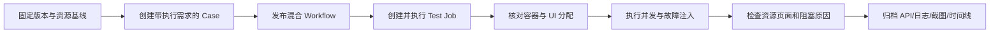

# TestForge 执行资源与 Case 级调度验收方案

> 验收只认真实 Case/Workflow/Test Job API、真实 Docker 运行实例、真实 Windows VM 执行和可追溯资源时间线。

## 1. 验收流程

### 1.1 验收准备

| 项目 | 要求 |
| --- | --- |
| 验收版本 | 固定 TestForge Commit、Worker/Agent 版本、Skill Sandbox Commit 和 WorkflowVersion |
| 验收环境 | MySQL、Redis、MinIO、Docker Engine、两台 Windows Hyper-V VM、Jenkins |
| 测试数据 | 至少两个 HEADLESS Case、八个 Windows UI Case、一个混合依赖 Workflow、一个 SUBFLOW 会话 Workflow |
| 资源基线 | Dispatcher Worker 数固定；Docker Node 提供可观测 CPU/内存；两台 VM 各提供一个 Windows Desktop |
| 证据目录 | `acceptance/evidence/tfp-063/` |
| API 集合 | `docs/06-execution-resources/bruno/` |

### 1.2 执行顺序

## 2. 流程验收场景

| 场景编号 | 覆盖的成功标准 | 前置条件 | 操作 | 预期结果 | 已知相邻影响检查 | 证据要求 |
| --- | --- | --- | --- | --- | --- | --- |
| CR-AC-01 | CR-S1 | Case API 可访问 | 分别创建 HEADLESS 与 UI Case；创建 Test Job | Case 返回执行需求；Test Job 请求无资源模式、资源池和并发字段 | 既有 Case 基础字段与 Test Job 固定 Commit 正常 | Bruno 请求/响应、页面截图 |
| CR-AC-02 | CR-S2 | Case 和 Workflow 可发布 | 发布 v1，修改 Case 需求，再读取并执行 v1 | v1 节点仍使用发布时需求；新版本使用新需求 | Workflow checksum 和节点名称正常 | 两版 Snapshot、执行消息 |
| CR-AC-03 | CR-S3 | Docker 与 Windows VM 在线 | 执行“脚本→UI→脚本”混合 Workflow | 两个脚本 Case 各在临时容器运行；只有 UI Case 时间段持有 Desktop Lease | DAG 前后继顺序、Attempt 证据不变 | Container 列表、Claim/Lease 时间线、截图 |
| CR-AC-04 | CR-S6 | 暂停一个 Provider 或 Agent | 运行需要对应能力的 Case并打开资源页 | Case 保持等待；页面显示稳定原因和等待时长；恢复后自动执行 | SSE 重连和历史 Attempt 可读 | 页面录屏、SSE、Claim API |
| CR-AC-05 | CR-S3 | SUBFLOW Workflow 已发布 | 执行建立登录会话的 Fixture 和两个后继 Case | 同一 sessionKey 使用同一 Allocation，子流程结束后释放 | 普通 CASE scope 不复用 Lease | Workflow、Allocation、Agent 日志 |
| CR-AC-06 | CR-S5 | 一个 UI Attempt 正在执行 | 终止 Agent，等待恢复并提交旧回调 | 旧 Attempt LOST，Claim 重新调度；迟到结果不覆盖新结果 | 报告只引用有效 Attempt | 故障日志、Lease、回调响应、报告 |
| CR-AC-07 | CR-S7 | 两个 Environment 已登记 | 启动两个 Agent，重启其中一个并重新上报资源 | 环境数量不变；新 session 接管；旧 session 不能心跳；容量不重复 | 另一环境执行不受影响 | Agent/Environment/Resource API 与事件 |
| CR-AC-08 | CR-S8 | Driver Factory 与 Airtest 可用 | 为 Windows、Android、iOS 生成执行规格，并真实执行 Windows Case | 三平台规格可生成；未知平台拒绝；Windows 结果含日志、截图和 HTML | pytest-http Provider 不受影响 | 单测、Attempt、对象存储证据 |
| CR-AC-09 | CR-S3 | Workflow 同时含未声明平台、`ANY` 和显式平台 Case | 以 WINDOWS Test Job 分别创建执行 | 缺省与 ANY 节点均生成 WINDOWS Task；显式 ANDROID 节点稳定拒绝；错误中不出现“平台 null” | capabilities 与 Provider 匹配不放宽 | RunTaskService 集成测试、真实任务执行响应 |
| CR-AC-10 | CR-S7 | 两台 Windows VM 已登录且 Worker/Sandbox 正在运行 | Jenkins 向两台 VM 发布同一冻结 Commit | 发布脚本停止计划任务和完整进程树，目录原子切换后重启；无目录占用错误；两台 Worker/DeviceSlot 恢复新鲜心跳 | 计划任务不与 Jenkins 自动重启竞争 | Jenkins Console、VM 进程与心跳、Deployment READY |

## 3. 并发验收

| 项目 | 验收口径 |
| --- | --- |
| 并发不变量 | 一个 Task 最多一个活动 Claim；一个 Windows Desktop 最多一个有效 Lease；计量资源 allocated 不超过 capacity；同一 Task 最多一个有效 Attempt |
| 负载模型 | 同一 Workflow 包含 20 个 HEADLESS Case 和 8 个 Windows UI Case；两台 Windows VM 各 1 个 Desktop；Docker Node 资源规格固定 |
| 并发量与持续时间 | 连续执行至少 3 轮；每轮等待所有节点终态，并在中间随机重启一个 Agent |
| 执行步骤 | 启动 Test Job；采集 Claim、Allocation、Attempt、容器、Agent 和 Resource 指标；注入 Agent 重启；等待收敛 |
| 达标指标 | UI 峰值并发恰为 2；桌面双占用 0；脚本并发随 Docker 可用容量变化且不读取 Test Job 并发值；任务丢失 0；重复有效结果 0；资源最终全部释放 |
| 已知相邻影响检查 | Jenkins 发布只发生在需要部署的目标环境；报告 Case 数与 Workflow 一致；SSE 与 REST 最终状态一致 |
| 证据要求 | 压测脚本输出、Claim/Allocation 导出、Prometheus 曲线、Docker 实例清单、双 VM Agent 日志、最终报告 |

| 场景编号 | 覆盖的成功标准 | 并发场景 | 预期结果 | 证据要求 |
| --- | --- | --- | --- | --- |
| CR-CC-01 | CR-S4 | 20 脚本 + 8 UI 混合负载 | 脚本按计算余量并行；UI 以两台 VM 为上限分批执行 | 时间线、资源曲线、容器与 Lease 清单 |
| CR-CC-02 | CR-S5 | 20 个 Claim 竞争同一 Desktop，重复 20 轮 | 每轮只有一个 Claim 获得 Lease，未获资源者不创建有效 Attempt | 数据库快照、服务日志、汇总脚本 |
| CR-CC-03 | CR-S5 | 两个 Dispatcher Worker 同时处理同一重复消息 | 只产生一个活动 Claim、一个 Allocation 和一个有效 Attempt | Outbox/Stream、Claim、Attempt 记录 |

## 4. 执行记录与证据

| 场景编号 | 状态 | 实际结果 | 执行命令或操作 | 证据路径 | 执行人 / 时间 |
| --- | --- | --- | --- | --- | --- |
| CR-AC-01 | NOT_RUN | Case API、Workflow 快照和 Task 资源字段已通过自动化测试；但完整真实页面/API场景尚未执行，不能标记通过 | Gradle 模块测试、前端测试、契约校验 | Gradle/Vitest/契约校验输出 | Codex / 2026-09-25 |
| CR-AC-02 | PASS | 已验证相邻 DAG 节点分别保留 HEADLESS/UI 需求且不沿边传播 | `WorkflowSnapshotCompilerTest` | 测试报告 | Codex / 2026-09-25 |
| CR-AC-03～CR-AC-08 | NOT_RUN | 独立 Claim/Provider/Agent 生命周期与真实混合环境尚未完整验收 | 待后续实现并执行 Bruno、浏览器与故障注入 | `acceptance/evidence/tfp-063/` | 待填写 |
| CR-CC-01～CR-CC-03 | NOT_RUN | 文档已设计，代码尚未实现 | 待开发后执行混合负载验收器 | `acceptance/evidence/tfp-063/` | 待填写 |

### 验收结论

| 项目 | 结论 |
| --- | --- |
| 核心流程 | NOT_RUN：基础自动化测试已通过，但完整真实流程尚未执行 |
| 并发要求 | NOT_RUN |
| 阻塞问题 | 独立 ResourceClaim/Allocation、Container Provider、Agent 资源 API 尚未完成 |
| 最终结论 | 基础资源契约可用；TFP-063 保持执行中，不能视为完整资源调度验收通过 |

> 历史记录说明：上述既有执行结果来自独立仓库建立前的开发环境，原始材料不随公开仓库分发，不能作为本次公开版本的验收结论。当前验证范围见 [公开准备记录](../reference/公开准备记录.md).
