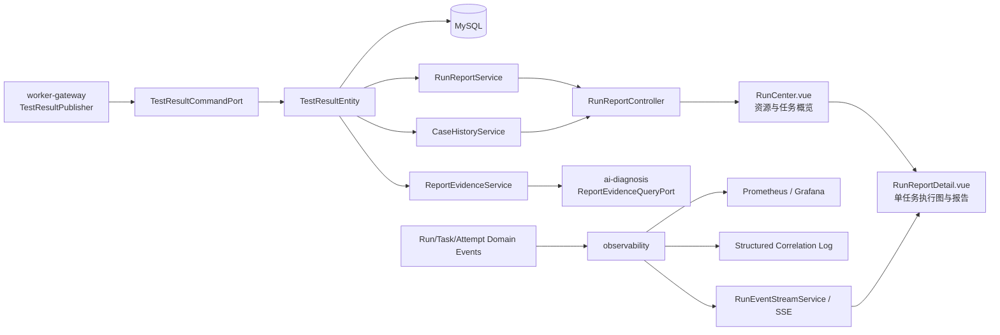
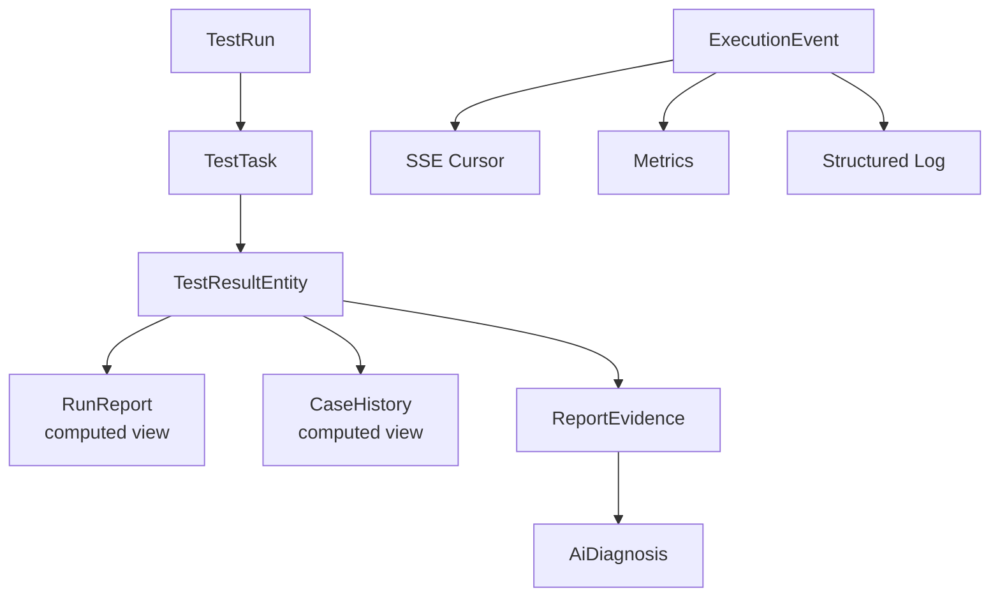

# TestForge 结果、事件与可观测性架构设计

## 1. 总体架构



`report` 负责确定性结果、报告、历史与证据；`observability` 已提供持久化 ExecutionEvent、历史查询和 SSE，平台应用层提供资源监控 API，Prometheus/Grafana 消费统一指标。

## 2. 关键规则

| 对象/场景 | 规则 | 生效条件 |
| --- | --- | --- |
| TestResult | taskId 唯一；有效 Attempt 结果才可写入；BLOCKED 可无 attemptId 但必须有 blockedBy | Task 收敛 |
| RunReport | 全部 Task 终态后聚合；Fixture 不计入断言通过率分母 | 查询或生成报告 |
| 耗时 | P50/P95 只统计具有有效执行耗时的结果 | 报告聚合 |
| 失败分类 | 确定性分类优先，AI 不得覆盖 | 结果写入 |
| CaseHistory | 同 caseId+scriptVersion+environment 比较，避免跨版本误报 Flaky | 历史查询 |
| Flaky | 最近窗口同时出现通过和失败才形成波动证据 | 历史聚合 |
| ExecutionEvent | 只追加，包含 aggregateId、状态、reason、业务关联 ID、时间 | 状态迁移 |
| SSE | 按 eventId 有序；`Last-Event-ID` 后续传 | 运行详情重连 |
| 可观测性 | 只消费事件并输出，不反向修改 Run/Task/Attempt | 全链路 |

## 3. 模块职责边界

| 模块 | 职责 | 数据/依赖 |
| --- | --- | --- |
| `TestResultCommandPort` | 接收已校验的确定性结果 | 由 worker-gateway 调用 |
| `RunReportService` | 按 runId 聚合通过率、耗时和失败计数 | `TestResultRepository` |
| `CaseHistoryService` | 按 Case/版本/环境构造历史和 Flaky 证据 | Result + run context |
| `ReportEvidenceService` | 将断言、日志、环境、执行事件、历史整理为只读证据 | `ReportEvidenceQueryPort` 暴露给 AI |
| `RunReportController` | 报告与历史查询入口 | 不负责状态迁移 |
| `observability` | 持久化执行事件、历史查询、SSE、Metrics 和关联日志 | MySQL、MeterRegistry |
| `run-orchestrator` | 拥有 Run/Task/Attempt 终态与事件来源 | report/observability 不反向改状态 |
| `testforge-client/src/runs/RunCenter.vue` | 运行与报告主页面：先展示全局资源/队列，再按 Test Job 展示运行概述和“查看报告”入口 | REST；主页面不建立 Run SSE |
| `testforge-client/src/runs/RunReportDetail.vue` | 单个 Test Job 的二级详情：执行历史、Workflow 运行图、节点时间线、确定性报告与 AI 诊断 | REST + 仅当前所选 Run 的 SSE |

## 4. 核心数据模型

### 4.1 结果、报告、证据关系



### 4.2 模型定义

| 模型 | 代码位置 | 核心字段 | 存储/约束 |
| --- | --- | --- | --- |
| `TestResultEntity` | `report/persistence` | taskId、attemptId、status、durationMs、failureType、summary、artifactKeys、blockedBy | MySQL；taskId 唯一 |
| `RunReport` | `report/service` | runId、total、passed、failed、blocked、passRate、p50、p95、failureCounts | 查询聚合视图 |
| `CaseHistory` | `report/service` | caseId、environment、scriptVersion、result sequence、flaky | 查询聚合视图 |
| `ReportEvidence` | `report/model` | reportId、evidence references、environment/history context | 只读值对象 |
| `ExecutionEventEntity` | `observability/event` | id、eventKey、aggregateId、type、sequence、runId/taskId/attemptId/deploymentId、occurredAt、payloadJson | MySQL；eventKey 唯一、只追加 |

## 5. 核心流程

### 5.1 报告生成与证据输出

```text
worker-gateway 完成有效 Attempt
  -> TestResultCommandPort 校验 taskId/attemptId 与结果字段
  -> TestResultRepository 幂等保存 TestResultEntity
  -> RunReportService 按 runId 读取全部结果
  -> 区分 ASSERTION / FIXTURE / BLOCKED，计算 passRate 与 P50/P95
  -> CaseHistoryService 读取同版本同环境历史，形成 Flaky 序列
  -> ReportEvidenceService 生成稳定 evidenceId
  -> RunReportController 返回报告；AI 只读 ReportEvidenceQueryPort
```

### 5.2 实时事件与断线续传

```text
业务状态机发布 DomainEvent
  -> observability 在同一业务事务内追加 ExecutionEvent
  -> SSE 按 eventId 推送
  -> RunReportDetail.vue 只更新当前所选 runId/taskId/attemptId
  ├─ 正常连接 -> 持续应用增量事件
  ├─ 带 Last-Event-ID 重连 -> 查询并补发后续事件
  └─ cursor 失效/事件缺口 -> 前端重新拉取 REST 快照，再恢复 SSE
```

### 5.3 运行与报告页面分层

```text
打开运行与报告
  -> RunCenter 并行读取资源快照、Agent/目标清单和 Test Job 执行摘要
  -> 第一块用单行五指标渲染执行资源与队列
     ├─ 等待发布 Case = deploymentWaiting
     ├─ 待调度 Case = processQueued + deviceQueued
     ├─ 执行中 Case = processRunning + deviceRunning
     ├─ 脚本执行槽 = max(processCapacity - processRunning, 0) / processCapacity
     └─ UI 测试机 = deviceAvailable / deviceCapacity
  -> 第二块一行一个 Test Job
  -> 点击“查看报告”并携带 taskId/currentAttemptId 进入 RunReportDetail
  -> 详情读取该任务执行历史、当前 Run、运行图、报告与 AI 诊断
  -> 只为当前 Run 建立 SSE；切换历史执行、返回主页面或卸载时关闭旧连接
```

## 6. 模块目录

标记：`[+]` 新增　`[~]` 修改　`[-]` 删除。

```text
testforge-platform
├─ testforge-app/report/src/main/java/io/testforge/report
│  ├─ [~] ReportConfig.java
│  ├─ ctrl/[~] RunReportController.java
│  ├─ persistence
│  │  ├─ [~] TestResultEntity.java
│  │  └─ [~] TestResultRepository.java
│  ├─ model
│  │  ├─ [~] ReportEvidence.java
│  │  ├─ [~] EvidenceReference.java / EvidenceType.java
│  │  └─ [~] TestResultCommand.java
│  ├─ port/inbound
│  │  ├─ [~] TestResultCommandPort.java
│  │  └─ [~] ReportEvidenceQueryPort.java
│  └─ service
│     ├─ [~] RunReportService.java / RunReport.java
│     ├─ [~] CaseHistoryService.java / CaseHistory.java
│     └─ [~] ReportEvidenceService.java
├─ testforge-app/observability/src/main/java/io/testforge/observability
│  ├─ [~] ObservabilityConfig.java
│  ├─ [~] event/ExecutionEventEntity.java / ExecutionEventRepository.java
│  ├─ [~] event/ExecutionEventService.java / ExecutionEventController.java
│  ├─ [~] sse/RunEventPublisher.java / SseCursorService.java
│  ├─ [~] metrics/TestForgeMetrics.java
│  └─ [~] logging/CorrelationLogContext.java
├─ testforge-client/src/runs
│  ├─ [~] RunCenter.vue
│  ├─ [+] RunReportDetail.vue
│  ├─ [+] models.ts
│  ├─ [+] RunCenter.test.ts
│  ├─ [+] RunReportDetail.test.ts
│  ├─ [~] live.ts / live.test.ts
│  └─ [~] index.ts
└─ infra
   ├─ [~] prometheus/prometheus.yml
   ├─ [~] prometheus/rules/testforge-alerts.yml
   ├─ [~] grafana/dashboards/testforge-overview.json
   └─ [~] grafana/provisioning/datasources/prometheus.yml
```

## 7. 数据与迁移

| 类型 | 归属 | 处理方式 |
| --- | --- | --- |
| TestResult 普通字段 | `report` JPA 实体 | Hibernate `ddl-auto=update` |
| ExecutionEvent 存储 | `observability_execution_event` | JPA DDL update；事件只追加，按 eventId/sequence 续传 |
| 报表视图/性能索引 | 数据所属模块 | 确认真实查询瓶颈后才用 simple-migration 创建，文件名全局唯一 |
| 历史结果兼容 | `report/src/main/resources/simple-migration` | 仅需批量修正历史 failureType/artifact 格式时新增迁移 |
| 完整日志与附件 | MinIO | MySQL 只保留摘要、hash 与 objectKey |
