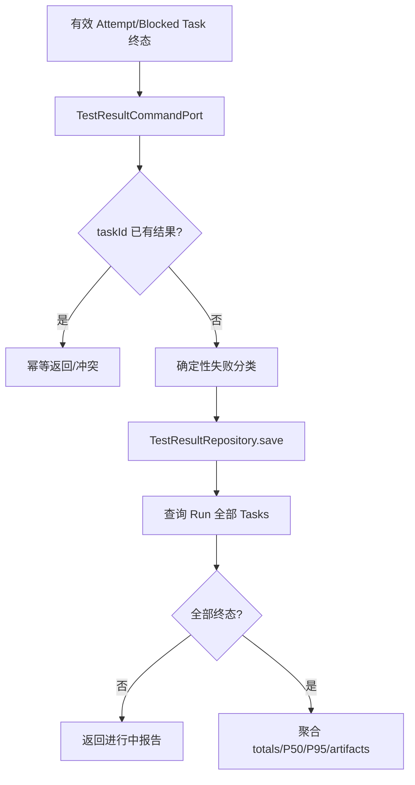
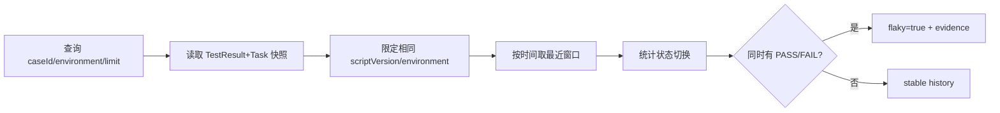
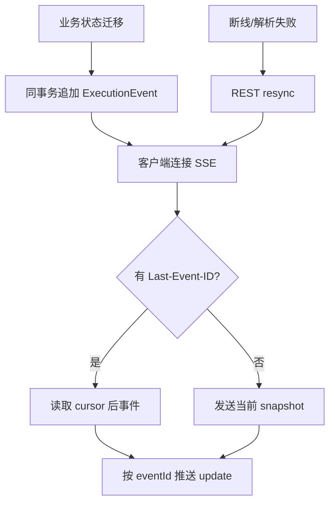
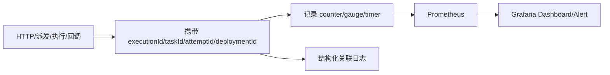
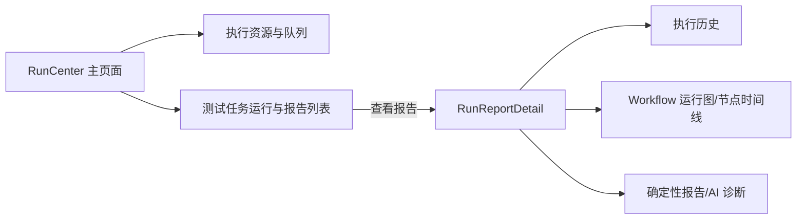

# TestForge 结果、事件与可观测性开发方案

## 1. 开发目标

| 编号 | 对应需求 | 开发目标 |
| --- | --- | --- |
| RO-G1 | RO-IN1 | 保存有效 TestResult 并聚合确定性 RunReport |
| RO-G2 | RO-IN2 | 生成同版本同环境 CaseHistory 与 Flaky 证据 |
| RO-G3 | RO-IN3、RO-IN4 | 输出可恢复事件、SSE、指标和结构化关联日志 |
| RO-G4 | RO-IN5 | 把资源/队列与任务运行概述收敛到主页面，把流程图、节点时间线和报告隔离到单任务二级详情页 |

## 2. 功能清单与实施顺序

| 顺序 | 功能 | 前置依赖 | 核心产出 |
| --- | --- | --- | --- |
| 1 | 结果写入与报告聚合 | 有效 Attempt 终态 | TestResult/RunReport |
| 2 | Case 历史与 Flaky | 历史 TestResult | CaseHistory |
| 3 | Run 事件与 SSE | 状态事件 | 可续传实时快照 |
| 4 | Metrics 与关联日志 | 统一业务关联 ID | 平台观测信号 |
| 5 | 运行与报告页面分层 | 执行摘要、资源快照、Run 图与报告 API | 主页面概览 + 单任务报告详情 |

## 3. 功能开发设计

### 3.1 结果写入与报告聚合

| 步骤 | 代码落点 | 输入 | 处理逻辑 | 数据/状态变化 | 输出/异常 |
| --- | --- | --- | --- | --- | --- |
| 1 | `TestResultCommandPort` 实现 | taskId、attemptId、status、duration、failure、artifacts | 校验有效 Attempt | 新增 TestResult | 冲突/结果 |
| 2 | `RunReportService` | runId | 读取 Task 和 Result，排除 Fixture 分母 | 无 | RunReport |
| 3 | `ReportEvidenceService` | report/run | 组装稳定 evidenceId | 无 | ReportEvidence |

| 模型 | 关键字段 | 约束 |
| --- | --- | --- |
| `TestResultEntity` | taskId、attemptId、status、durationMs、failureType、summary、artifactKeys、blockedBy | taskId 唯一 |
| `RunReport` | total、passed、failed、pending、durationMs、p50/p95、failureCategories、results | 只基于有效结果 |

#### 3.1.1 并发实现方式

| 项 | 实现方式 |
| --- | --- |
| 并发不变量 | 每个 Task 只有一个有效 TestResult |
| 实现机制 | taskId 唯一约束 + 当前 Attempt 校验 |
| 竞争失败处理 | 相同结果幂等返回；不同结果拒绝，报告重新读取权威数据 |

### 3.2 Case 历史与 Flaky

| 步骤 | 代码落点 | 输入 | 处理逻辑 | 数据/状态变化 | 输出/异常 |
| --- | --- | --- | --- | --- | --- |
| 1 | `CaseHistoryService` | caseId、environmentId、limit | 查询并限定可比较维度 | 无 | CaseHistory |
| 2 | History aggregation | recent results | 计算 sampleSize/statusTransitions/latestFailure | 无 | flaky evidence |

| 模型 | 关键字段 | 约束 |
| --- | --- | --- |
| `CaseHistory` | caseId、scriptVersion、environmentId、sampleSize、statusTransitions、flaky、recentResults | 不跨版本/环境 |

### 3.3 执行事件与 SSE

| 步骤 | 代码落点 | 输入 | 处理逻辑 | 数据/状态变化 | 输出/异常 |
| --- | --- | --- | --- | --- | --- |
| 1 | `ExecutionEventService` | DomainEvent | 同事务追加不可变事件 | ExecutionEvent append | eventId |
| 2 | `RunEventController/RunEventStreamService` | runId、Last-Event-ID | snapshot/增量/续传 | SSE 会话 | cursor error |
| 3 | `RunEventClient` | SSE message | apply 后 REST 校正 | 页面执行快照 | reconnecting |

#### 3.3.1 并发实现方式

| 项 | 实现方式 |
| --- | --- |
| 并发不变量 | 同一执行的事件按 eventId 可重放，连接并发不改变业务状态 |
| 实现机制 | ExecutionEvent 只追加；SSE 每连接独立游标；REST 快照最终校正 |
| 超时与恢复 | 浏览器自动重连，服务端按 cursor 续传或要求 resync |

### 3.4 Metrics 与关联日志

| 步骤 | 代码落点 | 输入 | 处理逻辑 | 数据/状态变化 | 输出/异常 |
| --- | --- | --- | --- | --- | --- |
| 1 | `ObservabilityConfig` 与目标埋点 | 关联 ID、状态、耗时 | 标准化标签与指标 | 观测信号 | 降级不抛业务异常 |
| 2 | Prometheus/Grafana 配置 | metrics | 抓取、展示 | 时序数据 | 健康状态 |

| 观测模型 | 关键字段 | 约束 |
| --- | --- | --- |
| Log context | executionId、taskId、attemptId、deploymentId、claimId | 跨模块结构化关联 |
| Metrics | pending claims、running attempts、provider capacity、online agents、lease loss、stream pending、duration、failure count | 标签低基数 |

### 3.5 运行与报告页面分层

| 步骤 | 代码落点 | 输入 | 处理逻辑 | 输出/异常 |
| --- | --- | --- | --- | --- |
| 1 | `RunCenter.vue` | `/test-jobs/execution-summaries`、`/monitoring/resources` | 资源块固定在前；任务一行一条，执行中优先，展示当前或最近一次状态 | 概览；无执行的任务禁用查看报告 |
| 2 | `RunCenter.vue` | 用户点击某行“查看报告” | 只传递所选 JobSummary，不在主页面预加载图或报告 | 进入二级详情 |
| 3 | `RunReportDetail.vue` | taskId/currentAttemptId | 读取执行历史并加载所选 Run、Graph、Report、Diagnosis | 单任务详情；报告未生成时显示等待态 |
| 4 | `RunReportDetail.vue` | 当前 runId | 建立单一 SSE；切换执行、返回或卸载时关闭旧连接 | 不串用其他任务状态 |

| 前端模型 | 关键字段 | 约束 |
| --- | --- | --- |
| `JobSummary` | taskId、projectName、name、currentAttemptId/state、progress、resolvedCommit、workflowVersion、attemptCount、lastExecutedAt | 一行对应一个 Test Job |
| `RunReportDetail` | selected Run、Graph、Report、Diagnosis、ConnectionState | 任一时刻只持有一个 taskId/runId 上下文 |

## 4. 公共实现规则

| 规则类型 | 统一实现 | 适用功能 |
| --- | --- | --- |
| 分类 | 确定性失败分类先于 AI，AI 不回写 | 3.1、3.2 |
| 附件 | 报告只保存 objectKey/hash/摘要 | 3.1、3.2 |
| 降级 | 观测/SSE 失败不改变测试任务当前结果与报告状态 | 3.3、3.4 |
| 页面隔离 | 主页面不持有 Run 图和报告状态；详情卸载时释放 SSE | 3.5 |
