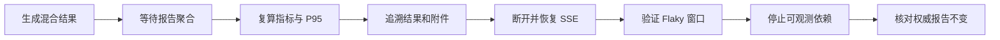

# TestForge 结果、事件与可观测性验收方案

> 验收只认真实执行结果与证据。本文验证 RO-S1～RO-S6；已知相邻影响随场景检查，广泛回归由平台固定主流程承担。

## 1. 验收流程

### 1.1 验收准备

| 项目 | 要求 |
|---|---|
| 验收版本 | 固定 app、前端、报告算法和事件契约版本 |
| 验收环境 | MySQL、对象存储、SSE、Web Console 和可观测组件可用 |
| 账号与数据 | 准备成功、失败、阻断、Fixture 及跨版本/环境历史结果 |
| 故障注入 | 可断开 SSE、停止可观测依赖并恢复连接 |
| 证据目录 | 保存原始结果、手工复算、事件序列、页面截图和监控日志 |

### 1.2 执行顺序

## 2. 流程验收场景

| 场景编号 | 覆盖的成功标准 | 前置条件 | 操作 | 预期结果 | 已知相邻影响检查 | 证据要求 |
|---|---|---|---|---|---|---|
| RO-AC-01 | RO-S1 | 固定的成功、失败、BLOCKED、Fixture 原始结果集 | 生成报告并手工复算通过率、分类计数和 P95 | 报告指标与有效原始结果一致，Fixture 不进断言分母 | Web Console 汇总与报告 API 一致 | 原始数据、复算表、API 响应、页面截图 |
| RO-AC-02 | RO-S2 | 报告含失败分类与附件 | 从报告逐项反查 Task、有效 Attempt 和 objectKey | 每个结果、分类和附件均有唯一可达来源 | AI 输入中的 evidenceId 指向同一证据 | 追溯清单、数据库查询、对象元数据 |
| RO-AC-03 | RO-S3 | 运行中持续产生事件 | 记录 eventId，断网，重连后再用 REST 刷新 | 续传或快照恢复后页面终态与 REST 一致，无最终状态遗漏 | 运行态 DAG 和时间线一致 | SSE 原始流、Last-Event-ID、REST 快照、录屏 |
| RO-AC-04 | RO-S4 | 同 Case 有稳定、波动、跨版本三组历史 | 分别查询 Flaky 分析 | 仅同版本同环境窗口内发生通过/失败切换的样本标为 Flaky | 历史详情展示相同样本窗口 | 样本数据、分析响应、页面截图 |
| RO-AC-05 | RO-S5 | 测试任务执行已完成且报告可查询 | 停止 Prometheus/Grafana 等指标依赖后再次查询 | 测试任务结果和报告完全不变，指标故障单独暴露 | 核心查询和附件访问保持可用 | 停止/恢复命令、前后报告 diff、错误日志 |
| RO-AC-06 | RO-S6 | 至少有一个执行中、一个已完成和一个未执行 Test Job | 打开运行与报告主页面 | 第一块为资源/队列，第二块一行一个任务；行内有状态、进度、Commit、Workflow、执行次数和查看报告；未执行任务按钮禁用 | 页面不出现 Workflow 图、节点时间线和报告正文 | 组件测试、页面截图 |
| RO-AC-07 | RO-S6 | 两个任务均有执行历史 | 依次进入两个任务报告详情并返回 | 每次详情只显示所选任务的执行图、历史、节点时间线和报告；切换与返回关闭旧 SSE，无跨任务内容叠加 | 资源/队列和任务列表返回后保持可刷新 | 组件测试、SSE 连接记录、页面截图 |
| RO-AC-08 | RO-S6 | 一个任务等待 Deployment，数据库另有无 Test Job 的遗留 QUEUED Run | 打开运行与报告并进入任务详情 | 任务行和节点显示“等待 Jenkins 发布”；资源排队不包含遗留孤立 Run | 可用 Agent/目标容量仍按真实在线资源显示 | API 响应、组件测试、页面截图 |
| RO-AC-09 | RO-S6 | 资源快照同时包含脚本与 UI 的排队、运行和容量数据 | 打开桌面端运行与报告主页面 | 五个资源指标保持同一行；待调度与执行中分别聚合两类 Case，脚本槽和 UI 测试机显示“可用/总量”，Agent 仅作副说明 | 展开资源明细仍可查看各 Agent 与测试机 | 组件测试、生产构建、页面截图 |

## 4. 执行记录与证据

状态只允许使用 `PASS`、`FAIL`、`BLOCKED`、`NOT_RUN`。所有场景均有真实证据且为 `PASS` 才能通过；固定平台回归由 [平台工程验收方案](../09-platform-engineering/04-验收方案.md) 另行执行。

| 场景编号 | 状态 | 实际结果 | 执行命令或操作 | 证据路径 | 执行人 / 时间 |
|---|---|---|---|---|---|
| RO-AC-01～RO-AC-05 | NOT_RUN | 待执行 | 待填写 | 待填写 | 待填写 |
| RO-AC-06～RO-AC-07 | PASS | 概览按资源/队列、任务运行/报告两块展示；一行一个 Test Job；报告详情只加载所选任务，返回后恢复概览并释放详情组件 | `npm test -- --run`；`npm run build`；浏览器访问 `http://127.0.0.1:5174/?view=runs`，进入“人工测试”报告后返回 | `src/runs/RunCenter.test.ts`、`src/runs/RunReportDetail.test.ts`；真实 API 页面检查 | Codex / 2026-09-26 |
| RO-AC-09 | PASS | 资源概览收敛为单行五指标；排队、运行、脚本槽与 UI 测试机计算符合快照数据 | `npm test -- --run src/runs/RunCenter.test.ts`；`npm run build` | `src/runs/RunCenter.test.ts` | Codex / 2026-09-26 |

### 验收结论

| 项目 | 结论 |
|---|---|
| 核心流程 | 本期页面分层 RO-AC-06～07 PASS；既有 RO-AC-01～05 未在本轮重跑 |
| 并发要求 | 不适用 |
| 阻塞问题 | 待填写 |
| 最终结论 | 运行与报告页面分层验收通过；不替代既有报告算法与故障注入验收 |

> 历史记录说明：上述既有执行结果来自独立仓库建立前的开发环境，原始材料不随公开仓库分发，不能作为本次公开版本的验收结论。当前验证范围见 [公开准备记录](../reference/公开准备记录.md).
