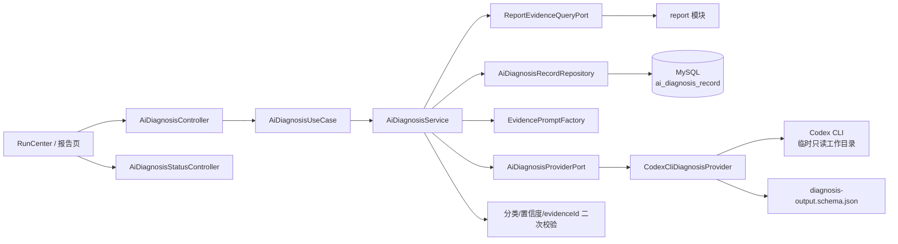
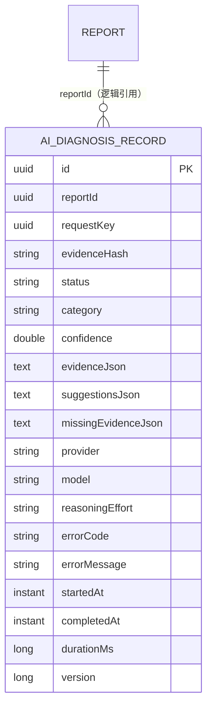
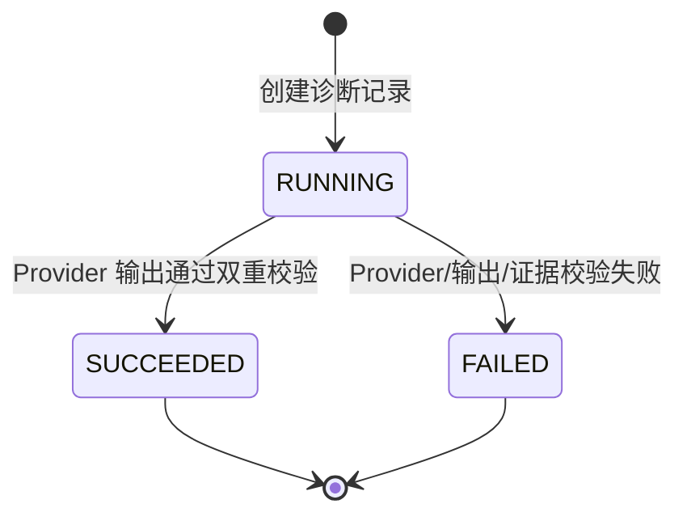
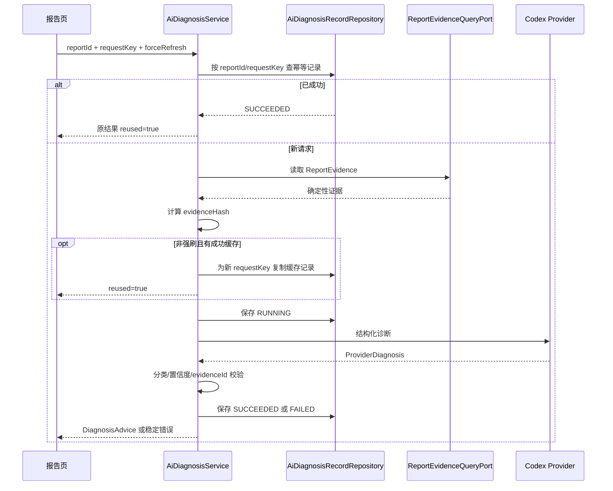

# TestForge AI 证据诊断架构设计

## 1. 总体架构

AI 诊断是报告域的只读增强能力：它读取已经形成的确定性证据，生成带证据引用的辅助建议，但不改变 Run、Task、Attempt 或测试结果。



依赖方向固定为 `ai-diagnosis -> report`。`report` 不依赖 AI，Provider 不直接读取业务数据库，前端也不把 AI 输出当作确定性测试结论。

## 2. 关键规则

| 场景 | 架构规则 |
| --- | --- |
| 证据来源 | 只通过 `ReportEvidenceQueryPort` 读取报告证据，不直接访问 report Repository |
| 幂等 | `(reportId, requestKey)` 唯一；同一请求成功则重放结果，运行中或失败的旧 key 返回稳定冲突 |
| 结果复用 | 未要求强制刷新时，以 `reportId + evidenceHash + SUCCEEDED` 查找可复用结果，并为新 requestKey 复制记录 |
| 输出约束 | Provider 输出先受 JSON Schema 约束，再由 Service 校验分类、置信度和 evidenceId |
| 引用闭包 | 输出中的每个 `evidenceId` 必须属于本次输入证据集，否则整次诊断失败 |
| 隔离 | Codex CLI 使用临时目录、`--ephemeral`、只读 sandbox；结束后删除临时文件 |
| 容量保护 | Provider 通过 Semaphore 限并发；忙、超时、未登录、非法输出使用不同错误码 |
| 状态隔离 | AI 失败只落 `AiDiagnosisRecord`，不修改报告结论和运行状态 |

## 3. 模块职责边界

| 模块/组件 | 负责 | 不负责 |
| --- | --- | --- |
| `ctrl` | 接收诊断、查询最新诊断和 Provider 状态请求；映射统一响应 | 拼 Prompt、直接调用 CLI、改报告 |
| `AiDiagnosisService` | 幂等判断、证据读取、缓存复用、状态落库、业务校验 | 拼接 HTTP 页面、读取 report 表 |
| `EvidencePromptFactory` | 稳定排序、裁剪证据、构造 Prompt、计算 evidenceHash | 调用 Provider、持久化结果 |
| `AiDiagnosisProviderPort` | 隔离模型提供方接口 | 暴露 Codex CLI 细节给业务层 |
| `CodexCliDiagnosisProvider` | readiness、并发限制、进程生命周期、Schema 输出和临时目录清理 | 决定报告状态、放宽 evidenceId 校验 |
| `report` | 提供只读 `ReportEvidence` | 依赖 AI 或接受 AI 回写 |
| `testforge-client/src/reports` | 展示 AI 可用性、辅助建议、证据与缺失证据 | 将建议显示为测试真相 |

## 4. 核心数据模型

### 4.1 持久化关系



`reportId` 是跨模块逻辑引用，不把 report 实体映射为 JPA 关联，以免模块实体互相渗透。

### 4.2 状态与结果对象



| 对象 | 位置 | 说明 |
| --- | --- | --- |
| `AiDiagnosisRecordEntity` | `repo` | 保存请求身份、证据哈希、Provider 元数据、结果 JSON、失败信息和耗时 |
| `ProviderDiagnosis` | `model` | Provider 的结构化原始输出 |
| `DiagnosisAdvice` | `model` | 对外返回的诊断结果，额外包含 `reused` 与生成时间 |
| `EvidenceCitation` | `model` | `evidenceId + reason`；evidenceId 必须来自输入证据 |
| `ProviderStatus` | `model` | readiness、Provider、模型与 reasoning effort |

## 5. 核心流程

### 5.1 诊断与复用



### 5.2 Provider 失败分支

```text
未启用/未登录       -> AI_PROVIDER_UNAVAILABLE
并发令牌不足        -> AI_PROVIDER_BUSY
执行超过配置时限    -> AI_PROVIDER_TIMEOUT
缺字段/Schema 不符  -> AI_OUTPUT_INVALID
引用输入外 evidence -> AI_OUTPUT_INVALID
以上失败            -> 记录 FAILED；报告与 Run 保持原状
```

## 6. 模块目录

标记：`[+]` 新增　`[~]` 修改　`[-]` 删除；未标记表示现有结构。

```text
testforge-platform
├─ testforge-app/ai-diagnosis
│  ├─ build.gradle
│  ├─ MODULE.md
│  └─ src
│     ├─ main/java/io/testforge/aidiagnosis
│     │  ├─ AiDiagnosisConfig.java                 # 模块装配
│     │  ├─ config/AiDiagnosisProperties.java      # Provider/模型/并发/超时配置
│     │  ├─ ctrl
│     │  │  ├─ AiDiagnosisController.java
│     │  │  ├─ AiDiagnosisStatusController.java
│     │  │  └─ AiDiagnosisExceptionHandler.java
│     │  ├─ model
│     │  │  ├─ DiagnosisRequest.java
│     │  │  ├─ DiagnosisAdvice.java
│     │  │  ├─ ProviderDiagnosis.java
│     │  │  ├─ ProviderStatus.java
│     │  │  └─ EvidenceCitation.java
│     │  ├─ port
│     │  │  ├─ inbound/AiDiagnosisUseCase.java
│     │  │  └─ outbound/AiDiagnosisProviderPort.java
│     │  ├─ provider
│     │  │  ├─ EvidencePromptFactory.java
│     │  │  └─ CodexCliDiagnosisProvider.java
│     │  ├─ repo
│     │  │  ├─ AiDiagnosisRecordEntity.java
│     │  │  └─ AiDiagnosisRecordRepository.java
│     │  └─ service
│     │     ├─ AiDiagnosisService.java
│     │     └─ AiDiagnosisException.java
│     └─ main/resources/io/testforge/aidiagnosis
│        └─ diagnosis-output.schema.json
├─ testforge-app/report/src/main/java/io/testforge/report
│  ├─ port/inbound/ReportEvidenceQueryPort.java
│  └─ model/ReportEvidence.java
├─ testforge-client/src
│  ├─ reports
│  │  ├─ index.ts                                  # 诊断/历史查询客户端
│  │  └─ aiDiagnosis.test.ts
│  └─ runs/RunCenter.vue                           # 报告与 AI 建议展示
├─ acceptance
│  ├─ bruno/ai-diagnosis
│  └─ evidence/ai-diagnosis
└─ docs/08-ai-diagnosis
   ├─ 01-需求分析.md
   ├─ 02-架构设计.md
   ├─ 03-开发方案.md
   └─ 04-验收方案.md
```

## 7. 数据与迁移

| 变更 | 归属 | 策略 |
| --- | --- | --- |
| `ai_diagnosis_record` 新实体和普通字段 | `ai-diagnosis` | 当前由 JPA/Hibernate `ddl-auto=update` 承接 |
| `(report_id, request_key)` 唯一约束、报告完成时间索引 | `AiDiagnosisRecordEntity` | 约束名称保持稳定；部署前校验存量重复数据 |
| JSON 结果字段 | `ai-diagnosis` | 以 text 保存版本内结构；读取失败视为数据异常，不静默吞掉 |
| 未来的索引、视图或兼容数据修复 | 所属业务模块 | 仅在必须启动执行时新增全局唯一的 `simple-migration` 文件 |
| 已执行迁移 | 全平台 | 不修改原文件；通过新增版本化迁移演进 |
