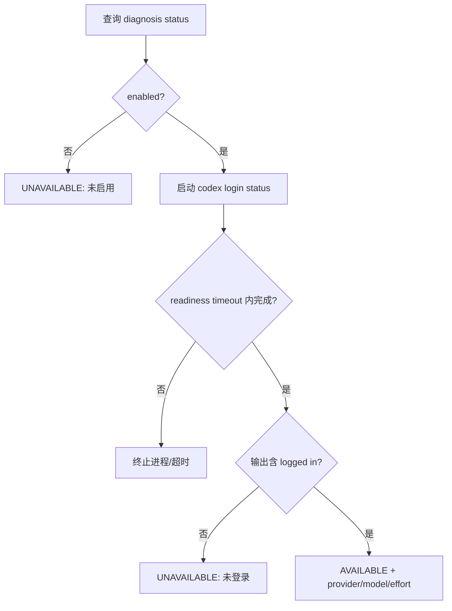
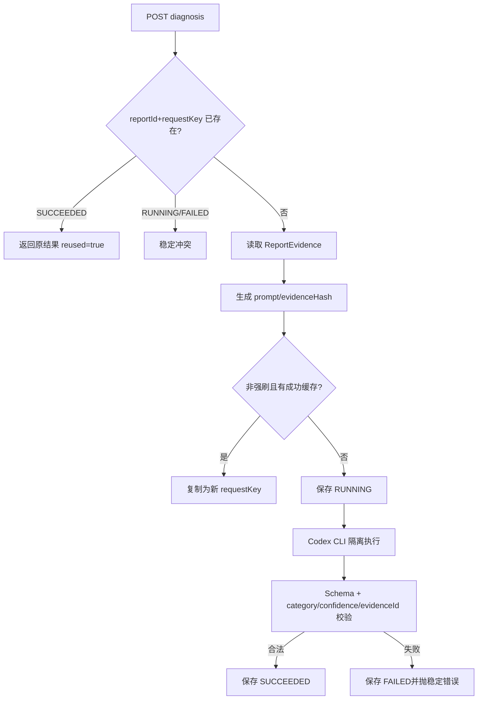
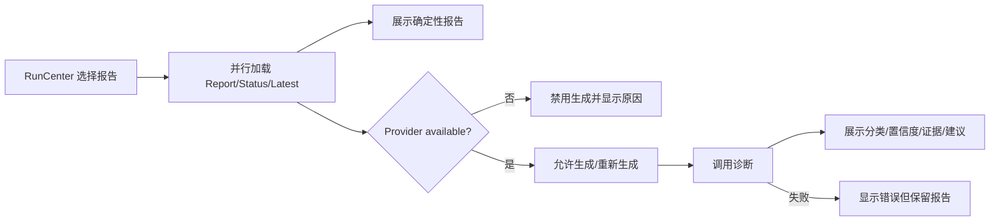

# TestForge AI 证据诊断开发方案

## 1. 开发目标

| 编号 | 对应需求 | 开发目标 |
| --- | --- | --- |
| AI-G1 | AI-IN1 | 提供 Codex CLI readiness 与可解释降级 |
| AI-G2 | AI-IN2～AI-IN4 | 实现幂等、可复用、双重校验的同步诊断 |
| AI-G3 | AI-IN5 | 在报告页展示受控建议且不影响确定性报告 |

## 2. 功能清单与实施顺序

| 顺序 | 功能 | 前置依赖 | 核心产出 |
| --- | --- | --- | --- |
| 1 | Provider 状态检查 | Codex CLI 配置 | ProviderStatus |
| 2 | 诊断生成与结果复用 | ReportEvidence、Provider | DiagnosisAdvice |
| 3 | 报告页诊断交互 | 前两项 API | AI 辅助建议面板 |

## 3. 功能开发设计

### 3.1 Provider 状态检查

| 步骤 | 代码落点 | 输入 | 处理逻辑 | 数据/状态变化 | 输出/异常 |
| --- | --- | --- | --- | --- | --- |
| 1 | `AiDiagnosisStatusController` | report/run context | 调用 Provider status | 无 | ApiResponse |
| 2 | `CodexCliDiagnosisProvider.status` | command、timeout | 启动进程并检查登录输出 | 无 | ProviderStatus |

| 模型 | 关键字段 | 约束 |
| --- | --- | --- |
| `AiDiagnosisProperties` | enabled、codexCommand、provider、model、reasoningEffort、readinessTimeout | 环境配置 |
| `ProviderStatus` | available、status、message、provider、model、reasoningEffort | 不抛出到报告主体 |

### 3.2 诊断生成与结果复用

| 步骤 | 代码落点 | 输入 | 处理逻辑 | 数据/状态变化 | 输出/异常 |
| --- | --- | --- | --- | --- | --- |
| 1 | `AiDiagnosisController`/`AiDiagnosisService` | reportId、requestKey、forceRefresh | 幂等、缓存和状态编排 | RUNNING/SUCCEEDED/FAILED | DiagnosisAdvice/错误 |
| 2 | `ReportEvidenceQueryPort` | reportId | 只读获取证据 | 无 | REPORT_NOT_FOUND |
| 3 | `EvidencePromptFactory` | ReportEvidence | 稳定排序、裁剪、hash、prompt | evidenceHash | prompt |
| 4 | `CodexCliDiagnosisProvider` | prompt、schema | Semaphore、临时目录、进程超时、解析 JSON | 临时文件后清理 | ProviderDiagnosis/错误 |
| 5 | `AiDiagnosisRecordRepository` | Entity | 保存请求、结果、错误和耗时 | 诊断记录 | Advice |

| 接口/模型 | 关键字段 | 约束 |
| --- | --- | --- |
| 生成诊断 | reportId、requestKey、forceRefresh | forceRefresh 也必须使用新 requestKey |
| `AiDiagnosisRecordEntity` | id、reportId、requestKey、evidenceHash、status、provider、model、result JSON、error、version | reportId+requestKey 唯一 |
| `ProviderDiagnosis` | category、confidence、evidence[]、suggestions[]、missingEvidence[] | evidenceId 属于输入证据 |

#### 3.2.1 并发实现方式

| 项 | 实现方式 |
| --- | --- |
| 并发不变量 | 同一 reportId+requestKey 只执行一次；Provider 并发不超配置值 |
| 竞争资源 | 诊断请求身份、Codex CLI 进程槽位 |
| 实现机制 | 数据库唯一约束/乐观锁 + JVM Semaphore |
| 事务边界 | RUNNING 先持久化；Provider 调用后单独保存 SUCCEEDED/FAILED，避免长事务 |
| 幂等方式 | 成功重放原记录；相同 evidenceHash 可复制成功缓存 |
| 竞争失败处理 | 运行中返回 DIAGNOSIS_IN_PROGRESS；无槽位返回 AI_PROVIDER_BUSY |
| 超时与恢复 | 强制终止进程树、记录 FAILED、清理临时目录；使用新 requestKey 重试 |

### 3.3 报告页诊断交互

| 步骤 | 代码落点 | 输入 | 处理逻辑 | 数据/状态变化 | 输出/异常 |
| --- | --- | --- | --- | --- | --- |
| 1 | `testforge-client/src/reports/index.ts` | reportId | latest/status/diagnose 请求 | 无 | DTO/ApiError |
| 2 | `RunCenter.vue` | Report、ProviderStatus、Advice | 管理 aiBusy/degraded/reused 展示 | 浏览器状态 | 辅助建议面板 |

| 页面模型 | 关键字段 | 约束 |
| --- | --- | --- |
| `AiDiagnosis` | category、confidence、evidence、suggestions、missingEvidence、provider、model、reused、generatedAt | 显示“辅助建议” |

## 4. 公共实现规则

| 规则类型 | 统一实现 | 适用功能 |
| --- | --- | --- |
| 隔离 | CLI 使用临时目录、ephemeral、只读 sandbox，结束清理 | 3.1、3.2 |
| 状态隔离 | AI 错误只写诊断记录，不修改 Report/Run | 3.2、3.3 |
| 配置 | 命令、模型、effort、超时、并发由环境配置 | 3.1、3.2 |
