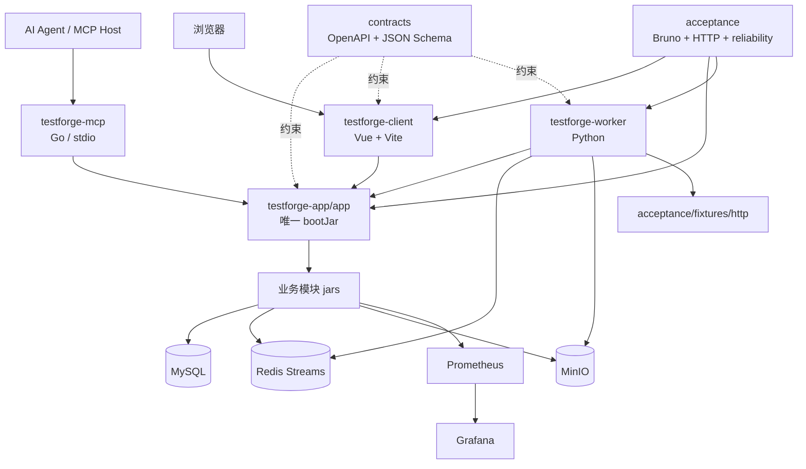
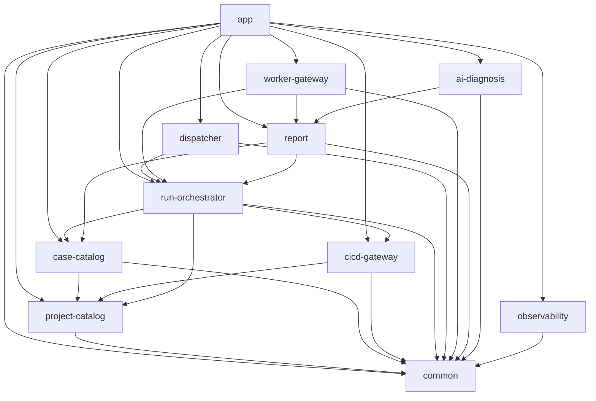
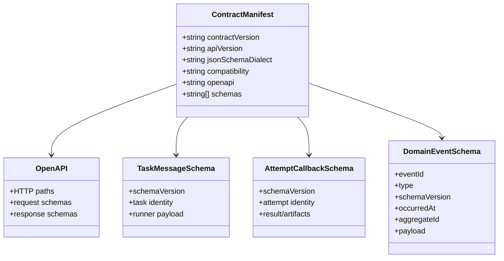
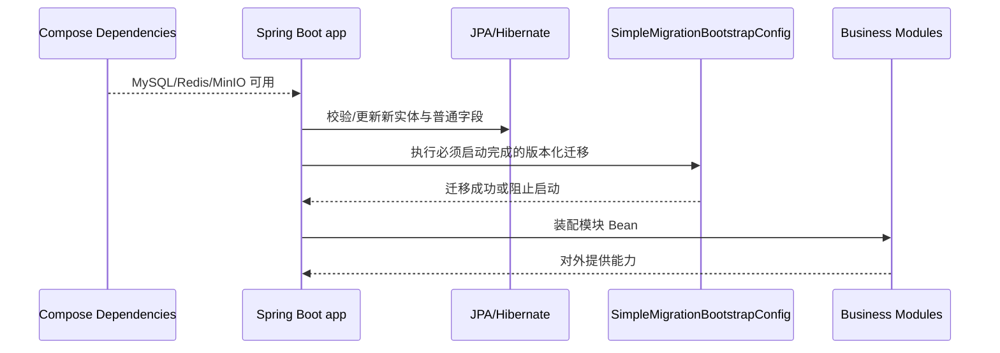
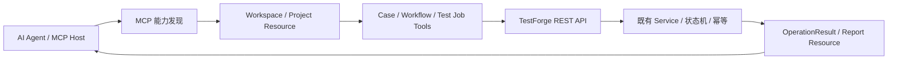

# TestForge 平台工程、控制台与交付架构设计

## 1. 总体架构

平台由一个 Spring Boot 模块化单体、一个 Vue Web Console、一个 Python Worker、一个独立 Go MCP 接入层和本地基础设施组成。契约目录连接 Java、TypeScript、Python、Go 四种实现，验收目录保存真实 HTTP 与可靠性证据。



### 1.1 Web Console 外壳

```text
testforge-client
├─ app
│  ├─ 主导航：测试任务 / 实时运行 / 被测项目 / 环境资源
│  ├─ 页面外壳：品牌区、模块栏、内容视口
│  └─ 设计令牌：ink / paper / cyan / status colors
├─ common
│  ├─ API client
│  ├─ loading / empty / error / degraded
│  └─ SSE reconnect / snapshot correction
└─ feature pages
   └─ 业务规则分别归属项目、任务、工作流、执行资源、结果与 AI 功能域
```

### 1.2 后端模块依赖图



此依赖矩阵由根 `build.gradle` 的 `verifyModuleBoundaries` 校验；`app` 只做启动和装配，业务模块只生成普通 jar。

## 2. 关键规则

| 场景 | 架构规则 |
| --- | --- |
| 构建产物 | `app` 是唯一 bootJar；其他 Java 模块只能生成普通 jar |
| 模块依赖 | 依赖集合必须与根构建矩阵一致，禁止循环依赖和跨模块 Repository 访问 |
| 跨语言契约 | OpenAPI 和 JSON Schema 以 `contracts/manifest.json` 为入口；同主版本只做向后兼容新增 |
| 消息兼容 | 生产者写明确版本；消费者拒绝缺失必填字段并允许未知可选字段 |
| 配置与密钥 | 默认值只服务本地开发；真实密钥通过环境变量注入，不提交 `.env.local` |
| 基础设施 | Compose 服务需有健康检查；应用启动不等于依赖健康 |
| 数据演进 | 新实体/普通字段默认用 JPA DDL update；索引、视图、兼容数据等才使用 simple-migration |
| 验收证据 | 单测、构建、mock、真实 HTTP、真实 Provider、手工 UI 证据分开标识，不能互相替代 |
| 文档维护 | 每个任务在自己的 worktree 同时更新任务文档和对应项目文档，合并代码时一起合并文档 |
| 控制台边界 | App 只维护导航、视口、请求和视觉基础；业务表单、状态和流程由所属功能域维护 |
| Jenkins CI | 平台 Jenkinsfile 负责平台构建与门禁；被测项目 Jenkinsfile 负责自身构建、初始化和发布 |
| AI 接入 | MCP 仅适配授权工作区与公开 REST；stdout 为 MCP 协议，stderr 为诊断；不直连数据库、中间件或 Provider |
| MCP 写操作 | 使用名称明确的写 Tool 和 requestKey；Tool annotations 只作提示，业务幂等仍由服务端保证 |

## 3. 模块职责边界

| 模块/目录 | 职责 | 边界 |
| --- | --- | --- |
| `testforge-app/app` | Spring Boot 启动、应用配置、模块装配、迁移引导 | 不编写领域规则 |
| `testforge-app/common` | 真正跨模块的稳定基础类型与配置 | 不成为任意工具类垃圾桶 |
| 九个后端模块 | 各自实体、状态机、Service、Port、Controller | 通过公开 Service/Port 协作，不共享 Repo |
| `testforge-client` | 浏览器交互和组合视图 | 不作为业务真相源 |
| `testforge-worker` | 领取任务、执行 runner、上传证据、回调 | 不自行决定平台状态机终态 |
| `testforge-mcp` | 面向 MCP Host 的工作区识别、HTTP 适配、项目上下文聚合和协议能力 | 不复制领域状态机，不直连存储和 Jenkins；详细设计归属功能域 10 |
| `contracts` | OpenAPI、消息 Schema、合法/非法示例、兼容策略 | 不复制业务实现代码 |
| `infra` | MySQL、Redis、MinIO、Prometheus、Grafana 编排与配置 | 不承载应用业务数据定义 |
| `scripts` | 一键开发、构建、验证和端到端入口 | 不隐藏不可审计的业务修复 |
| `acceptance` | Bruno、真实 HTTP、可靠性场景和证据归档 | 不把 mock 通过写成真实链路通过 |

## 4. 核心数据模型

### 4.1 契约拓扑



### 4.2 环境与交付证据

| 对象 | 存储位置 | 核心约束 |
| --- | --- | --- |
| `EnvironmentProfile` | `.env.local.example`、环境变量、`application.yml`、Compose overlay | dev/test/demo 彼此独立；密钥不入库 |
| `AcceptanceRecord` | `acceptance/evidence/<capability>/` | 记录环境、命令、结果、证据类型和限制 |
| `ContractManifest` | `contracts/manifest.json` | 文件路径存在且 Schema/example 可校验 |
| `ModuleDependencyMatrix` | `testforge-app/build.gradle` | 实际项目依赖必须精确匹配且无环 |

### 4.3 MCP OperationResult

| 字段 | 类型 | 必填 | 说明 |
| --- | --- | --- | --- |
| ok | boolean | 是 | Tool 是否完成业务目标 |
| operation/status/summary | string | 是 | 稳定操作名、当前状态和人类摘要 |
| data | any | 成功时 | API 数据或聚合上下文 |
| requestKey | UUID | 写操作按需 | 幂等关联键，结果不确定时复用 |
| warnings/nextActions | string[] | 是 | 事实边界和后续可执行动作 |
| error.code/message/retryable | mixed | 失败时 | 稳定错误码、说明和是否可重试 |
| error.status/traceId | mixed | 平台失败时 | HTTP 状态和服务端追踪 ID |

## 5. 核心流程

### 5.1 从契约到交付

```mermaid
flowchart LR
    DOC[需求/架构/开发/验收文档] --> CONTRACT[更新 OpenAPI / Schema / example]
    CONTRACT --> VERIFY_CONTRACT[契约校验]
    VERIFY_CONTRACT --> IMPLEMENT[Java / TS / Python 实现]
    IMPLEMENT --> UNIT[各子项目单测]
    UNIT --> BUILD[根构建 + 模块边界校验]
    BUILD --> INFRA[启动 Compose 并等待健康]
    INFRA --> ACCEPT[Bruno / HTTP / reliability / UI 验收]
    ACCEPT --> EVIDENCE[归档脱敏证据]
    EVIDENCE --> UPDATE_DOC[更新项目文档与任务文档]
    UPDATE_DOC --> MERGE[合并代码、契约、证据、文档]
```



### 5.2 应用启动与数据演进



普通业务写入不应放入启动迁移；只有视图、索引、兼容数据或必须在服务可用前完成的 SQL 才进入 simple-migration。

### 5.3 MCP 调用链



## 6. 模块目录

标记：`[+]` 新增　`[~]` 修改　`[-]` 删除；未标记表示现有结构。

```text
testforge-platform
├─ README.md
├─ .env.local.example
├─ testforge-app
│  ├─ settings.gradle                         # 11 个 Gradle project（app+10 模块）
│  ├─ build.gradle                            # 依赖矩阵与 verifyModuleBoundaries
│  ├─ app
│  │  ├─ build.gradle                         # 唯一 Spring Boot bootJar
│  │  └─ src/main
│  │     ├─ java/io/testforge/app
│  │     │  ├─ TestForgeApplication.java
│  │     │  ├─ HealthController.java
│  │     │  └─ SimpleMigrationBootstrapConfig.java
│  │     └─ resources/application.yml
│  ├─ common
│  ├─ project-catalog
│  ├─ case-catalog
│  ├─ cicd-gateway
│  ├─ run-orchestrator
│  ├─ dispatcher
│  ├─ worker-gateway
│  ├─ report
│  ├─ ai-diagnosis
│  └─ observability
├─ testforge-client
│  ├─ package.json
│  ├─ vite.config.ts
│  └─ src/{app,common,projects,catalog,workflows,runs,workers,reports}
├─ testforge-worker
│  ├─ pyproject.toml
│  ├─ testforge_worker/{consumer,runtime,executor,callback,artifact}
│  └─ tests
├─ testforge-mcp
│  ├─ go.mod / go.sum
│  ├─ README.md
│  ├─ cmd/testforge-mcp/main.go
│  └─ internal/{application,binding,config,mcpserver,result,testforge,workspace}
├─ contracts
│  ├─ manifest.json
│  ├─ openapi/v1/testforge.yaml
│  ├─ schemas/v1
│  │  ├─ task-message.schema.json
│  │  ├─ attempt-callback.schema.json
│  │  ├─ domain-event.schema.json
│  │  └─ artifact.schema.json
│  └─ examples/v1
├─ infra
│  ├─ compose.yaml                            # 基础依赖
│  ├─ compose.dev.yaml
│  ├─ compose.test.yaml
│  ├─ compose.demo.yaml
│  ├─ bin/{compose.ps1,compose.sh}
│  ├─ redis/redis.conf
│  ├─ prometheus/{prometheus.yml,rules}
│  └─ grafana/{dashboards,provisioning}
├─ scripts
│  ├─ dev.ps1                                # Windows 本地启动
│  ├─ [~] build.ps1 / build.sh               # 聚合构建，包含 MCP
│  ├─ check.ps1 / check.sh                 # 聚合验证
│  ├─ workers/                              # Worker 启动
│  └─ selftest/                             # Jenkins 自测实例部署
├─ acceptance
│  ├─ smoke                                 # Compose 冒烟
│  ├─ fixtures/http                         # 按需启动的 HTTP 验收夹具
│  ├─ bruno
│  ├─ reliability
│  ├─ evidence
│  ├─ asset_management_http.py
│  ├─ realtime_center_http.py
│  ├─ report_history_http.py
│  └─ validate.py
└─ docs/09-platform-engineering
   ├─ 01-需求分析.md
   ├─ 02-架构设计.md
   ├─ 03-开发方案.md
   └─ 04-验收方案.md
```

## 7. 数据与迁移

| 类型 | 所在位置 | 执行策略 |
| --- | --- | --- |
| 新实体、普通字段 | 各业务模块 JPA Entity | 默认由 Hibernate `ddl-auto=update` 承接 |
| 视图、索引、兼容数据、必须启动前执行 SQL | 所属模块 `src/main/resources/simple-migration` | 文件名全局唯一、可重复启动安全、失败阻止应用进入可用态 |
| 迁移引导 | `app/SimpleMigrationBootstrapConfig.java` | 只负责框架装配，不把业务 SQL集中到 app |
| 业务数据修复 | 对应业务模块和单独审批流程 | 不伪装成普通 schema 变更 |
| 已执行迁移 | 全平台 | 永不修改历史文件；新增下一版本迁移 |

数据库卷、Redis 数据、MinIO 证据和 Grafana 数据由 Compose 命名卷管理；重建环境前必须明确哪些卷可删除，交付脚本不得默认清空持久化数据。
