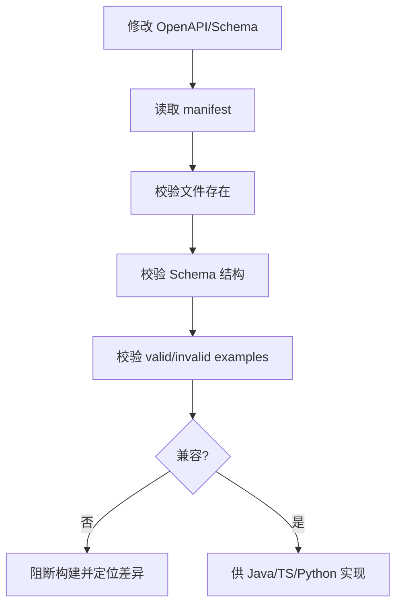
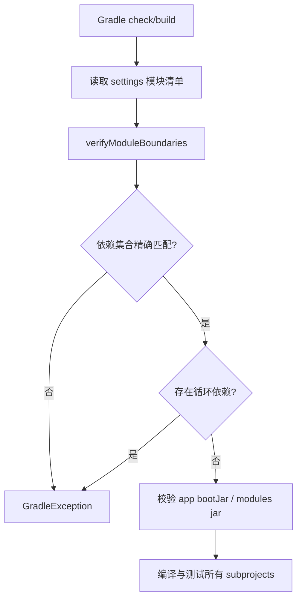
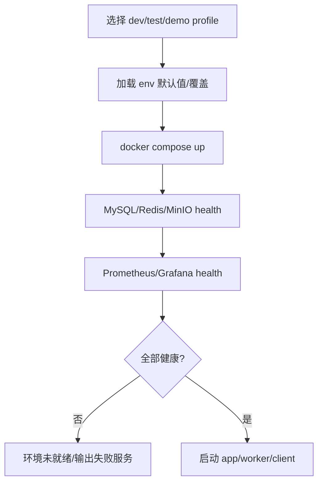
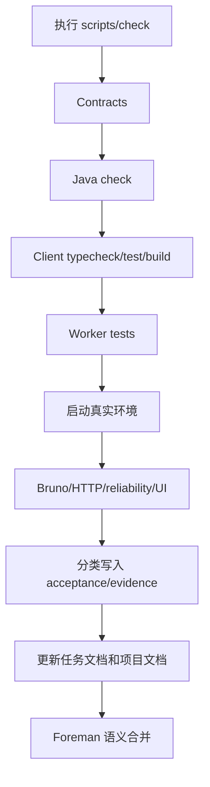
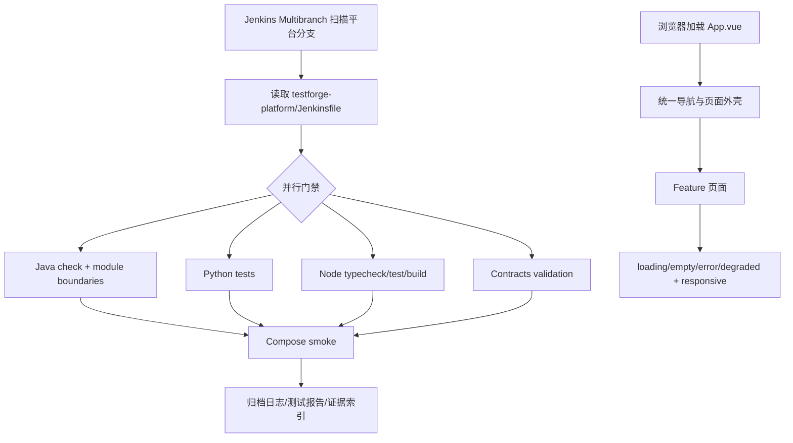
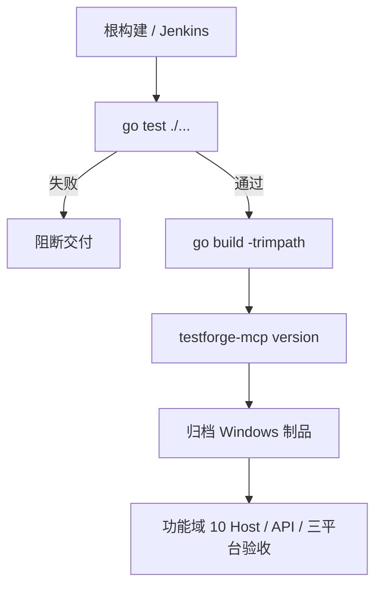

# TestForge 平台工程、控制台与交付开发方案

## 1. 开发目标

| 编号 | 对应需求 | 开发目标 |
| --- | --- | --- |
| PD-G1 | PD-IN1、PD-IN2 | 固定 Java 模块边界与跨语言契约校验 |
| PD-G2 | PD-IN3、PD-IN4 | 提供可复现基础设施和统一构建/启动入口 |
| PD-G3 | PD-IN5、PD-IN6 | 执行真实验收并归档代码、证据和文档 |
| PD-G4 | PD-IN7、PD-IN8 | 统一 Console 外壳，并用 Jenkins Multibranch 执行平台分支 CI |
| PD-G5 | PD-IN9 | 提供面向 AI Agent 和自动化脚本的 JSON CLI 与公开使用文档 |

## 2. 功能清单与实施顺序

| 顺序 | 功能 | 前置依赖 | 核心产出 |
| --- | --- | --- | --- |
| 1 | 契约维护与校验 | manifest | OpenAPI/Schema 校验结果 |
| 2 | Java 模块构建与边界校验 | Gradle 配置 | 唯一 bootJar 与模块 jars |
| 3 | 基础设施启动和健康检查 | Docker/环境变量 | 可用依赖环境 |
| 4 | 聚合验证、验收与证据归档 | 前三项和业务实现 | 可追溯交付记录 |
| 5 | Console 外壳与 Jenkins CI | 稳定构建和业务页面 | 统一 UI 基座、分支门禁与归档 |
| 6 | Go MCP 构建 | 官方 MCP SDK + 稳定 REST API | MCP 单测、二进制构建、能力发现和版本输出门禁 |

## 3. 功能开发设计

### 3.1 契约维护与校验

| 步骤 | 代码落点 | 输入 | 处理逻辑 | 数据/状态变化 | 输出/异常 |
| --- | --- | --- | --- | --- | --- |
| 1 | `contracts/manifest.json` | contractVersion、apiVersion、paths | 声明契约入口 | Git 契约文件 | manifest |
| 2 | `acceptance/validate.py`/验证脚本 | OpenAPI、schemas、examples | 解析和正反例断言 | 无 | 校验摘要/非零退出 |
| 3 | 各语言 DTO/encoder | versioned contract | 映射请求、消息和回调 | 实现代码 | 编译/测试结果 |

| 模型 | 关键字段 | 约束 |
| --- | --- | --- |
| ContractManifest | contractVersion、apiVersion、jsonSchemaDialect、openapi、schemas[] | 路径必须存在 |
| DomainEvent | eventId、type、schemaVersion、occurredAt、aggregateId、payload | 未知可选字段可忽略 |

### 3.2 Java 模块构建与边界校验

| 步骤 | 代码落点 | 输入 | 处理逻辑 | 数据/状态变化 | 输出/异常 |
| --- | --- | --- | --- | --- | --- |
| 1 | `testforge-app/settings.gradle` | project includes | 固定模块集合 | Gradle model | 模块清单 |
| 2 | 根 `build.gradle` | ProjectDependency graph | 精确比对矩阵、DFS 查环、校验 jar 任务 | 无 | check pass/fail |
| 3 | `app/build.gradle` | 业务模块 dependencies | 聚合唯一可执行应用 | build artifact | bootJar |

### 3.3 基础设施启动和健康检查

| 步骤 | 代码落点 | 输入 | 处理逻辑 | 数据/状态变化 | 输出/异常 |
| --- | --- | --- | --- | --- | --- |
| 1 | `infra/compose*.yaml` | 环境变量、profile | 编排服务、卷、网络和健康检查 | 容器/命名卷 | health status |
| 2 | `infra/bin/compose.*`、`scripts/dev.ps1` | action/profile | 封装启动、停止和状态检查 | 运行环境 | 退出码/日志 |
| 3 | `application.yml`/Worker config | service endpoints/secrets | 装配应用运行配置 | 进程 | readiness |

| 配置模型 | 关键字段 | 约束 |
| --- | --- | --- |
| EnvironmentProfile | mysql、redis、minio、telemetry、ai | 密钥经环境变量；profile 隔离 |

### 3.4 聚合验证、验收与证据归档

| 步骤 | 代码落点 | 输入 | 处理逻辑 | 数据/状态变化 | 输出/异常 |
| --- | --- | --- | --- | --- | --- |
| 1 | `scripts/build.*`/`check.*` | component/profile | 顺序执行子项目并传播非零退出 | build outputs | 汇总结果 |
| 2 | `acceptance/bruno`、HTTP/reliability scripts | baseUrl、测试数据 | 真实请求与断言 | 业务测试数据 | 验收结果 |
| 3 | `acceptance/evidence` | commands/results/logs/screenshots | 脱敏并按能力归档 | 证据文件 | evidence path |
| 4 | `docs/tasks` 与功能文档 | commit、验证、结论 | worker 更新，foreman 语义合并 | Git 文档 | 可追溯记录 |

| 模型 | 关键字段 | 约束 |
| --- | --- | --- |
| AcceptanceRecord | commit、environment、commands、results、evidence、conclusion | 区分 API/单测/构建/UI/Provider |

#### 3.4.1 并发实现方式

| 项 | 实现方式 |
| --- | --- |
| 并发不变量 | 并行 worker 的代码和文档事实都被保留，不能整体覆盖共享文档 |
| 竞争资源 | 项目级文档、任务索引、批次档案 |
| 实现机制 | 每任务独立 worktree/commit；Foreman 按章节和事实语义合并 |
| 竞争失败处理 | 冲突未消解前不标记 done；禁止整体 ours/theirs |

### 3.5 Console 外壳与 Jenkins 分支 CI

| 步骤 | 代码落点 | 输入 | 处理逻辑 | 数据/状态变化 | 输出/异常 |
| --- | --- | --- | --- | --- | --- |
| 1 | `testforge-platform/Jenkinsfile` | 分支 SCM Revision | 调用现有构建、测试、契约和 Compose smoke 脚本 | Jenkins Build | 阶段状态、归档物 |
| 2 | `scripts/check.ps1` | SkipInstall/profile | 统一执行 Java/Python/Node/Contracts | build/test outputs | 非零退出 |
| 3 | `testforge-client/src/app/App.vue` | 当前一级页面 | 渲染四段导航、品牌区和内容视口 | 本地路由状态 | 页面外壳 |
| 4 | `testforge-client/src/app/styles.css` | 语义 class | 应用设计令牌、状态色、字号、网格与响应式规则 | 无业务写入 | 统一视觉 |

| 视觉规则 | 实现 | 约束 |
| --- | --- | --- |
| 主色 | `--ink`、`--paper`、`--cyan`、`--acid` | cyan 用于交互和运行态，acid 只作局部信号 |
| 信息层级 | 黑色品牌区、浅色工作区、黑色表头、蓝色活动线 | 装饰不得覆盖字段和数据 |
| 状态 | success/error/running/queued 同时使用颜色和文本 | 不只依赖颜色 |
| 字号 | 浅色卡片深灰、深色区域中亮灰，提示正文不低于 `.7rem` | 禁止低对比小字 |
| 响应式 | 桌面多栏；窄屏纵向排列；表格和局部资产栏独立滚动 | 页面主视口不因编辑器产生双重滚动 |

#### 3.5.1 并发实现方式

| 项 | 实现方式 |
| --- | --- |
| 并发不变量 | Java、Python、Node、契约作业可并行，但 Compose smoke 只在前置全部成功后运行一次 |
| 竞争资源 | Jenkins workspace、Compose project name、端口和临时卷 |
| 控制粒度 | Jenkins Build ID |
| 实现机制 | 独立 workspace；Compose 使用 build-specific project name 与端口 |
| 事务边界 | 不适用；以阶段退出码和归档结果作为门禁 |
| 幂等方式 | 同一 Revision 可重建；证据目录包含 Build ID 和 Commit |
| 竞争失败处理 | 任一阶段失败取消后续 smoke，并保留失败日志 |
| 超时与恢复 | 阶段超时终止子进程；重新 Build 不复用运行中 Compose 环境 |

### 3.6 MCP 构建与交付门禁

| 步骤 | 代码落点 | 输入 | 处理逻辑 | 数据/状态变化 | 输出/异常 |
| --- | --- | --- | --- | --- | --- |
| 1 | `scripts/build.*` | Component=Mcp/mcp | 执行 Go 单测并构建当前平台制品 | `testforge-mcp/build` | 构建失败即非零退出 |
| 2 | `Jenkinsfile` | 分支源码 | 执行 MCP 测试、构建和 version 冒烟 | Jenkins MCP 制品 | 任一步失败阻断 CI |
| 3 | `testforge-mcp/README.md` | MCP Host 配置 | 说明安装、环境变量、能力与安全边界 | 无 | 可复制配置示例 |
| 4 | `docs/10-mcp-integration` | MCP 功能设计 | 维护 Tools、Resources、Prompts、工作区和 API Adapter 的完整设计 | 无 | 四份功能域文档 |

MCP 运行时的完整调用链、接口和错误码不在平台工程文档重复维护，统一见 [MCP 开发方案](../10-mcp-integration/03-开发方案.md)。

#### 3.6.1 并发实现方式

| 项 | 实现方式 |
| --- | --- |
| 并发不变量 | Agent 重试同一发布、执行或诊断操作时使用同一 requestKey，不产生第二个有效业务动作 |
| 竞争资源 | Workflow 发布、Test Job 执行、AI 诊断 |
| 控制粒度 | requestKey 与服务端聚合根 |
| 实现机制 | MCP Tool 接受 requestKey，缺省生成并在 OperationResult 回显；服务端执行唯一性与状态机校验 |
| 事务边界 | MCP 无业务事务；业务事务全部位于 TestForge API |
| 幂等方式 | UUID requestKey |
| 竞争失败处理 | 409 作为结构化 API 错误返回，Agent 不自动改 key 重放 |
| 超时与恢复 | Tool 返回 retryable 平台错误；调用方以原 requestKey 查询状态或重试 |

## 4. 公共实现规则

| 规则类型 | 统一实现 | 适用功能 |
| --- | --- | --- |
| 退出状态 | 任一校验或构建失败向上返回非零；MCP 业务失败使用结构化 OperationResult | 3.1、3.2、3.4、3.6 |
| 配置 | 示例配置可提交，真实密钥只来自环境变量 | 3.3、3.4 |
| 数据演进 | JPA 与 simple-migration 边界按所属模块执行 | 3.2、3.3 |
