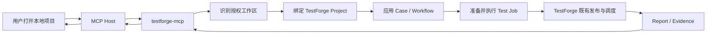

# TestForge MCP 接入层 v0.1 需求分析

> 核心业务闭环：使用支持 MCP 的 AI 客户端的开发者，在打开本地 Git 项目后，希望让 AI 直接使用既有 TestForge 完成测试资产准备、固定版本执行与报告读取；开发者安装并配置独立的 `testforge-mcp` 后，AI 能在授权工作区内识别项目，通过 TestForge 公开 API 完成测试闭环，并返回可追溯到固定 Commit 的确定性结果。

## 1. 目标

| 项 | 内容 |
| --- | --- |
| 目标用户/系统 | 使用 Codex、Claude、Cursor 等 MCP Host 的开发者；既有 TestForge 实例 |
| 触发场景 | 用户在 AI 客户端中打开本地 Git 项目并提出“使用 TestForge 测试当前项目”等请求 |
| 当前问题 | TestForge 只有 Web、REST 和 CLI 入口；AI 客户端无法通过标准 MCP 发现能力、读取受控工作区并安全调用测试平台；现有 CLI 不是 MCP Server |
| 期望结果 | 用户安装一个 Go 单文件 MCP Server，配置 TestForge 地址和本地工作区后，AI 可以识别项目、准备测试资产、执行固定 Commit 的 Test Job，并读取报告与 Evidence |
| 业务价值 | 让 TestForge 以标准 MCP 能力接入主流 AI 客户端；保持平台本体稳定；为后续开源提供低依赖、跨平台的安装方式 |

## 2. 核心业务流程

| 步骤 | 执行者 | 动作 | 系统响应或状态变化 |
| --- | --- | --- | --- |
| 1 | 用户 | 在 MCP Host 中安装并配置 `testforge-mcp`，指定 TestForge Endpoint 与本地工作区 | MCP Host 通过 stdio 启动 Go 进程并发现 Tools、Resources、Prompts |
| 2 | 用户/AI | 发起“测试当前项目” | MCP 读取授权工作区的 Git、构建清单、Pipeline 和既有测试资产，返回 `WorkspaceContext` |
| 3 | AI | 查询或建立工作区与 TestForge Project 的绑定 | MCP 按 Git Remote 或本地绑定匹配 Project；不能唯一匹配时返回候选供用户选择 |
| 4 | AI | 生成 Case YAML、脚本和 Workflow 图，并调用校验/应用能力 | MCP 调用 TestForge 现有资产 API；TestForge 保存 Case 和 Workflow |
| 5 | AI | 选择固定 Commit、WorkflowVersion 和目标系统，准备 Test Job | TestForge 创建或复用 Test Job，并固化可追溯版本 |
| 6 | AI | 显式执行 Test Job | MCP 使用 requestKey 调用 TestForge；TestForge 继续负责 Jenkins 发布、任务调度和 Worker 执行 |
| 7 | AI | 查询执行状态和报告 | MCP 返回发布、排队、执行、终态、报告与 Evidence 摘要 |
| 8 | 用户 | 在 AI 客户端查看测试结论和证据 | 用户得到与固定 Commit 对应的确定性结果；MCP 不篡改 TestForge 终态 |

## 3. 关键规则

| 编号 | 规则 | 生效条件 | 影响的流程步骤 |
| --- | --- | --- | --- |
| R1 | TestForge 控制面、Web Console、Jenkins、Worker、数据库、状态机和公开 API 均不因 MCP 接入修改 | 全流程 | 3-7 |
| R2 | `testforge-mcp` 安装在 MCP Host 环境中，不作为被测项目的语言依赖 | 安装与启动 | 1 |
| R3 | 工作区必须由用户配置或 Tool 参数显式指定；MCP 不扫描工作区之外的目录 | 工作区读取 | 1-2 |
| R4 | AI 负责生成 Case、脚本和 Workflow 内容；MCP 负责协议转换、校验、传输与平台调用，不内置第二个模型 | 测试资产准备 | 4 |
| R5 | TestForge 执行必须对应固定 Commit；未提交修改可被分析，但不得被描述为已进入测试 | 版本准备与执行 | 2、5-8 |
| R6 | Dirty 工作区默认不能执行“当前修改”；显式选择 HEAD 时只能测试已提交内容，并返回未提交内容未纳入的警告 | 工作区 Dirty | 5-6 |
| R7 | 本地 TestForge/Jenkins 必须能访问配置的本地仓库路径；远程 TestForge 必须能访问 Git Remote 中已推送的 Commit | Project 与版本绑定 | 3、5 |
| R8 | Resource 和发现 Tool 只读；创建、更新、发布、确认、执行使用名称明确的写 Tool | MCP 能力调用 | 2-7 |
| R9 | 发布、执行和诊断沿用 TestForge requestKey 幂等语义；结果不确定时复用原 key | 写操作重试 | 4、6-7 |
| R10 | Project、Case、Workflow、Test Job、Run、Report 和 Evidence 以 TestForge 为唯一业务真相源 | 全流程 | 3-8 |
| R11 | 长时间执行不占用单次 MCP Tool 调用等待；执行返回标识，状态和报告由查询 Tool 获取 | Jenkins/Worker 执行 | 6-7 |
| R12 | stdout 只传输 MCP 协议消息；运行日志写 stderr，Token 不进入日志、资源或 Tool 结果 | MCP Server 运行 | 1-8 |

## 4. 异常分支

| 编号 | 异常场景/触发条件 | 系统处理 | 用户或调用方可见结果 | 最终状态 |
| --- | --- | --- | --- | --- |
| E1 | 工作区不存在、不是目录或越出授权根 | 拒绝读取，不继续调用 TestForge | `WORKSPACE_OUT_OF_SCOPE` 或 `INVALID_WORKSPACE` | 未执行 |
| E2 | 工作区不是 Git 仓库或没有 HEAD Commit | 返回缺失前置条件 | `NOT_GIT_REPOSITORY` 或 `REVISION_NOT_FOUND` | 未执行 |
| E3 | 工作区 Dirty 且用户要求测试未提交修改 | 阻止准备/执行 Test Job | `DIRTY_WORKTREE`，提示提交后重试或显式测试 HEAD | 未执行 |
| E4 | Project 无匹配 | 返回创建/绑定所需信息，不自动创建 | `PROJECT_NOT_BOUND` | 等待绑定 |
| E5 | 多个 Project 匹配同一仓库 | 返回候选，不自动选择 | `PROJECT_AMBIGUOUS` | 等待选择 |
| E6 | Jenkins 无法访问本地路径或远程 Commit | 执行前终止版本准备 | `REVISION_UNREACHABLE` 与修复提示 | 未执行 |
| E7 | Case YAML 或 Workflow 图不合法 | 透传 TestForge 校验事实，不保存/发布 | `ASSET_INVALID` 或 `WORKFLOW_INVALID` | 未应用 |
| E8 | TestForge 认证、网络或 5xx 失败 | 返回结构化平台错误，保留 traceId/requestKey | `PLATFORM_UNAUTHORIZED`、`PLATFORM_UNAVAILABLE` | 状态不确定时可查询/幂等重试 |
| E9 | TestForge API 契约与 MCP 版本不兼容 | 停止解析，避免误判成功 | `CONTRACT_MISMATCH`，提示兼容版本 | 未完成 |
| E10 | Jenkins 发布或测试执行失败 | 不在 MCP 内改写结果；读取 TestForge 报告 | 返回 FAILED/CANCELLED 与 Evidence | TestForge 终态 |

## 5. 本期包含

> 本节采用白名单：本期只实现下表明确列出的内容。未列出的能力一律不属于本期，不因相关、常见、顺手或便于扩展而追加实现。

| 编号 | 能力或场景 | 完成边界 |
| --- | --- | --- |
| IN-1 | Go MCP Server | 使用官方 Go MCP SDK，以 stdio 运行并暴露稳定 server/version 信息 |
| IN-2 | 工作区识别 | 读取显式授权目录内的 Git Remote、分支、HEAD、Dirty、构建清单、Pipeline 与测试资产摘要 |
| IN-3 | Project 绑定 | 按仓库身份匹配已有 Project；支持显式绑定和通过现有 API 创建 Project |
| IN-4 | 测试资产操作 | 提供 Case 校验/创建/更新、脚本资源上传、Workflow 创建/更新/发布能力 |
| IN-5 | Test Job 闭环 | 固化 Commit、WorkflowVersion、目标系统，创建/确认/执行 Test Job |
| IN-6 | 执行与报告 | 查询发布/运行状态、确定性报告、Evidence 和 AI Diagnosis 状态 |
| IN-7 | MCP Resources/Prompts | 提供工作区、项目、报告、Case Schema 资源，以及测试当前项目、添加回归用例、分析失败提示模板 |
| IN-8 | 本地绑定与配置 | 保存 Endpoint + WorkspaceIdentity + ProjectId；Token 仅从进程配置读取，不落盘 |
| IN-9 | 开源发布 | 生成 Windows/macOS/Linux 单文件制品、SHA-256、版本说明和 MCP Host 配置示例 |

## 6. 成功标准

| 编号 | 可验证结果 | 验证方式 | 对应流程/规则 |
| --- | --- | --- | --- |
| S1 | MCP Inspector 和至少一个真实 MCP Host 能发现约定的 Tools、Resources、Prompts | 启动发布制品并保存能力发现输出 | 1；R2、R12；IN-1、IN-7 |
| S2 | 对示例 Git 项目只返回授权根目录内的工作区事实，越界路径被拒绝 | 正常、符号链接越界、父目录越界用例 | 2；R3；IN-2 |
| S3 | 工作区能够唯一绑定 TestForge Project；无匹配和多匹配均产生稳定可处理结果 | 真实 TestForge Project 数据验收 | 3；R7；IN-3 |
| S4 | AI 通过 MCP 提交的 Case YAML 和 Workflow 能被 TestForge 校验、保存并发布 | MCP Host 调用记录 + TestForge 页面/API 结果 | 4；R4、R8；IN-4 |
| S5 | Test Job 固化的 Commit 与本地 HEAD 一致；Dirty 修改不会被冒充为已测试内容 | Clean/Dirty/未推送 Commit 场景 | 5；R5-R7；IN-5 |
| S6 | 同一 requestKey 重复执行不会产生第二个有效业务执行 | 并发/重复调用后核对 TestForge Attempt/Run | 6；R9；IN-5 |
| S7 | MCP 能返回 TestForge 的发布状态、运行终态、报告和 Evidence，且与 Web Console 一致 | 对同一 Run 交叉核对 MCP 与 Console | 7-8；R10-R11；IN-6 |
| S8 | 三个平台制品无需 Python/Node 即可启动，版本号和 SHA-256 可核对 | Windows/macOS/Linux 构建与干净环境安装验证 | 1；IN-9 |
