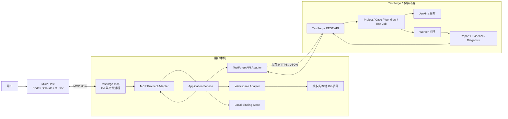
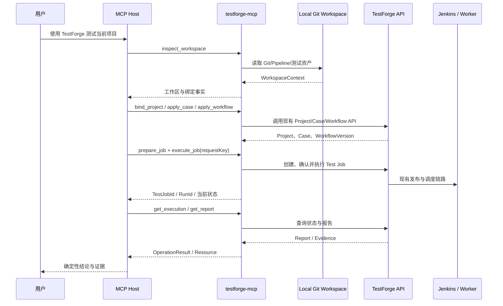

# TestForge MCP 接入层 v0.1 架构设计

## 1. 总体架构



```text
MCP Host
└─ testforge-mcp（Go / stdio）
   ├─ Protocol Adapter
   │  ├─ Tools：显式读写操作
   │  ├─ Resources：工作区、项目、报告上下文
   │  └─ Prompts：用户主动选择的测试模板
   ├─ Application Service
   │  ├─ 工作区识别与 Project 绑定
   │  ├─ Case / Workflow / Test Job 用例编排
   │  └─ 执行状态与报告转换
   ├─ Workspace Adapter
   │  └─ 只读取授权根目录内的 Git 和项目元数据
   ├─ TestForge API Adapter
   │  └─ 只调用 TestForge 现有公开 REST API
   └─ Binding Store
      └─ 保存本机 WorkspaceIdentity 与 ProjectId 映射
```

技术基线为官方 [`github.com/modelcontextprotocol/go-sdk/mcp`](https://github.com/modelcontextprotocol/go-sdk)。实现时必须在 `go.mod` 锁定已发布版本，并在 BuildInfo 中公开 Server 版本和支持的 MCP 协议版本；SDK 或协议升级只有通过 Host 兼容性与 Conformance 回归后才可合入，不隐式跟随 `latest`。MCP Server 是 AI 客户端启动的本地子进程，不嵌入被测项目，也不嵌入 TestForge 进程。

## 2. 关键规则

| 对象/场景 | 规则 | 生效条件 |
| --- | --- | --- |
| TestForge 边界 | MCP 只依赖公开 HTTP 契约，不导入 TestForge Java、Vue、Python 实现，不访问数据库、Redis、Jenkins 或 Worker | 全部模块 |
| MCP 传输 | v0.1 仅使用 stdio；stdout 只承载 MCP 协议，日志进入 stderr | Server 生命周期 |
| 工作区来源 | 使用启动参数、环境变量或 Tool 显式参数；不依赖自动磁盘扫描 | 工作区读取 |
| 路径约束 | 路径规范化及符号链接解析后仍须位于授权根目录 | 文件访问 |
| 版本边界 | 执行只引用 TestForge/Jenkins 可访问的固定 Commit | Test Job 准备与执行 |
| Dirty 状态 | 分析可以包含 Dirty 事实；执行只能声明测试 HEAD，不能声明测试了未提交修改 | Dirty 工作区 |
| 内容生成 | AI Host 生成 Case/脚本/Workflow；MCP 只校验、传输和调用平台 | 资产操作 |
| 写操作 | 发布、确认、执行和诊断携带 requestKey；重复调用复用相同 key | 状态变化 |
| 长任务 | Tool 返回平台业务标识并结束；调用方通过查询 Tool 获取后续状态 | Jenkins/Worker 长任务 |
| 状态存储 | TestForge 是业务真相源；本地只保存配置和 Project 绑定，不缓存终态 | 全流程 |
| 契约错误 | HTTP 状态、平台 code 和 traceId 转换为 MCP 结构化错误，不把错误响应包装为成功文本 | API 失败 |

## 3. 模块职责边界

| 模块 | 职责 | 数据/依赖 |
| --- | --- | --- |
| `cmd/testforge-mcp` | 解析配置、创建 Server、连接 stdio、处理进程退出 | Go runtime、MCP Go SDK |
| `internal/mcpserver` | 注册 Tools、Resources、Prompts；转换 MCP 输入输出 | `application` |
| `internal/application` | 编排工作区识别、绑定、资产应用、任务执行和报告读取 | `workspace`、`binding`、`testforge` |
| `internal/workspace` | 读取授权目录中的 Git、构建清单、Pipeline 和测试资产摘要 | 文件系统、Git |
| `internal/binding` | 持久化 Endpoint + WorkspaceIdentity + ProjectId 映射 | OS 用户配置目录 |
| `internal/testforge` | 调用现有 TestForge REST，管理 Token、超时、requestKey、DTO 与错误 | TestForge OpenAPI |
| `internal/result` | 生成稳定结构化 Tool 结果和 Resource 内容 | 无外部状态 |
| MCP Host | 生成测试内容、选择 Tool、展示用户确认和报告 | LLM、MCP Client |
| TestForge | 继续承担所有测试平台领域能力和业务状态 | 保持现状 |

### 3.1 MCP 能力映射

| 类型 | 名称 | 职责 | 是否写入 |
| --- | --- | --- | --- |
| Tool | `testforge_inspect_workspace` | 返回 Git、构建、Pipeline、测试资产和绑定摘要 | 否 |
| Tool | `testforge_bind_project` | 绑定已有 Project，或显式创建后绑定 | 是 |
| Tool | `testforge_validate_case` | 使用平台契约校验 Case YAML | 否 |
| Tool | `testforge_apply_case` | 创建/更新 Case，按需上传 Case 脚本资源 | 是 |
| Tool | `testforge_apply_workflow` | 创建/更新 Workflow DAG，按需发布 | 是 |
| Tool | `testforge_prepare_job` | 固化 Project、Commit、WorkflowVersion、TargetSystem | 是 |
| Tool | `testforge_execute_job` | 确认并执行 Test Job，返回运行标识 | 是 |
| Tool | `testforge_get_execution` | 查询发布、排队、执行和终态摘要 | 否 |
| Tool | `testforge_get_report` | 查询确定性报告、Evidence 和诊断状态 | 否 |
| Resource | `testforge://workspace/context` | 当前授权工作区上下文 | 否 |
| Resource | `testforge://projects/{projectId}/context` | Project、Case、Workflow、Test Job 摘要 | 否 |
| Resource | `testforge://runs/{runId}/report` | 报告、失败分类和 Evidence URI | 否 |
| Resource | `testforge://schemas/test-case` | Case YAML Schema 与示例 | 否 |
| Prompt | `test_current_project` | 引导 AI 完成当前项目测试闭环 | 用户主动选择 |
| Prompt | `add_regression_case` | 引导 AI 从需求/缺陷增加回归 Case | 用户主动选择 |
| Prompt | `analyze_test_failure` | 引导 AI 基于报告与 Evidence 分析失败 | 用户主动选择 |

## 4. 核心数据模型

### 4.1 `ServerConfig`

| 项 | 内容 |
| --- | --- |
| 代码位置 | `testforge-mcp/internal/config/config.go` |
| 数据表/存储 | 启动参数、环境变量；Token 只驻留内存 |

| 字段 | 类型 | 必填 | 说明 |
| --- | --- | --- | --- |
| `testforgeUrl` | URL | 是 | TestForge API 地址 |
| `token` | string | 否 | Bearer Token，不写入输出或磁盘 |
| `workspace` | absolute path | 是 | 授权工作区根目录 |
| `timeout` | duration | 是 | 单次平台请求超时 |
| `bindingFile` | path | 是 | 本地 Project 绑定文件 |

| 约束 | 规则 |
| --- | --- |
| 配置优先级 | Tool 显式参数 > 启动参数 > 环境变量 > 默认值 |
| Secret | Token 不进入 Tool 结果、Resource、日志和绑定文件 |

### 4.2 `WorkspaceContext`

| 项 | 内容 |
| --- | --- |
| 代码位置 | `testforge-mcp/internal/workspace/model.go` |
| 数据表/存储 | 调用时生成，不持久化源码内容 |

| 字段 | 类型 | 必填 | 说明 |
| --- | --- | --- | --- |
| `root` | path | 是 | 规范化授权根目录 |
| `identity` | string | 是 | 标准化 Git Remote；无 Remote 时为本机路径指纹 |
| `repositoryUrl` | string | 否 | Git Remote 或双方可访问的本地仓库路径 |
| `branch` | string | 否 | 当前分支 |
| `headCommit` | SHA | 是 | 当前 HEAD Commit |
| `dirty` | boolean | 是 | 是否存在未提交修改 |
| `untrackedCount` | integer | 是 | 未跟踪文件数量 |
| `manifests` | string[] | 是 | 构建清单相对路径 |
| `pipelines` | string[] | 是 | Pipeline 相对路径 |
| `testAssets` | string[] | 是 | 测试资产相对路径 |

| 约束 | 规则 |
| --- | --- |
| 路径 | 所有返回路径必须位于 `root` 内并使用相对路径 |
| Commit | `dirty=true` 时 HEAD 只代表已提交内容 |

### 4.3 `WorkspaceBinding`

| 项 | 内容 |
| --- | --- |
| 代码位置 | `testforge-mcp/internal/binding/model.go` |
| 数据表/存储 | OS 用户配置目录 `TestForge/mcp/bindings.json` |

| 字段 | 类型 | 必填 | 说明 |
| --- | --- | --- | --- |
| `testforgeUrl` | URL | 是 | 绑定所属平台实例 |
| `workspaceIdentity` | string | 是 | 工作区稳定身份 |
| `projectId` | UUID | 是 | TestForge Project |
| `repositoryUrl` | string | 否 | 最近验证的仓库地址 |
| `updatedAt` | instant | 是 | 绑定更新时间 |

| 约束 | 规则 |
| --- | --- |
| 复核 | 每次使用前从 TestForge 重新读取 Project |
| 可移植性 | 不把实例相关 ProjectId 写入被测项目 Git |

### 4.4 `OperationResult`

| 项 | 内容 |
| --- | --- |
| 代码位置 | `testforge-mcp/internal/result/model.go` |
| 数据表/存储 | 不持久化 |

| 字段 | 类型 | 必填 | 说明 |
| --- | --- | --- | --- |
| `ok` | boolean | 是 | 操作是否完成 |
| `operation` | string | 是 | 稳定操作名 |
| `projectId` | UUID | 否 | 关联 Project |
| `testJobId` | UUID | 否 | 关联 Test Job |
| `runId` | UUID | 否 | 关联 Run |
| `requestKey` | UUID | 写操作按需 | 幂等重试键 |
| `status` | string | 是 | 当前确定性状态 |
| `summary` | string | 是 | 精简事实摘要 |
| `warnings` | string[] | 是 | Dirty、未推送等边界提示 |
| `nextActions` | string[] | 是 | 无隐式副作用的下一步 |
| `error` | object | 失败时 | code、message、traceId、retryable、remediation |

## 5. 核心流程

### 5.1 当前项目测试主流程



### 5.2 项目绑定分支

```text
WorkspaceIdentity
  ├─ 本地绑定存在且平台 Project 仍有效 -> 复用绑定
  ├─ 无本地绑定 + repositoryUrl 唯一匹配 -> 返回候选，显式确认后保存绑定
  ├─ 无匹配 -> 显式创建 Project 或选择已有 Project
  └─ 多匹配 -> 返回候选，禁止自动选择
```

### 5.3 版本可达性分支

```text
当前 Git 状态
  ├─ Clean + Commit 对 Jenkins 可达 -> 允许执行
  ├─ Dirty + 显式 HEAD_COMMIT -> 允许执行 HEAD，警告未包含未提交修改
  ├─ Dirty + 请求测试当前修改 -> DIRTY_WORKTREE
  ├─ 远程 Commit 未推送 -> REVISION_UNREACHABLE
  └─ 本地仓库路径未被 TestForge/Jenkins 共享 -> REVISION_UNREACHABLE
```

### 5.4 平台错误转换

```text
TestForge HTTP 响应
  ├─ 2xx -> OperationResult / Resource
  ├─ 400/422 -> ASSET_INVALID 或 PLATFORM_INPUT
  ├─ 401/403 -> PLATFORM_UNAUTHORIZED
  ├─ 404 -> PLATFORM_NOT_FOUND
  ├─ 409 -> PLATFORM_CONFLICT，保留 requestKey
  ├─ 5xx/timeout -> PLATFORM_UNAVAILABLE，标记 retryable
  └─ 响应结构不兼容 -> CONTRACT_MISMATCH
```

## 6. 模块目录

标记：`[+]` 新增　`[~]` 修改　`[-]` 删除

```text
testforge-demo
├─ .github/workflows
│  └─ [+] testforge-mcp-release.yml
└─ testforge-platform
   ├─ [-] testforge-cli
   ├─ docs
   │  ├─ [~] README.md
   │  ├─ tasks
   │  │  └─ [+] TFP-076.md
   │  └─ 10-mcp-integration
   │     ├─ [+] 01-需求分析.md
   │     ├─ [+] 02-架构设计.md
   │     ├─ [+] 03-开发方案.md
   │     └─ [+] 04-验收方案.md
   └─ testforge-mcp
      ├─ [+] go.mod
      ├─ [+] go.sum
      ├─ [+] README.md
      ├─ cmd/testforge-mcp
      │  └─ [+] main.go
      └─ internal
         ├─ application
         │  ├─ [+] service.go
         │  └─ [+] service_test.go
         ├─ binding
         │  ├─ [+] store.go
         │  └─ [+] store_test.go
         ├─ config
         │  ├─ [+] config.go
         │  └─ [+] config_test.go
         ├─ mcpserver
         │  ├─ [+] server.go
         │  ├─ [+] prompts.go
         │  └─ [+] server_test.go
         ├─ result
         │  └─ [+] model.go
         ├─ testforge
         │  ├─ [+] client.go
         │  └─ [+] client_test.go
         └─ workspace
            ├─ [+] inspector.go
            ├─ [+] inspector_test.go
            └─ [+] model.go
```

`testforge-mcp` 是平台仓库内的独立 Go module，只在运行时通过公开 HTTP 契约连接 TestForge，不依赖平台实现源码。

## 7. 数据与迁移

| 类型 | 归属 | 处理方式 |
| --- | --- | --- |
| TestForge 业务数据 | TestForge | 保持现有存储和状态机；MCP 不建镜像库 |
| 工作区事实 | `testforge-mcp` 进程 | 每次从授权目录读取，不保存源码副本 |
| Workspace/Project 绑定 | 用户配置目录 | JSON 原子替换写入；使用前向 TestForge 复核 |
| Token | 进程内存 | 从启动配置读取，不持久化 |
| requestKey | MCP 输入输出与 TestForge | 由调用方在不确定结果时复用 |

本功能不新增或修改 TestForge 表结构，不需要数据库迁移。
