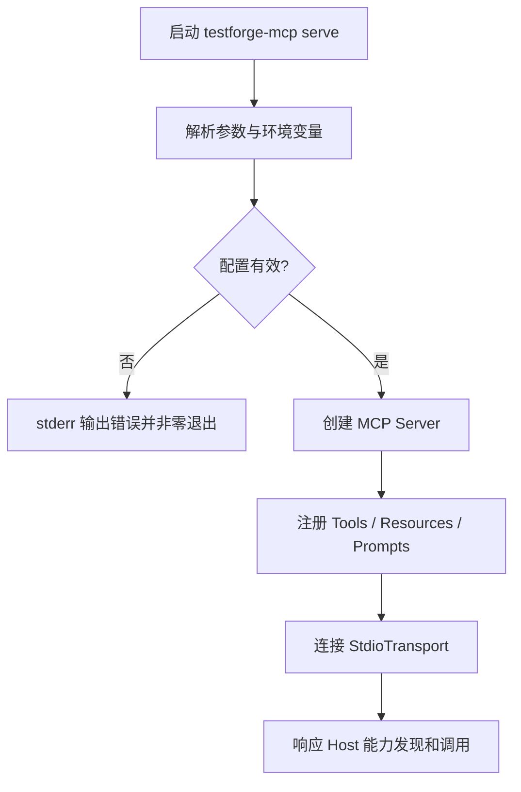
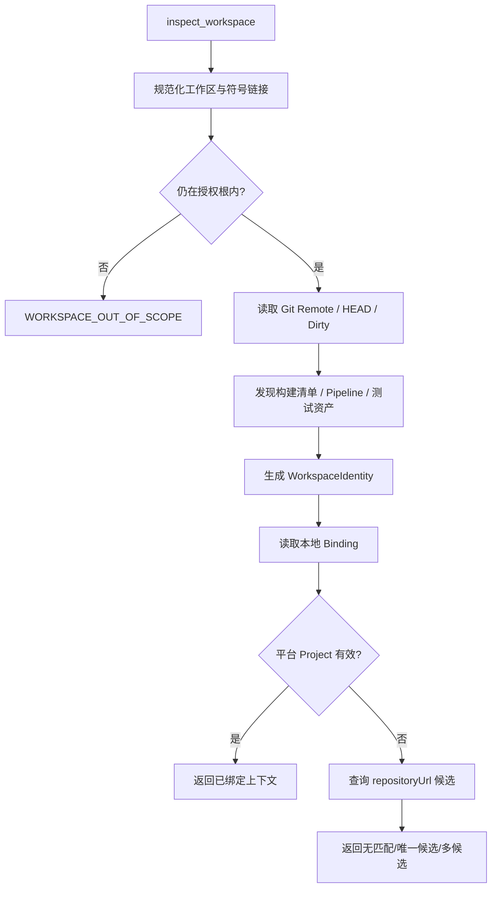
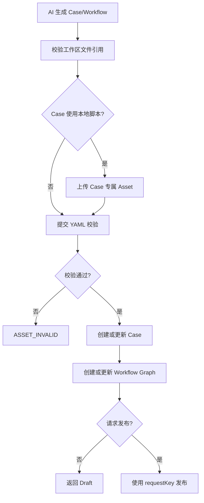
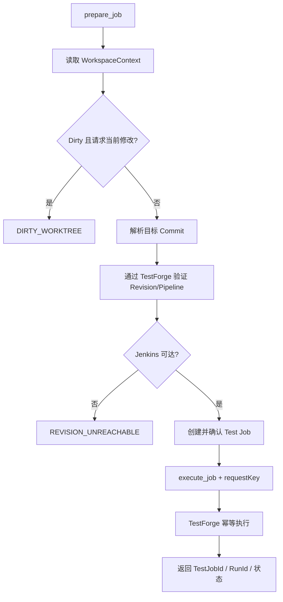
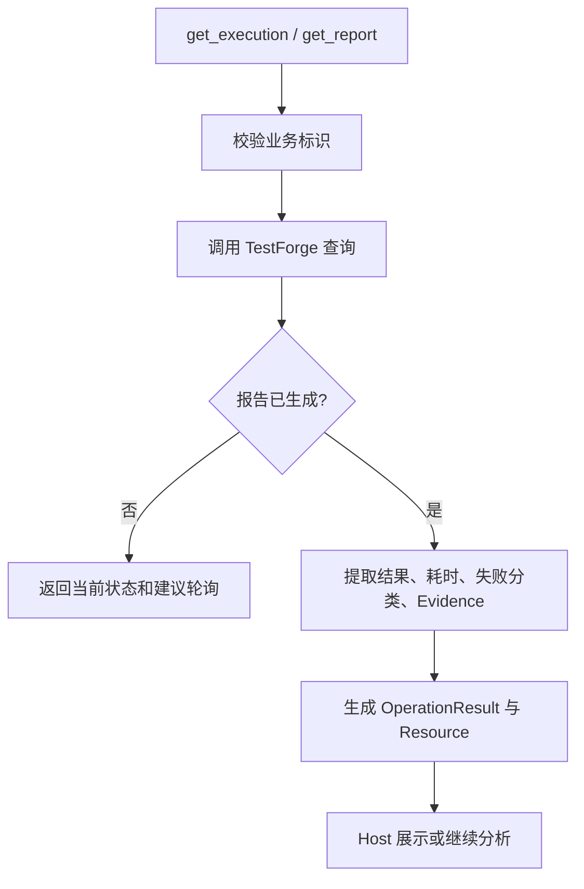
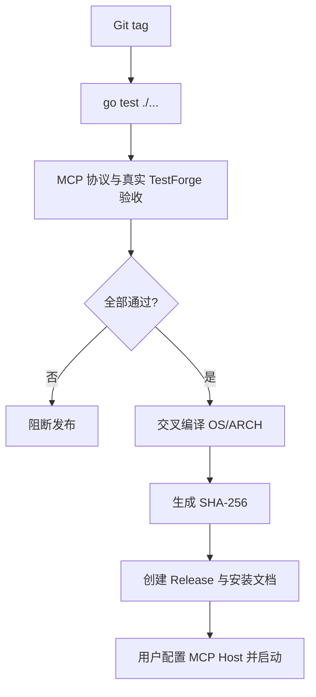

# TestForge MCP 接入层 v0.1 开发方案

## 1. 开发目标

| 编号 | 对应需求 | 开发目标 |
| --- | --- | --- |
| G1 | IN-1、IN-7 | 建立可被 MCP Host 发现的 Go stdio Server 与稳定 Tools、Resources、Prompts |
| G2 | IN-2、IN-3、IN-8 | 安全识别授权工作区并建立可复核的 TestForge Project 绑定 |
| G3 | IN-4 | 通过既有 TestForge API 校验和维护 Case、脚本资源与 Workflow |
| G4 | IN-5、IN-6 | 固化可达 Commit，幂等执行 Test Job，并读取状态、报告和 Evidence |
| G5 | IN-9 | 生成可校验的跨平台单文件制品与开源安装文档 |

## 2. 功能清单与实施顺序

| 顺序 | 功能 | 前置依赖 | 核心产出 |
| --- | --- | --- | --- |
| 1 | MCP Server 启动与能力发现 | Go module、官方 MCP Go SDK | stdio Server、能力清单 |
| 2 | 工作区识别与 Project 绑定 | 功能 1、Git、TestForge Project API | WorkspaceContext、WorkspaceBinding |
| 3 | Case 与 Workflow 资产应用 | 功能 2、TestForge 资产 API | Case、Asset、WorkflowVersion |
| 4 | Test Job 准备与执行 | 功能 2-3、版本解析 API | 固定 Commit 的 Test Job、Run 标识 |
| 5 | 执行状态与报告读取 | 功能 4、TestForge Report API | 状态摘要、Report、Evidence Resource |
| 6 | 开源构建与安装 | 功能 1-5 | 三平台二进制、SHA-256、配置示例 |

## 3. 功能开发设计

### 3.1 MCP Server 启动与能力发现

#### 3.1.1 功能说明

| 项 | 内容 |
| --- | --- |
| 触发入口 | MCP Host 以子进程方式启动 `testforge-mcp serve` |
| 前置条件 | 可执行程序可运行；提供 TestForge URL 和工作区 |
| 最终结果 | Host 通过 stdio 发现版本、Tools、Resources、Prompts；stdout 无协议外内容 |

#### 3.1.2 技术流程图

#### 3.1.3 流程节点实现

| 步骤 | 代码落点 | 输入 | 处理逻辑 | 数据/状态变化 | 输出/异常 |
| --- | --- | --- | --- | --- | --- |
| 1 | `cmd/testforge-mcp/main.go` | argv、env | 解析 `serve` 与 `version` | 无 | ServerConfig/启动错误 |
| 2 | `internal/config/config.go` | URL、workspace、timeout、token | 规范化 URL/路径并校验 | 内存配置 | `INVALID_CONFIG` |
| 3 | `internal/mcpserver/server.go` | ServerConfig | 创建 SDK Server、注册实现版本 | Server 内存状态 | MCP Server |
| 4 | `internal/mcpserver/{tools,resources,prompts}.go` | Application Service | 注册名称、Schema、描述和处理器 | 能力目录 | list/get/call 响应 |
| 5 | `cmd/testforge-mcp/main.go` | stdin/stdout | 启动 `mcp.StdioTransport`，日志定向 stderr | 进程生命周期 | 正常关闭/协议错误 |

#### 3.1.4 关键接口

| 接口/能力 | 方法/动作 | 请求字段 | 返回字段 | 错误码/异常 |
| --- | --- | --- | --- | --- |
| Server metadata | MCP discovery | 无 | name、version、protocol capabilities | `INVALID_CONFIG` |
| `tools/list` | MCP list | SDK 分页元数据 | Tool name、description、input/output schema | 协议错误 |
| `resources/list` | MCP list | 无 | Workspace/Project/Run/Schema resources | 协议错误 |
| `prompts/list` | MCP list | 无 | Prompt 描述和参数 | 协议错误 |

#### 3.1.5 关键数据模型

| 数据模型 | 字段 | 类型 | 必填 | 用途与约束 |
| --- | --- | --- | --- | --- |
| ServerConfig | testforgeUrl | URL | 是 | TestForge API 地址 |
| ServerConfig | workspace | path | 是 | 存在的规范化绝对目录 |
| ServerConfig | token | string | 否 | 仅进程内存使用 |
| ServerConfig | timeout | duration | 是 | 必须大于 0 |

### 3.2 工作区识别与 Project 绑定

#### 3.2.1 功能说明

| 项 | 内容 |
| --- | --- |
| 触发入口 | `testforge_inspect_workspace`、`testforge_bind_project` |
| 前置条件 | ServerConfig 有效；工作区可读；绑定时 TestForge 可访问 |
| 最终结果 | 返回 WorkspaceContext，并获得经过平台复核的 ProjectId 绑定 |

#### 3.2.2 技术流程图

#### 3.2.3 流程节点实现

| 步骤 | 代码落点 | 输入 | 处理逻辑 | 数据/状态变化 | 输出/异常 |
| --- | --- | --- | --- | --- | --- |
| 1 | `internal/workspace/inspector.go` | workspace | EvalSymlinks、Rel 校验 | 无 | 授权根/越界错误 |
| 2 | `internal/workspace/git.go` | 授权根 | 读取 top-level、remote、branch、HEAD、porcelain status | 无 | GitFacts/Git 错误 |
| 3 | `internal/workspace/inspector.go` | 授权根 | 有界发现构建和测试标识文件 | 无 | manifests/pipelines/testAssets |
| 4 | `internal/binding/store.go` | endpoint、identity | 读取并校验本地 JSON | 无 | WorkspaceBinding/无绑定 |
| 5 | `internal/testforge/client.go` | ProjectId/repositoryUrl | 调用 Project 查询并复核仓库 | 无 | Project 候选/平台错误 |
| 6 | `internal/application/service.go` | 显式选择或创建请求 | 校验候选并原子保存绑定 | bindings.json 更新 | ProjectContext |

#### 3.2.4 关键接口

| 接口/能力 | 方法/动作 | 请求字段 | 返回字段 | 错误码/异常 |
| --- | --- | --- | --- | --- |
| `testforge_inspect_workspace` | Tool/read | `workspace?` | WorkspaceContext、bindingStatus、projectCandidates | `INVALID_WORKSPACE`、`WORKSPACE_OUT_OF_SCOPE`、`NOT_GIT_REPOSITORY` |
| `testforge_bind_project` | Tool/write | `projectId?`、`createProject?`、`displayName?` | projectId、bindingStatus | `PROJECT_NOT_FOUND`、`PROJECT_AMBIGUOUS`、`PLATFORM_*` |
| Project Adapter | Existing REST read/create | repositoryUrl、name、defaultBranch | TestForge Project DTO | 平台 HTTP/code/traceId |

#### 3.2.5 关键数据模型

| 数据模型 | 字段 | 类型 | 必填 | 用途与约束 |
| --- | --- | --- | --- | --- |
| WorkspaceContext | root/identity/headCommit/dirty | path/string/SHA/bool | 是 | 当前工作区事实 |
| WorkspaceContext | repositoryUrl/branch | string | 否 | Project 匹配和展示 |
| WorkspaceContext | manifests/pipelines/testAssets | string[] | 是 | 仅工作区内相对路径 |
| WorkspaceBinding | testforgeUrl/workspaceIdentity/projectId | string/UUID | 是 | 本地绑定复核键 |
| WorkspaceBinding | repositoryUrl/updatedAt | string/instant | 否/是 | 诊断与更新时间 |

#### 3.2.6 并发实现方式

| 项 | 实现方式 |
| --- | --- |
| 并发不变量 | bindings.json 始终是完整合法 JSON；同一 Endpoint + WorkspaceIdentity 只有一个当前绑定 |
| 竞争资源 | 本地绑定文件 |
| 控制粒度 | 进程内 mutex + 单个绑定文件 |
| 实现机制 | 读取合并后写入同目录临时文件，再原子 rename |
| 事务边界 | 单次本地文件替换；Project 创建由平台事务保证 |
| 幂等方式 | 已绑定相同 Project 时返回当前绑定，不重复写入 |
| 竞争失败处理 | 文件变化时重新读取；损坏文件不覆盖，返回 `BINDING_STORE_INVALID` |
| 超时与恢复 | 文件操作支持 context 取消；失败保留旧文件 |

### 3.3 Case 与 Workflow 资产应用

#### 3.3.1 功能说明

| 项 | 内容 |
| --- | --- |
| 触发入口 | `testforge_validate_case`、`testforge_apply_case`、`testforge_apply_workflow` |
| 前置条件 | 已绑定 Project；AI 已生成 YAML、脚本和 Workflow 图 |
| 最终结果 | TestForge 中存在校验通过的 Case、Case 脚本与指定发布状态的 Workflow |

#### 3.3.2 技术流程图

#### 3.3.3 流程节点实现

| 步骤 | 代码落点 | 输入 | 处理逻辑 | 数据/状态变化 | 输出/异常 |
| --- | --- | --- | --- | --- | --- |
| 1 | `internal/mcpserver/server.go` | Tool JSON | Schema 校验并转换命令 | 无 | command/协议输入错误 |
| 2 | `internal/workspace/inspector.go` | scriptPath | 验证位于 root，计算 SHA-256 | 无 | AssetInput/越界错误 |
| 3 | `internal/testforge/client.go` | projectId、file | Multipart 上传现有 Asset API | TestForge Asset | Asset DTO/平台错误 |
| 4 | `internal/testforge/client.go` | projectId、Case YAML | 调用 validate/create/update | TestForge Case | Case DTO/字段错误 |
| 5 | `internal/testforge/client.go` | workflowId、graph | create/apply/publish；透传 requestKey | WorkflowVersion | Draft/Published/冲突 |
| 6 | `internal/result/model.go` | 平台 DTO | 返回必要 ID、版本和警告 | 无 | OperationResult |

#### 3.3.4 关键接口

| 接口/能力 | 方法/动作 | 请求字段 | 返回字段 | 错误码/异常 |
| --- | --- | --- | --- | --- |
| `testforge_validate_case` | Tool/read | projectId?、yaml | valid、errors[]、normalizedSummary | `ASSET_INVALID`、`PROJECT_NOT_BOUND` |
| `testforge_apply_case` | Tool/write | caseId?、yaml、scriptPath? | caseId、assetUri?、definitionVersion | `WORKSPACE_OUT_OF_SCOPE`、`ASSET_INVALID`、`PLATFORM_*` |
| `testforge_apply_workflow` | Tool/write | workflowId?、name?、graph、publish、requestKey? | workflowId、draftRevision、publishedVersion?、requestKey? | `WORKFLOW_INVALID`、`PLATFORM_CONFLICT` |

#### 3.3.5 关键数据模型

| 数据模型 | 字段 | 类型 | 必填 | 用途与约束 |
| --- | --- | --- | --- | --- |
| CaseApplyInput | caseId/yaml/scriptPath | UUID/string/path | 否/是/否 | scriptPath 必须在工作区内 |
| AssetRef | assetUri/checksum/entrypoint | URI/SHA/string | 是/是/否 | 由平台上传结果生成 |
| WorkflowApplyInput | workflowId/name/graph/publish/requestKey | mixed | 按创建/更新条件 | publish=true 时 requestKey 生成或透传 |

### 3.4 Test Job 准备与执行

#### 3.4.1 功能说明

| 项 | 内容 |
| --- | --- |
| 触发入口 | `testforge_prepare_job`、`testforge_execute_job` |
| 前置条件 | Project 已绑定；Workflow 已发布；Commit 对 Jenkins 可达 |
| 最终结果 | TestForge 存在固定版本 Test Job，并只产生一个幂等业务执行 |

#### 3.4.2 技术流程图

#### 3.4.3 流程节点实现

| 步骤 | 代码落点 | 输入 | 处理逻辑 | 数据/状态变化 | 输出/异常 |
| --- | --- | --- | --- | --- | --- |
| 1 | `internal/application/service.go` | revisionMode | 比对 WorkspaceContext 与用户意图 | 无 | HEAD/Dirty 错误 |
| 2 | `internal/testforge/client.go` | projectId、Commit | 调用现有 revision/pipeline 查询 | 无 | resolved revision/不可达 |
| 3 | `internal/testforge/client.go` | JobPrepareInput | 创建 Test Job，再按 configVersion 确认 | Test Job | Job DTO/状态冲突 |
| 4 | `internal/testforge/client.go` | jobId、requestKey | 调用 execute；超时不更换 key | execution | Run/Attempt 摘要或不确定状态 |
| 5 | `internal/result/model.go` | Job/Run DTO | 标注 fixedCommit、warnings、nextActions | 无 | OperationResult |

#### 3.4.4 关键接口

| 接口/能力 | 方法/动作 | 请求字段 | 返回字段 | 错误码/异常 |
| --- | --- | --- | --- | --- |
| `testforge_prepare_job` | Tool/write | name、workflowId、workflowVersion?、revisionMode、commit?、targetSystem | testJobId、fixedCommit、workflowVersion、state | `DIRTY_WORKTREE`、`REVISION_UNREACHABLE`、`PLATFORM_CONFLICT` |
| `testforge_execute_job` | Tool/write | testJobId、requestKey? | requestKey、testJobId、runId?、state | `PLATFORM_CONFLICT`、`PLATFORM_UNAVAILABLE` |

#### 3.4.5 关键数据模型

| 数据模型 | 字段 | 类型 | 必填 | 用途与约束 |
| --- | --- | --- | --- | --- |
| JobPrepareInput | name/workflowId/revisionMode/targetSystem | string/UUID/enum/enum | 是 | revisionMode=`HEAD_COMMIT` 或显式 COMMIT |
| JobPrepareInput | commit/workflowVersion | SHA/integer | 条件必填 | 不允许隐式使用 Dirty 内容 |
| ExecuteInput | testJobId/requestKey | UUID/UUID | 是/否 | 缺省生成并在结果回显 |

#### 3.4.6 并发实现方式

| 项 | 实现方式 |
| --- | --- |
| 并发不变量 | 同一 requestKey 只对应一个有效 TestForge 执行；MCP 超时不创建新 key 重放 |
| 竞争资源 | Test Job 状态、Workflow 发布状态、requestKey |
| 控制粒度 | TestForge 聚合根 + requestKey；MCP 不加跨进程业务锁 |
| 实现机制 | requestKey 原样传给 TestForge，由平台现有幂等和状态机保证唯一性 |
| 事务边界 | MCP 无业务事务；创建/确认/执行事务归 TestForge |
| 幂等方式 | UUID requestKey；成功和不确定结果均回显 |
| 竞争失败处理 | 409 转换为 `PLATFORM_CONFLICT` 并返回当前状态，不自动改变输入重试 |
| 超时与恢复 | 返回 `PLATFORM_UNAVAILABLE`、retryable=true；使用原 key 查询或重试 |

### 3.5 执行状态与报告读取

#### 3.5.1 功能说明

| 项 | 内容 |
| --- | --- |
| 触发入口 | `testforge_get_execution`、`testforge_get_report`、对应 Resources |
| 前置条件 | Test Job 或 Run 已存在 |
| 最终结果 | AI 获得与 TestForge Web Console 一致的确定性状态、报告和 Evidence URI |

#### 3.5.2 技术流程图

#### 3.5.3 流程节点实现

| 步骤 | 代码落点 | 输入 | 处理逻辑 | 数据/状态变化 | 输出/异常 |
| --- | --- | --- | --- | --- | --- |
| 1 | `internal/mcpserver/server.go` | testJobId/runId | 校验 UUID 和查询类型 | 无 | query/输入错误 |
| 2 | `internal/testforge/client.go` | 标识 | 查询 job attempts/run/report/diagnosis | 无 | 平台 DTO/404/5xx |
| 3 | `internal/result/model.go` | 平台 DTO | 保留状态、失败分类、Evidence URI | 无 | OperationResult |
| 4 | `internal/mcpserver/server.go` | Resource URI | 转换为结构化文本或 embedded resource | 无 | MCP Resource |

#### 3.5.4 关键接口

| 接口/能力 | 方法/动作 | 请求字段 | 返回字段 | 错误码/异常 |
| --- | --- | --- | --- | --- |
| `testforge_get_execution` | Tool/read | testJobId、runId? | deploymentStatus、runStatus、attempts、progress | `PLATFORM_NOT_FOUND`、`PLATFORM_UNAVAILABLE` |
| `testforge_get_report` | Tool/read | runId | totals、p95、cases、evidence、diagnosisStatus | `REPORT_NOT_READY`、`PLATFORM_NOT_FOUND` |
| Run Report Resource | resources/read | `testforge://runs/{runId}/report` | JSON/Markdown 报告资源 | 同上 |

#### 3.5.5 关键数据模型

| 数据模型 | 字段 | 类型 | 必填 | 用途与约束 |
| --- | --- | --- | --- | --- |
| OperationResult | ok/operation/status/summary | mixed | 是 | 统一 Tool 结果 |
| OperationResult | projectId/testJobId/runId/requestKey | UUID | 否 | 关联平台对象 |
| OperationResult | warnings/nextActions/error | array/array/object | 是/是/失败时 | 不把建议冒充事实 |

### 3.6 开源构建与安装

#### 3.6.1 功能说明

| 项 | 内容 |
| --- | --- |
| 触发入口 | Git tag / Release Workflow；用户下载并配置 MCP Host |
| 前置条件 | Go 测试、MCP 协议测试和真实 TestForge 验收通过 |
| 最终结果 | Windows、macOS、Linux 制品、SHA-256、变更说明和配置示例可下载 |

#### 3.6.2 技术流程图

#### 3.6.3 流程节点实现

| 步骤 | 代码落点 | 输入 | 处理逻辑 | 数据/状态变化 | 输出/异常 |
| --- | --- | --- | --- | --- | --- |
| 1 | `../.github/workflows/testforge-mcp-release.yml` | tag | 执行测试与验收门禁 | CI 状态 | PASS/阻断 |
| 2 | Release Workflow | version、GOOS、GOARCH | `go build -trimpath` 并注入版本 | 制品文件 | 多平台二进制 |
| 3 | Release Workflow | 制品 | 计算 SHA-256 并归档 | checksum 文件 | 校验和 |
| 4 | `testforge-mcp/README.md` | 版本与制品地址 | 提供 Host 配置、环境变量、升级方式 | 文档 | 可复制安装步骤 |

#### 3.6.4 关键接口

| 接口/能力 | 方法/动作 | 请求字段 | 返回字段 | 错误码/异常 |
| --- | --- | --- | --- | --- |
| `testforge-mcp version` | local command | 无 | version、commit、buildDate、protocol | 非零退出 |
| Release assets | 下载 | OS、ARCH、version | binary、SHA256SUMS、release notes | 制品不存在/校验失败 |

#### 3.6.5 关键数据模型

| 数据模型 | 字段 | 类型 | 必填 | 用途与约束 |
| --- | --- | --- | --- | --- |
| BuildInfo | version/commit/buildDate/protocol | string | 是 | 构建时注入并由 version 命令返回 |

## 4. 公共实现规则

| 规则类型 | 统一实现 | 适用功能 |
| --- | --- | --- |
| 响应/错误 | Tool 返回结构化 `OperationResult`；稳定错误码统一为 `INVALID_CONFIG`、`INVALID_WORKSPACE`、`WORKSPACE_OUT_OF_SCOPE`、`NOT_GIT_REPOSITORY`、`REVISION_NOT_FOUND`、`DIRTY_WORKTREE`、`PROJECT_NOT_BOUND`、`PROJECT_AMBIGUOUS`、`PROJECT_NOT_FOUND`、`BINDING_STORE_INVALID`、`REVISION_UNREACHABLE`、`ASSET_INVALID`、`WORKFLOW_INVALID`、`REPORT_NOT_READY`、`PLATFORM_INPUT`、`PLATFORM_UNAUTHORIZED`、`PLATFORM_NOT_FOUND`、`PLATFORM_CONFLICT`、`PLATFORM_UNAVAILABLE`、`CONTRACT_MISMATCH` | 3.1-3.6 |
| 事务/幂等 | 本地绑定使用原子文件替换；平台业务事务和 requestKey 幂等全部交给 TestForge | 3.2-3.5 |
| 配置/契约 | MCP Tool Schema 由 Go 类型生成；TestForge DTO 对齐现有 OpenAPI；Token 不落盘；超时支持 context 取消 | 3.1-3.6 |

> 历史记录说明：上述既有执行结果来自独立仓库建立前的开发环境，原始材料不随公开仓库分发，不能作为本次公开版本的验收结论。当前验证范围见 [公开准备记录](../reference/公开准备记录.md).
