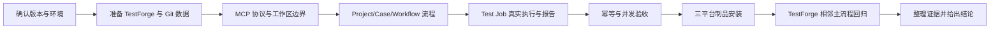

# TestForge MCP 接入层 v0.1 验收方案

> 验收只认真实执行结果与证据。本文验证需求中写明的成功标准；已知相邻影响随本功能检查，无法预知的跨功能影响由 TestForge 固定主流程回归承担。

## 1. 验收流程

### 1.1 验收准备

| 项目 | 要求 |
|---|---|
| 验收版本 | 填写 `testforge-mcp` Git Commit、tag 和三平台制品 SHA-256 |
| 验收环境 | Go 支持版本；MCP Inspector；至少一个真实 MCP Host；可访问的 TestForge；可被 Jenkins 发布的示例 Git 项目 |
| 账号与权限 | TestForge Project/Case/Workflow/Test Job 读写权限；Token 通过环境变量提供且证据脱敏 |
| 测试数据 | Clean/Dirty Git 项目、无 Git 目录、越界目录、Project 无/唯一/多匹配、可达/不可达 Commit；验收后清理临时数据 |
| 证据目录 | `acceptance/evidence/mcp-integration/<version>/`：Inspector、Host、Go test、Bruno、TestForge 报告、Release 制品与校验和 |

### 1.2 执行顺序

### 1.3 API 验收材料

| 项目 | 约定 |
|---|---|
| Bruno 目录 | `docs/10-mcp-integration/bruno/` |
| 环境 | `bruno/environments/local.bru` 提供 baseUrl、projectId、workflowId、testJobId、runId 占位；Token 从环境变量注入 |
| 请求顺序 | health → projects → case validate/apply → workflow apply/publish → test-job prepare/execute → execution/report |
| 断言 | HTTP 状态、平台 code、关键 ID、固定 Commit、requestKey、Run 终态、Evidence 数量 |
| 说明 | Bruno 证明 MCP 所依赖的真实 TestForge API；MCP 协议由 Inspector、真实 Host 和 Go E2E Harness 验收 |

## 2. 流程验收场景

| 场景编号 | 覆盖的成功标准 | 前置条件 | 操作 | 预期结果 | 已知相邻影响检查 | 证据要求 |
|---|---|---|---|---|---|---|
| AC-001 | S1 | 已构建当前平台制品 | 使用 Inspector 和真实 Host 启动 stdio Server 并列出能力 | 名称、Schema、版本符合文档；stdout 无协议外文本 | 仅发现能力不产生平台写入 | Inspector JSON、Host 截图/日志、stderr |
| AC-002 | S2 | 正常工作区、父目录和越界符号链接 | 调用 inspect_workspace，分别传入合法与越界路径 | 合法目录返回摘要；越界稳定拒绝且不泄露外部内容 | 无平台写入 | Tool 结果、目录基线、Go E2E 日志 |
| AC-003 | S3 | 准备无、唯一、多匹配 Project 数据 | 执行 inspect/bind；显式创建或选择 Project | 三种状态可区分；多匹配不自动绑定；绑定可复核 | Console Project 与绑定一致 | MCP、binding、Console、Bruno 输出 |
| AC-004 | S4 | 已绑定 Project；合法/非法 Case 与 DAG | 校验并应用 Case、脚本和 Workflow | 非法输入无写入；合法资产可读取，版本一致 | Console 可继续编辑和查看 | Tool、Bruno、Console、WorkflowVersion |
| AC-005 | S5 | Clean、Dirty、未推送 Commit、不可共享路径 | 分别准备 Test Job | Clean Commit 固定；Dirty 当前修改拒绝；HEAD 有警告；不可达版本拒绝 | 不产生错误版本任务 | Git 输出、Tool 结果、Test Job 固定 Commit |
| AC-006 | S6 | 已确认 Test Job | 相同 requestKey 重复执行并查询记录 | 只有一个有效业务执行；响应关联相同执行 | 状态机和取消能力正常 | MCP、Bruno、Console 执行计数 |
| AC-007 | S7 | 任务完成且包含附件 | MCP 查询 execution/report，同时打开 Console | 终态、通过率、Case、P95、Evidence URI 一致 | 报告和 Diagnosis 状态不被修改 | MCP Resource、Console、Evidence key |
| AC-008 | S8 | 三平台 Release 制品已生成 | 在干净 Windows/macOS/Linux 环境校验并启动 | 无需 Python/Node；版本一致；SHA-256 通过 | TestForge 无需重新部署 | 安装日志、version、SHA256SUMS |
| AC-009 | S1-S7 | TestForge 固定回归环境 | 执行现有 Console 创建/执行任务与报告查看 | MCP 接入未修改 TestForge，既有流程仍通过 | Project、Case、Workflow、任务、报告 | TestForge 固定回归报告 |

## 3. 并发验收

| 项目 | 验收口径 |
|---|---|
| 并发不变量 | 同一 requestKey 只有一个有效执行；并发读取不跨工作区泄露；绑定文件始终是合法 JSON |
| 负载模型 | 20 个只读查询；5 组相同 requestKey 双重执行；20 次并发绑定读写 |
| 并发量与持续时间 | 20 并发只读持续 60 秒；10 个 execute 组成 5 个重复键；绑定写入重复 100 轮 |
| 执行步骤 | Go race detector + E2E Harness；完成后读取 TestForge execution 和 bindings.json |
| 达标指标 | `go test -race ./...` 通过；无竞争/崩溃；每组有效执行为 1；绑定 JSON 100% 可解析；越界读取为 0 |
| 已知相邻影响检查 | Test Job 幂等、状态机、取消和报告聚合 |
| 证据要求 | race 输出、E2E 原始结果、执行记录、bindings.json 校验结果 |

| 场景编号 | 覆盖的成功标准 | 并发场景 | 预期结果 | 证据要求 |
|---|---|---|---|---|
| CC-001 | S2 | 20 个并发读取混合合法和越界路径 | 合法请求只返回授权内容；越界全部拒绝；无 race | race 输出、请求摘要、越界计数 |
| CC-002 | S6 | 5 个 requestKey 各并发调用两次 execute | 每组只有一个有效业务执行 | MCP 结果、execution 数量、key 对照 |
| CC-003 | S3 | 同一绑定文件并发读写 100 轮 | 文件始终可解析；最终值来自完整写入 | race 输出、JSON 校验、最终文件 |

## 4. 执行记录与证据

执行状态只允许使用 `PASS`、`FAIL`、`BLOCKED`、`NOT_RUN`：

- `PASS` 必须附真实执行证据，构建成功、Mock 结果或预期描述不能代替业务验收。
- `NOT_RUN` 不等于通过；未执行或无证据的场景不得写成 `PASS`。
- 核心流程和并发场景全部 `PASS`，才可以给出“验收通过”。

| 场景编号 | 状态 | 实际结果 | 执行命令或操作 | 证据路径 | 执行人 / 时间 |
|---|---|---|---|---|---|
| AC-001 | NOT_RUN | 待实现后执行 | MCP Inspector + 真实 MCP Host | 待填写 | 待填写 |
| AC-002 | NOT_RUN | 待实现后执行 | Go E2E workspace boundary | 待填写 | 待填写 |
| AC-003 | NOT_RUN | 待实现后执行 | MCP Host + Project | 待填写 | 待填写 |
| AC-004 | NOT_RUN | 待实现后执行 | MCP Host + Bruno + Console | 待填写 | 待填写 |
| AC-005 | NOT_RUN | 待实现后执行 | Git 场景矩阵 + Test Job UI | 待填写 | 待填写 |
| AC-006 | NOT_RUN | 待实现后执行 | MCP/Bruno 重复 execute | 待填写 | 待填写 |
| AC-007 | NOT_RUN | 待实现后执行 | MCP Resource + Console 报告 | 待填写 | 待填写 |
| AC-008 | NOT_RUN | 待实现后执行 | 三平台干净环境安装 | 待填写 | 待填写 |
| AC-009 | NOT_RUN | 待实现后执行 | TestForge 固定 UI 回归 | 待填写 | 待填写 |
| CC-001 | NOT_RUN | 待实现后执行 | `go test -race ./...` + E2E | 待填写 | 待填写 |
| CC-002 | NOT_RUN | 待实现后执行 | 并发 execute E2E | 待填写 | 待填写 |
| CC-003 | NOT_RUN | 待实现后执行 | 并发 Binding Store E2E | 待填写 | 待填写 |

### 验收结论

| 项目 | 结论 |
|---|---|
| 核心流程 | NOT_RUN |
| 并发要求 | NOT_RUN |
| 阻塞问题 | Go MCP Server 尚未实现；无可执行制品与真实 TestForge 证据 |
| 最终结论 | 文档已定义验收口径，功能尚未验收，不得标记通过 |
