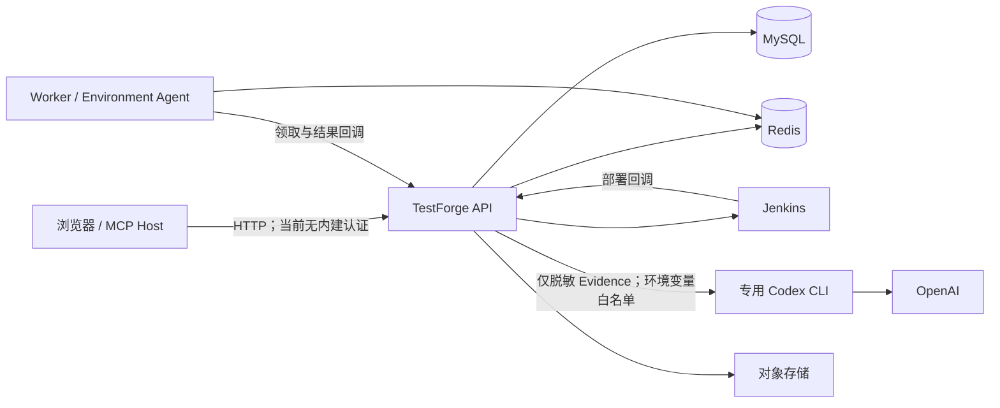

# TestForge 安全设计与开源审计

## 1. 目标与边界

本审计只覆盖未来独立公开的 `testforge-platform` 目录。上层仓库、同级示例项目、求职材料和其他个人文件不属于公开范围。目标是避免源码、Git 历史、构建产物和运行时 AI 调用泄露开发者凭据，并明确当前版本可安全运行的网络边界。

当前结论：本次交付范围是本机自托管开发与测试，适合在单机或该机器的受控 VM 网络中运行。公网服务器部署不是本期目标，也不作为开源代码供他人本机启动的阻断项。

## 2. 信任边界

关键资产包括数据库和 Redis 密码、Jenkins Credential、对象存储密钥、Codex 登录令牌、MCP 授权工作区、测试 Evidence 与浏览器会话。

## 3. 审计结果

| 等级 | 发现 | 当前处理 |
| --- | --- | --- |
| 高 | API 无内建认证/RBAC；离开本机边界后可能被用于管理项目、执行任务和触发 Jenkins/AI | 默认监听改为 `127.0.0.1`；服务器部署明确不在本期开源支持范围 |
| 高 | Codex 子进程原本继承 Java 全部环境变量，可能读取 DB、Redis、OSS、Jenkins 凭据 | 改为环境白名单，并要求独立 `TESTFORGE_AI_CODEX_HOME` |
| 高 | 本地 Jenkins Compose 关闭 CSRF 且绑定固定虚拟网卡地址 | 恢复 CSRF，默认仅绑定回环，地址与 Agent 路径改为配置 |
| 高 | Worker/Jenkins/Agent 回调缺少完整调用方身份认证 | 未完成；本期只支持本机进程和受控 VM 网络 |
| 中 | Evidence 脱敏只覆盖简单 `key=value` | 扩展 Bearer、JWT、常见 Token 与 URL 凭据；仍需数据分类和人工复核 |
| 中 | 子目录单独开源时原 `.gitignore` 依赖上层规则 | 平台 `.gitignore` 已自包含，并排除 `.env`、`auth.json`、Profile、日志和密钥文件 |
| 中 | 代码和文档含个人绝对路径与固定私网 IP | 运行代码改为环境配置；历史任务/Evidence 仍需从公开导出中移除或脱敏 |
| 低 | 历史扫描命中 UUID 形态的假阳性 | 已人工判定为 UUID，不是密钥 |

## 4. 凭据扫描事实

- 对 `testforge-platform` 当前树和 121 个相关提交执行 Gitleaks；历史仅发现 2 个 UUID 假阳性，没有发现可确认的已提交密钥。
- 自定义高置信规则未发现 OpenAI、GitHub、AWS、JWT、Bearer 或私钥进入跟踪树/历史。
- 本机未跟踪的 `.env.local` 含真实 OSS 凭据；生成的浏览器 Profile/日志也可能含 Token 或 Cookie。它们未进入 Git，但禁止用资源管理器直接打包整个目录公开。
- Git 提交仍可能包含作者邮箱。若不希望公开旧作者信息，应从 `testforge-platform` 当前干净树建立新的独立仓库与初始提交，而不是推送上层仓库历史。

只从 Git 跟踪内容制作发布物，并在发布前重新扫描。若 `.env.local` 中的密钥曾通过聊天、日志、网盘或制品外泄，应立即在云厂商控制台轮换；仅添加 `.gitignore` 不能让已泄露凭据失效。

## 5. Codex 接入规则

1. AI 默认关闭；启用时必须配置 TestForge 专用 `CODEX_HOME`。
2. 不把个人 Codex Home、`auth.json`、API Key 或浏览器登录态复制到仓库和镜像。
3. Codex 子进程只接收运行所需的 OS/证书/代理变量，不继承业务凭据。
4. `--sandbox read-only` 降低文件写入风险，但模型仍会获得发送给它的 Evidence；沙箱不是数据脱敏机制。
5. AI 输出只作为建议并引用 Evidence ID，不修改确定性测试结果。

独立 Codex Home 和环境变量白名单不等同于文件系统隔离；同一 OS 用户可读取的文件仍有暴露可能。当前实现要求 Home 非空，但不校验它是否指向个人目录。专用 OS 用户应只获得测试所需目录权限，不能据此声称个人文件已完全隔离。

## 6. 公开发布门禁

| 门禁 | 状态 | 通过条件 |
| --- | --- | --- |
| 初始公开源码扫描 | `PASS` | Gitleaks v8.30.1：无密钥命中；不导入私有历史 |
| 发布物凭据检查 | `PASS` | 本次扫描仅导出待跟踪源码；未包含本机 `.env.local`、缓存和构建产物 |
| Node 依赖审计 | `PASS` | 前端升级后全量 npm audit 为 0 告警，含开发依赖；contracts 生产依赖此前扫描为 0 |
| Go 依赖审计 | `PASS` | 上轮 govulncheck：调用路径 0 个漏洞；依赖模块有 1 个未触达告警，不能表述为所有模块零漏洞 |
| Python Worker 依赖审计 | `PASS` | 上轮升级 pytest 至 >=9.0.3 后 pip-audit 返回无已知漏洞；不覆盖可选执行器和所有平台组合 |
| HTTP 验收夹具依赖审计 | `BLOCKED` | 原 Mock 内容已归入 `acceptance/fixtures/http`；2026-09-28 容器重试在依赖下载阶段退出，FastAPI 新依赖的干净环境验证仍待完成 |
| Java/容器依赖审计 | `NOT_RUN` | 尚未取得扫描结果，不作无漏洞承诺 |
| 平台公网认证 | `NOT_APPLICABLE` | 本期只支持每位用户在本机自托管；服务器部署另立需求 |
| 许可证 | `PASS` | 采用根目录 [Apache-2.0 LICENSE](../../LICENSE)，覆盖两个随附自有框架 JAR |
| 公开内容脱敏 | `PASS` | 私有任务档案与原始 Evidence 已移出，历史运行清单重置 |

## 7. 验收

1. AI 启用但未配置专用 Codex Home 时，Provider 必须返回不可用。
2. Codex ProcessBuilder 环境中不得出现 `MYSQL_PASSWORD`、`REDIS_PASSWORD`、`TESTFORGE_OSS_ACCESS_KEY_SECRET` 等业务密钥。
3. Bearer、JWT、常见云/API Token 和 URL 用户密码不得进入 Prompt 或返回的 Codex 错误信息。
4. 默认启动后 API 与 Jenkins 只监听回环地址。
5. 对计划发布的独立仓库重新运行凭据、依赖、SAST 和干净安装检查。

私有 Maven 依赖已改为随仓库分发的普通 JAR，两个自有 JAR 采用仓库 Apache-2.0 许可。验证范围与未完成项以[公开准备记录](公开准备记录.md)为准。
